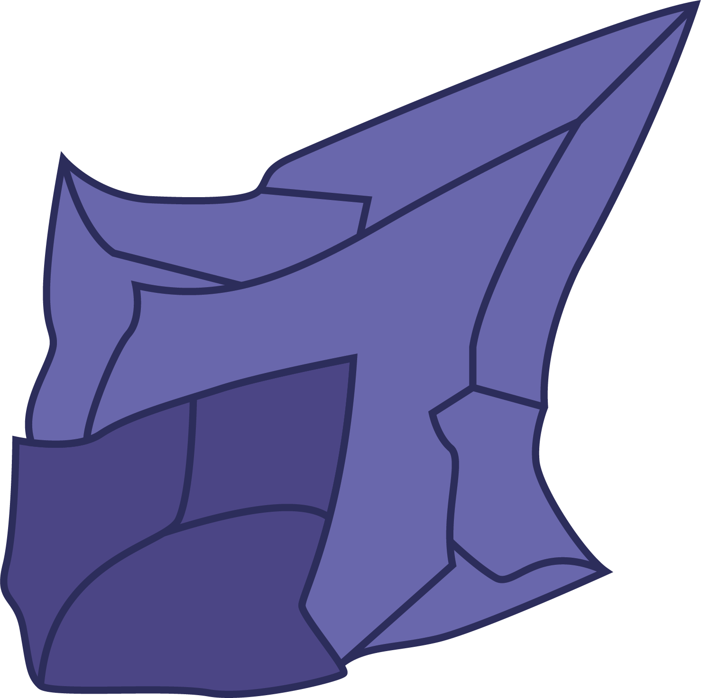

# Shards

<p align="center">
  
</p>

## A scripting tool to build tools.

[](./LICENSE)

[](https://codecov.io/gh/fragcolor-xyz/shards)
[](https://docs.fragcolor.xyz/)
[](https://learn.fragcolor.xyz/)

## Vision

Fragcolor is building a programming tool for the future.

A future where current interfaces like *screen*, *desktop*, *mouse*, *keyboard*, etc. are replaced by more flexible and intuitive virtual interfaces within a *VR/MR/AR* environment.

A future where it's the creator's imagination that limits what they can build; not the technology or the tools. 

And, a future where artists, creators, and developers all over the world can freely leverage each other's work to build something even bigger and better, while still getting justly rewarded for their efforts.

To that end, Fragcolor's vision is to build a low-code way of producing high performance and multi-platform apps in the form of a scripting tool that can be both visual and textual at the same time, and one that represents the flow of data and logic as it is (what you see is how it works).

## Goals

The two main goals of this project are:  

### To unleash creativity
* Prototype quickly; unchain your imagination
* Go from pseudo code to real app, real fast
* Replace pseudo blocks with native blocks in real time without pausing program execution
* An easy-to-use universal interface to your mixed/native code
* Maximum modularity and inter-project reuse of code
* Release a fully bundled executable app or library with just one click

### To be accessible  
* Automation scripting for everyone
* Video game engine scripting; even for non-technical artists
* Simplified Machine Learning scripting - just build graphs
* Powerful textual representation (scripting language) for experienced programmers

## Features

Shards has a number of features that make it highly suitable for live on-the-fly game development, using both visual scripting as well as traditional game scripting.

### Intuitive
* Supports **visual editing** without the associated spaghetti and spider webs
* Versatile textual representation (for now backed by a derived **Clojure/Lisp**). Read more about it [here](https://docs.fragcolor.xyz/blocks/).
  
### Developer friendly
* Clear data flow
* Extremely easy to debug and dissect
* Automatically inferred strong types
* **SIMD** vectors as first-class types
* Hot code reloading, without any serialization due to completely decoupled data
  
### Performant
* Performance-driven and easy to profile
* Deterministic execution and performance
* Strong validation, composition, and optimization ahead of run-time
* Built on top of **co-routines**; extremely easy to unleash parallelism and low syscall count
* Fast execution inspired by threaded code interpreters
* Support for WASM

### Built for game development
* Batteries included: 600+ shards & functions allowing a high level of abstraction
* Game loops: Trivially easy implementation and control of game loop code
* Graphics rendering: A `wgpu` based composable/swappable graphics rendering pipeline implementation


## TL;DR

<details><summary>This code</summary>

```clojure
(defwire action
  (Pause 2.0)
  (Msg "This happened 2 seconds later"))

(defmesh main)

(defloop main-loop
  (GFX.MainWindow
   :Title "My Window"
   :Width 400 :Height 200
   :Contents
   (->
    (GUI.Window
     "My GUI Window"
     :Width 400 :Height 200
     :Pos (Int2 0 0)
     :Contents
     (->
      "Hello world"   (GUI.Text)
      "Hello world 2" (GUI.Text)
      "Hello world 3" (GUI.Text)
      "Hello world 4" (GUI.SameLine) (GUI.Text)
      (GUI.Button "Push me!" (->
                              (Msg "Action!")
                              (Detach action)))
      (GUI.Checkbox)
      (When (Is true) (->
                       "Hello optional world" (GUI.Text))))))))

(schedule main main-loop)
(run main 0.02)
```
</details>

<details><summary>Becomes this app (cross-platform)</summary>

  

</details>

## Installation

To start developing with Shards, you'll need to [set up your environment](https://docs.fragcolor.xyz/contribute/code/getting-started/) and then [build Shards](https://docs.fragcolor.xyz/contribute/code/building-shards/).

## Usage

Shards files end with extension `.edn`. These scripts can be directly run from the console using the following script (from the `/build` folder):

```
./cbl <filename.edn>
```

Shards language API and features are documented [here](https://docs.fragcolor.xyz/) while example codes and tutorials can be found [here](https://learn.fragcolor.xyz/).

## License

Shards source code is licensed under the [BSD 3-Clause license](./LICENSE).
