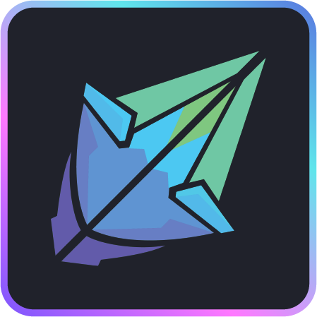

# Shards

<p align="center">
  
</p>

## A scripting tool to build tools.

[](./LICENSE)

[](https://codecov.io/gh/fragcolor-xyz/shards)
[](https://docs.fragcolor.xyz/)
[](https://learn.fragcolor.xyz/)

## Vision

We, the developers of Shards, have a vision for the future. We are developing a programming tool that aims to revolutionize the way we interact with technology. Our goal is to create a future where current interfaces like *screen*, *desktop*, *mouse*, and *keyboard* are replaced by more flexible and intuitive virtual interfaces within a *VR/MR/AR* environment.

In this future, creators will only be limited by their imaginations, not by their technology or tools. A world where artists, creators, and developers from all over the world can freely leverage each other's work to build something even bigger and better, while still receiving fair rewards for their efforts.

To achieve this vision, we aim to create a low-code way of producing high-performance and multi-platform applications. We plan to do this by creating a scripting tool that can be both visual and textual at the same time. It will represent the flow of data and logic as it is, which means that "what you see is how it works."

Our vision is not only ambitious, it is also exciting! By creating a tool that is accessible, intuitive, and powerful, we are able to unleash the creativity of developers, artists, and creators worldwide. We firmly believe that this will lead to a future where we can build anything we can imagine, without being limited by our current technology or tools.

## Goals

This project has two main goals:

### Unleashing creativity

- Prototype quickly and unleash your imagination
- Quickly move from pseudo code to a real app
- Replace pseudo blocks with native blocks in real time, without pausing program execution
- An easy-to-use universal interface for your mixed/native code
- Maximum modularity and inter-project code reuse
- Release a fully bundled executable app or library with just one click

### Accessibility

- Automation scripting for everyone
- Video game engine scripting, even for non-technical artists
- Simplified machine learning scripting with just graph building
- Powerful textual representation (scripting language) for experienced programmers

## Features

Shards has numerous features that make it ideal for live on-the-fly game development, using both visual scripting and traditional game scripting.

### Intuitive

- Supports **visual editing** without the associated spaghetti and spider webs
- Offers a versatile textual representation (currently backed by a derived **Clojure/Lisp**). More information on this can be found [here](https://docs.fragcolor.xyz/docs/shards/).

### Developer-friendly

- Clear data flow
- Extremely easy to debug and dissect
- Automatically inferred strong types
- **SIMD** vectors as first-class types
- Hot code reloading, without any serialization due to completely decoupled data

### Performant

- Performance-driven and easy to profile
- Deterministic execution and performance
- Strong validation, composition, and optimization ahead of run-time
- Built on top of **co-routines**; extremely easy to unleash parallelism and maintain a low syscall count
- Fast execution inspired by threaded code interpreters
- Support for WASM

### Built for game development

- Batteries included: 600+ shards and functions allowing a high level of abstraction
- Game loops: Trivially easy implementation and control of game loop code
- Graphics rendering: A `wgpu`based composable/swappable graphics rendering pipeline implementation


## TL;DR

<details><summary>This code</summary>

```clojure
(defwire action
  (Pause 2.0)
  (Msg "This happened 2 seconds later"))

(defmesh main)

(defloop main-loop
  (GFX.MainWindow
   :Title "My Window"
   :Width 400 :Height 200
   :Contents
   (->
    (Setup
     (GFX.DrawQueue) >= .ui-draw-queue
     (GFX.UIPass .ui-draw-queue) >> .render-steps)
    .ui-draw-queue (GFX.ClearQueue)

    (UI
     .ui-draw-queue
     (UI.Window
      :Title "My UI Window"
      :Contents
      (->
       "Hello world"   (UI.Label)
       "Hello world 2" (UI.Label)
       "Hello world 3" (UI.Label)
       (UI.Button
        "Push me!"
        (-> (Msg "Action!")
            (Detach action)))
       (UI.Checkbox "" .checked)
       .checked
       (When (Is true)
             (-> "Hello optional world" (UI.Label))))))

    (GFX.Render :Steps .render-steps))))

(schedule main main-loop)
(run main 0.02)
```
</details>

<details><summary>Becomes this app (cross-platform)</summary>

  

</details>

## Installation

To start developing with Shards, you'll need to [set up your environment](https://docs.fragcolor.xyz/contribute/getting-started/) and then [build Shards](https://docs.fragcolor.xyz/contribute/code/build-shards/).

## Usage

Shards files end with extension `.edn` and can be directly run from the console using the following script (from the `/build` folder):

```
./shards <filename.edn>
```

Shards language API and features are documented [here](https://docs.fragcolor.xyz/docs/) while example codes and tutorials can be found [here](https://learn.fragcolor.xyz/).

## License

Shards source code is licensed under the [BSD 3-Clause license](./LICENSE).
