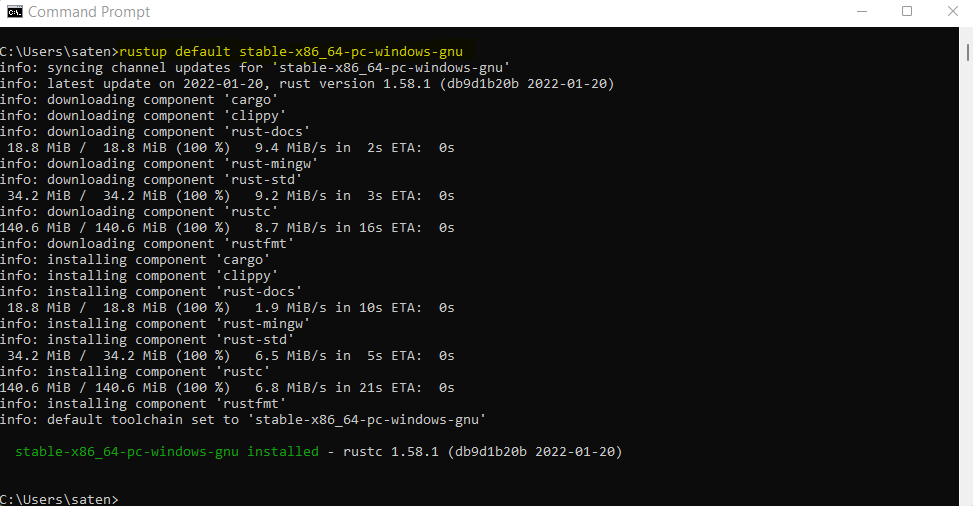
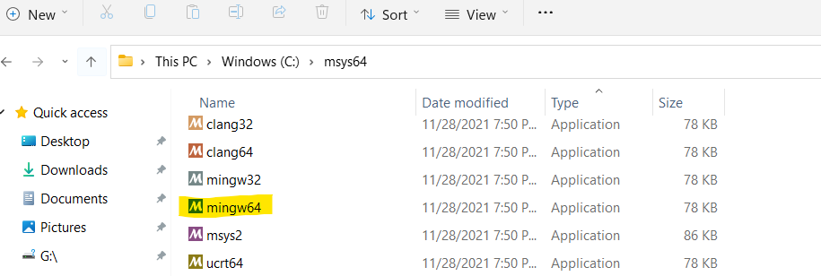
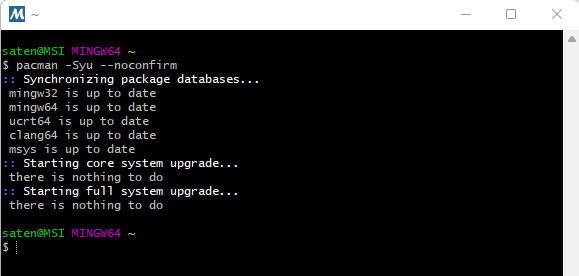
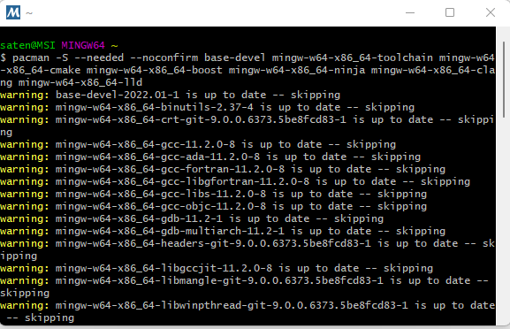
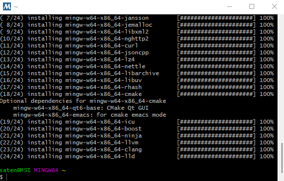
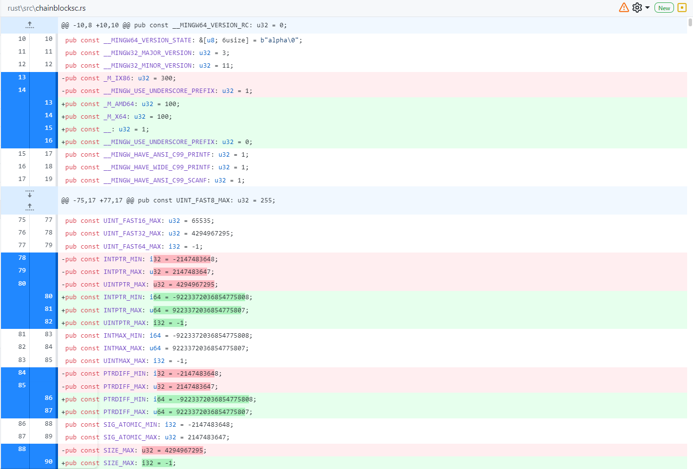

# Building Chainblocks

*Before building any Fragcolor project from the sources please ensure you've [setup your development environment](https://docs.fragcolor.xyz/contribute/code/getting-started/#development-environment) correctly.*

## Windows

### Requirements

*We use GCC and Clang a lot, MSVC might work but it's uncharted territory.*

1. The following tools need to be available on your system
    - msys2 - https://www.msys2.org/
    - rust - gnu toolchain

    *You probably already have these if you've followed the [Getting Started](https://docs.fragcolor.xyz/contribute/code/getting-started/) section - msys2 is installed as part of C++/ MinGW, and rustup installs the required rust toolchain.*

2. Make sure you pull this project repository with dependencies by using the following command (from any terminal): 
    
    `git submodule update --init --recursive`

3. Ensure you're using the Rust GNU toolchain by firing the following rustup command (from any terminal):

    `rustup default stable-x86_64-pc-windows-gnu`

    

4. For windows, the path of MinGW bin should be added to your system environment PATH variable (Settings > Edit environment variables for your account > User variables for 'user' > Path). This is needed in order to run MinGW from powershell, vscode, etc. The value of this PATH is usually `C:\msys64\mingw64\bin` .


### Update system packages

Open mingw prompt (use `mingw64.exe` from msys2 folder).



And run the following commands to update system packages:

1. This command will do a full update. You might have to reopen the prompt window
    ```
    pacman -Syu --noconfirm
    ``` 
    

2. This command will install dependencies:
    ```
    pacman -S --needed --noconfirm base-devel mingw-w64-x86_64-toolchain mingw-w64-x86_64-cmake mingw-w64-x86_64-boost mingw-w64-x86_64-ninja mingw-w64-x86_64-clang mingw-w64-x86_64-lld
    ```
    

    

### Build & run the project

Open your favorite terminal (could be within Visual Studio Code) pointing to this repo folder and run the following sequence of commands.

Create a build directory,
    
    mkdir build

and then navigate to it.

    cd build

Now run the following command to describe the build

    cmake -G Ninja -DCMAKE_BUILD_TYPE=Debug -DCMAKE_EXPORT_COMPILE_COMMANDS=1 ..

and then the following command to actually build and link Chainblocks.

    ninja format; ninja cbl

After the completion of the build you'll see a message on the terminal confirming the linking of cbl.exe.

 

*NOTE - The `rust/src/chainblocksc.rs` file might be updated automatically when generating the Rust bindings during compilation. In most cases these changes should not be pushed upstream (unless, and this is very rare, you're modifying certain core files in the project for build target architecture changes). So use the git command `git update-index --skip-worktree rust/src/chainblocksc.rs` to let git ignore changes to this file.*

 

### Build for Web Assembly

To create a Web Assembly (WASM) build, first clone the Emscripten SDK repo.

    git clone https://github.com/emscripten-core/emsdk.git

Use a `mingw64.exe` terminal to navigate to the emsdk directory,
    
    cd emsdk

and then Git Pull to get the latest tools from Github (not required the first time you clone the git).

    git pull

Update the SDK tools to latest version:

    emsdk install latest

Activate the latest SDK for the current user:    

    emsdk activate latest

Activate the PATH/ environment variables for the current terminal session.
    
    emsdk_env.bat

*NOTE - For non-Windows systems run the commands `./emsdk install latest`, `./emsdk activate latest`, and `source emsdk_env.sh` instead.*

Now go back to the chainblocks directory and run the following commands in sequence from the VS Code terminal to create and link the WASM build (similar to how we built Chainblocks for plain C++, in the previous section).
    
    mkdir build-wasm
    
    cd build-wasm
    
    cmake -G Ninja -DCMAKE_BUILD_TYPE=Debug -DCMAKE_TOOLCHAIN_FILE=$EMSDK/upstream/emscripten/cmake/Modules/Platform/Emscripten.cmake ..
    
    ninja format; ninja rust_blocks; ninja cbl
    
*More details can be found at the official Emscripten SDK [documentation](https://emscripten.org/docs/getting_started/downloads.html) page.*


--8<-- "includes/license.md"
