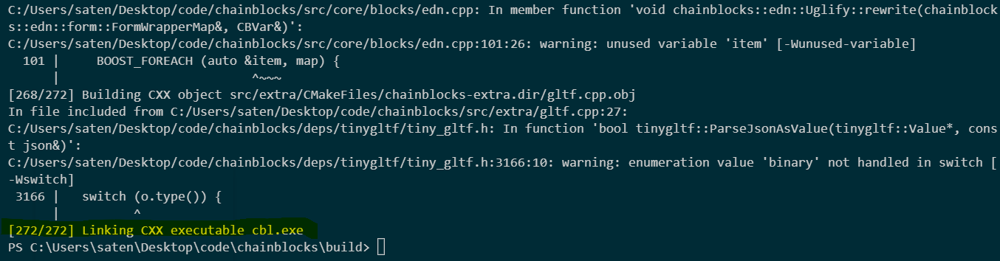

# Building Chainblocks

This guide explains how to build [Chainblocks](https://github.com/fragcolor-xyz/chainblocks) from the sources, for Windows. 

??? note "For Mac/Linux Users"
    The software requirements and terminal commands for Mac/Linux machines are the same as given for Windows. Most of these packages are pre-installed on these machines, but if required can be easily installed/updated on via `brew [install/upgrade] <package-name>` on Mac, `sudo apt-get [install/update] <package-name>` on Linux.

Before you start, ensure you've [set up your development environment](../getting-started/#development-environment).

## Requirements

!!! note
    We use GCC and Clang a lot; MSVC might work, but it's uncharted territory.

For Windows, ensure your system environment PATH variable includess the MinGW bin location. This value can be set from: Settings > Edit environment variables for your account > User variables for 'user' > Path > Edit. This allows you to run MinGW from Powershell, VS Code, etc. The value of this PATH is usually `C:\msys64\mingw64\bin`.


You'd normally clone the Chainblocks repository locally (`git clone ...`), checkout the branch you want to work with (`git checkout ...`), and pull the latest changes to your machine (`git pull`).

But since the Chainblocks repository contains [submodules](https://git-scm.com/book/en/v2/Git-Tools-Submodules) (links to external repositories), you also have to pull the latest changes for these submodules (including nested submodules). 

This can be done with the following command (to be run every time you want to build the project).

```
git submodule update --init --recursive
```

Install and switch to the Rust GNU toolchain with the following rustup commands (from any terminal).

=== "Command"

    ```
    rustup toolchain install nightly
    rustup default nightly-x86_64-pc-windows-gnu
    ```

=== "Output"

    ```
    C:\Users\saten>rustup default nightly-x86_64-pc-windows-gnu
    info: syncing channel updates for 'nightly-x86_64-pc-windows-gnu'
    info: latest update on 2022-01-20, rust version 1.58.1 (db9d1b20b 2022-01-20)
    info: downloading component 'cargo'
    info: downloading component 'clippy'
    info: downloading component 'rust-docs'
     18.8 MiB /  18.8 MiB (100 %)  9.4 MiB/s in  2s ETA:  0s
    .
    .
    .
    info: installing component 'rustfmt'
    info: default toolchain set to 'nightly-x86_64-pc-windows-gnu'
     nightly-x86_64-pc-windows-gnu installed - rust 1.58.1 (db9d1b20b 2022-01-20)

    C:\Users\saten>
    ```

When adding rust targets, ensure they're installed for nightly toolchain. For example to add the target `x86_64-pc-windows-gnu` run the following command.

=== "Command"

    ```
    rustup +nightly target add x86_64-pc-windows-gnu
    ```

=== "Output"

    ```
    info: downloading component 'rust-std' for 'x86_64-pc-windows-gnu'
    info: installing component 'rust-std' for 'x86_64-pc-windows-gnu'
        24.5 MiB /  24.5 MiB (100 %)   6.0 MiB/s in  4s ETA:  0s
    ```

## Update system packages

You should update your system packages frequently and preferably every time you want to build the project.

On Windows you'll need to run these commands in a MingW terminal. To get to this terminal go to the Windows start menu, search for 'MSYS2 MingW' and click the version appropriate for your machine (x86 or x64).

Update the Rust packages.

```
rustup update
```

Next, update other packages.

=== "Command"

    ```
    pacman -Syu --noconfirm
    ```

=== "Output"

    ```
    $ pacman -Syu
    :: Synchronizing package databases...
    mingw32                        805.0 KiB
    mingw32.sig                    438.0   B
    mingw64                        807.9 KiB
    mingw64.sig                    438.0   B
    msys                           289.3 KiB
    msys.sig                       438.0   B
    :: Starting core system upgrade...
    .
    .
    .
    ```

Restart the MingW terminal (if needed) and install the required build dependencies with this command (replace the `w64-x86_64` as appropriate for your target OS/machine).

=== "Command"

    ```
    pacman -Sy --needed --noconfirm base-devel mingw-w64-x86_64-toolchain mingw-w64-x86_64-cmake mingw-w64-x86_64-ninja mingw-w64-x86_64-clang mingw-w64-x86_64-lld wget
    ```

=== "Output"

    ```
    :: Synchronizing package databases...
    warning: base-devel-2022.01-1 is up to date -- skipping
    warning: mingw-w64-x86_64-binutils-2.37-4 is up to date -- skipping
    warning: mingw-w64-x86_64-crt-git-9.0.0.6373.5be8fcd83-1 is up to date -- skipping
    .
    .
    .
    (13/15) upgrading mingw-w64-x86_64-clang           [#####################] 100%
    (14/15) upgrading mingw-w64-x86_64-lld             [#####################] 100%
    (15/15) upgrading wget                             [#####################] 100%
    :: Running post-transaction hooks...
    (1/1) Updating the info directory file...
    ```

## Build & run the project

### Bootstrap the project

Continuing with the MingW terminal, navigate to Chainblocks root directory, and run the `bootstrap` shell script (to be run only once, when you build the project for the first time).

=== "Command"

    ```
    ./bootstrap
    ```

=== "Output"

    ```
    Using CHAINBLOCKS_ROOT=/c/Users/saten/Desktop/code/chainblocks
    /c/Users/saten/Desktop/code/chainblocks/deps /c/Users/saten/Desktop/code/chainblocks
    Setting up dependencies
    /c/Users/saten/Desktop/code/chainblocks
    Setting up tools
    /c/Users/saten/Desktop/code/chainblocks/src/tools /c/Users/saten/Desktop/code/chainblocks
    -- Build spdlog: 1.8.5
    -- Build type: Release
    -- Configuring done
    -- Generating done
    -- Build files have been written to: C:/Users/saten/Desktop/code/chainblocks/src/tools/build
    [1/6] Building CXX object deps/spdlog/CMakeFiles/spdlog.dir/src/stdout_sinks.cpp.obj
    [2/6] Building CXX object deps/spdlog/CMakeFiles/spdlog.dir/src/color_sinks.cpp.obj
    [3/6] Building CXX object deps/spdlog/CMakeFiles/spdlog.dir/src/fmt.cpp.obj
    [4/6] Building CXX object deps/spdlog/CMakeFiles/spdlog.dir/src/spdlog.cpp.obj
    [5/6] Linking CXX static library deps\spdlog\libspdlog.a
    [6/6] Linking CXX executable bin\bin2c.exe
    /c/Users/saten/Desktop/code/chainblocks
    ```

### Build the project

Now you may continue in a normal Windows/VS Code terminal.

Go to Chainblocks root and create a build directory (if it doesn't already exist) and navigate to it.

```
mkdir build
cd build
```
You need to run the following two commands every time you want to build the project.

Configure the build with `cmake`,

```
cmake -G Ninja -DCMAKE_BUILD_TYPE=Debug -DCMAKE_EXPORT_COMPILE_COMMANDS=1 ..
```

??? note "Release mode build"
    In case you need less verbose script execution logs, build Chainblocks in release mode (instead of the debug mode) by using the command `cmake -G Ninja -DCMAKE_BUILD_TYPE=Release -DCMAKE_EXPORT_COMPILE_COMMANDS=1 ..`
   
then format the source code and build the target with `ninja`

```
ninja format; ninja cbl
```

??? note "Build without formatting"
    Formatting the source is required when raising a PR (for contributing a change). For testing the build locally just use `ninja cbl`.

The build ends with a successful linking of the Chainblocks executable (cbl.exe).

 


??? note "Fix build errors"
    If your build fails with git/target file errors run `ninja clean` and/or delete the `target` folder and try building again. The build can also fail if your software packages or repository submodules (`/chainblocks/deps/`) are out-of-date. To resolve this update the specific software package as given [here](#update-system-packages) and pull the submodules again via `git submodule update --init --recursive`.

??? note
    When generating the Rust bindings during compilation, the file `rust/src/chainblocksc.rs` might be updated automatically. These changes should not be pushed upstream unless you're modifying certain core files for build-target architecture changes (which is very rare). Hence, use the git command `git update-index --skip-worktree rust/src/chainblocksc.rs` to let git ignore changes to this file.
  
### Verify build and run

To verify your build was successful create an empty script file (*.edn) in the `/build` folder, populate it with the **Script code**, and execute the **Run command** from the `/build` folder. 

=== "Script code"

    ```
    (defnode main)
    (defloop test
        (Msg "Hello World"))
    (schedule main test)
    (run main 1 1)
    ```
=== "Run command"

    ```
    ./cbl <script-filename.edn>
    ```

=== "Script result"

    ```
    [info] [2022-05-24 06:09:39.293] [T-3196] [logging.cpp::98] [test] Hello World
    ```

If you see `Hello World` printed on your screen (the **Script result**) your build was successful.

You can also configure the `Run Code` button on VS Code (arrow/triangle on the top right-hand corner of the code-editor) to run Chainblocks scripts.

1. Install the VS Code [code-runner](https://marketplace.visualstudio.com/items?itemName=formulahendry.code-runner) extension
2. Locate the `code-runner.executorMap` parameter to open in `settings.json` (VS Code > File > Preferences > Settings > search for code-runner.executorMap > click 'Edit in settings.json')
3. In the `settings.json` file set the value of the code-runner.excutorMap to point to `build\\cbl.exe` for `clojure`. You can also add a second entry setting `code-runner.runInTerminal` to `true` if you want the script output displayed in the **Terminal** tab of your terminal (instead of in the **Output** tab, which is the default).
```
    "code-runner.executorMap": {
     	"clojure": "build\\cbl.exe"
        "code-runner.runInTerminal": true
    },
```

Now open your Chainblocks script file and click the `Run Code` button. The script will be executed and you should see the script's result in your terminal. 

## Build for Web Assembly

To create a Web Assembly (WASM) build, first clone the Emscripten SDK repo.

```
git clone https://github.com/emscripten-core/emsdk.git
```

Use a `mingw64.exe` terminal to navigate to the emsdk directory,

```
cd emsdk
```

and then do a git pull to get the latest tools from GitHub (not required the first time you clone the git repository).

```
git pull
```

Update the SDK tools to the latest version.

```
emsdk install latest
```

Activate the latest SDK for the current user.

```
emsdk activate latest
```

Activate the PATH/ environment variables for the current terminal session.

```
emsdk_env.bat
```

!!! note
    For Mac/Linux, use the following commands instead: 
    - `./emsdk install latest`
    - `./emsdk activate latest`
    - `source emsdk_env.sh`.

Open a Windows or VS Code terminal and navigate to the Chainblocks directory. Run the following commands in sequence to create and link the Web Assembly build.

```
mkdir build-wasm
```

```
cd build-wasm
```

```
cmake -G Ninja -DCMAKE_BUILD_TYPE=Debug -DCMAKE_TOOLCHAIN_FILE=$EMSDK/upstream/emscripten/cmake/Modules/Platform/Emscripten.cmake ..
```

```
ninja format; ninja cbl
```

Refer to the official Emscripten SDK [documentation](https://emscripten.org/docs/getting_started/downloads.html) for more details on building for Web Assembly.


--8<-- "includes/license.md"
