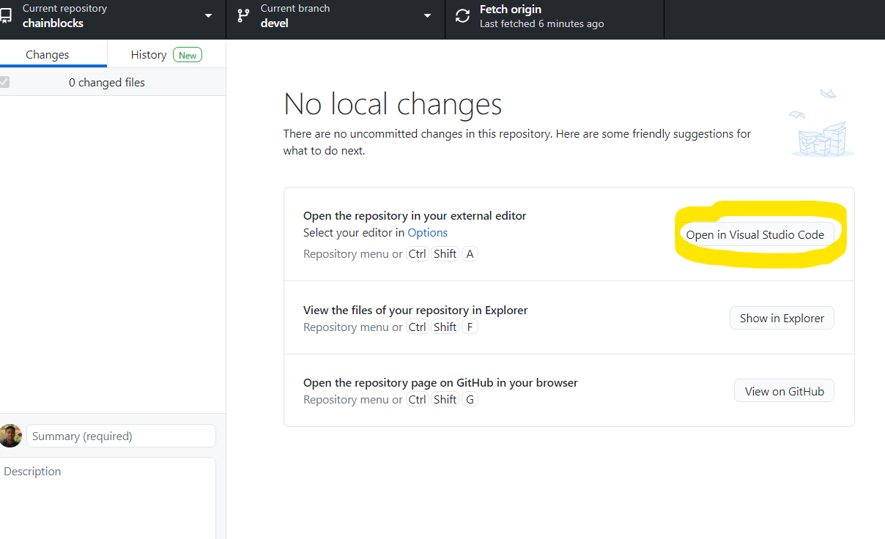
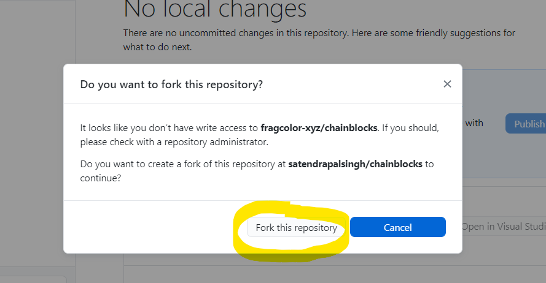
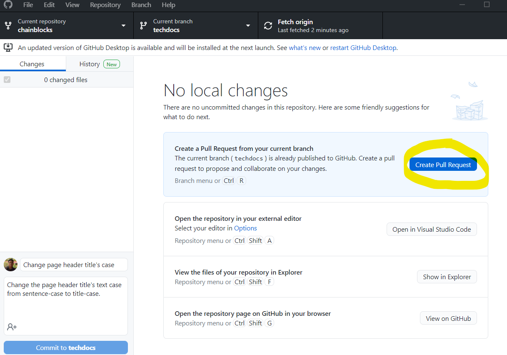
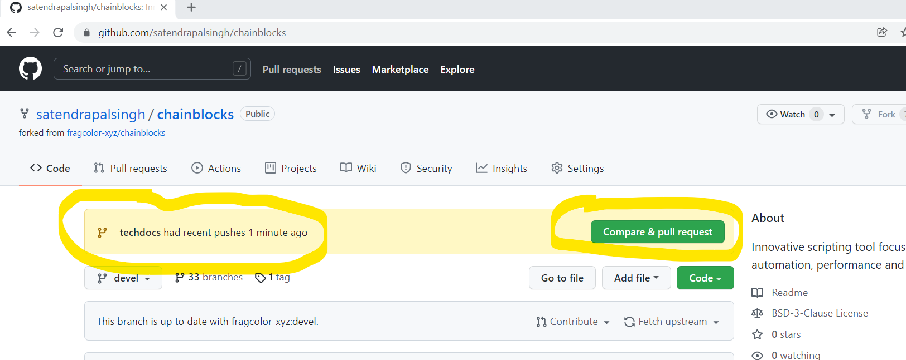

# Contributing changes

Fragcolor documentation exists under the [/docs](https://github.com/fragcolor-xyz/shards/tree/devel/docs) folder of the Shards repository.

This guide will get you started with contributing documentation changes to Fragcolor projects. We'll use the GitHub Desktop (GD) to deal with git as GD is easier to use than the git command line.

Also, all these steps are valid for code contributions too.

*For comprehensive coverage of git/ GitHub workflow, check out GitHub's excellent [Quickstart Tutorial](https://docs.github.com/en/get-started/quickstart/hello-world).*

## Clone the Repo

To begin, you'll need a copy of the project's repository on your local machine.

Go to the repository's GitHub page. Click the 'Code' button on the right, select HTTPS (under the heading 'Clone'), and copy the git repository path.

Open GD and choose the option 'Clone a repository from the Internet...'

Choose the 3rd tab (URL) on the window that opens, and paste the copied git repository URL in the first input box.

*The second input box is the local path where git will clone your repository. You can change this as desired.*

Cloning might take a couple of minutes (depending on the size of the repository). After it completes, you'll be able to view the repository files on your local system.

## Create a branch

You will need to create a new branch from the main/ default branch to hold your changes.

*Never work on the main branch of the repository; always create a new branch for your changes.*

You can create a new branch using GD. Click the 'Current Branch' dropdown to show the available branches for this repository. Now click on 'New Branch' button on the right-hand side.

A modal will pop up asking for the new branch's name. This modal also explains on what branch is this new branch based. Ensure that the source branch is the default branch of the repository. In this case, it's 'develop'.

Click on 'Create Branch'.

Publish this local branch to the project's remote (from where we cloned the repository).

If you don't have write access to a project repository, you can't push your changes to it. So, GD will ask you to fork (create a copy of) the target repository instead. Forking will put a copy of the original repository in your GitHub account. You can now push your local branch/ changes to this fork repository in your GitHub account.
Fork the repository.

After forking, choose 'To contribute to the parent project' option.

Publish the new branch to your fork repository.

On GD, you will now be able to see uncommitted changes (if any) in your local branch.

## Make & test changes

*Run all terminal commands from the project folder that contains `MkDocs.yml`. For the Shards repository, this folder is `...shards/docs`).*

MkDocs can build and serve the documentation website locally while you're making changes. The served pages reflect your documentation changes in real-time (also called hot reloading).

Before starting the MkDocs live-preview server, we need to install the required plugins.

MkDocs plugins get registered in the `MkDocs.yml` file against the keyword 'plugins'. Here, we have only one plugin: [awesome-pages](https://github.com/lukasgeiter/mkdocs-awesome-pages-plugin).

Install MkDocs plugins using the `pip install mkdocs-awesome-pages-plugin` command from the terminal.

=== "Command"

    

Start the MkDocs live-preview server with the `mkdocs serve` command. Once the server is running, the terminal will display the locally served website's URL path.

=== "Command"

    

=== "Result"

    

Navigate to this path in your local browser to access the served site.

Now we're ready to make some changes!

As an exercise, let's change the case of the header's title text. Change 'Fragcolor documentation' (sentence case) to 'Fragcolor Documentation' (title case). Save the edit.

Before the change:

After the change:

And now, let's go to our local URL to preview this change.

## Commit & push changes

GD will now show a summary of changes in this new local branch.

*Pink color highlights (marked with `-`) denote deleted lines. Blue color highlights (marked with `+`) denote added lines.*

Commit (save) your changes to the local repository branch.

To commit, click the 'Commit to LOCAL-REPO-NAME' in the bottom left-hand corner of GD.

GD will ask you to add a summary (commit message) and a description of the changes.

Add the commit message summary/ description and click on the 'Commit to ...' button below these fields. This commit saves the changes to your new branch locally (in your fork).

Now, click on the 'Push origin' button on the right-hand side. This action pushes your branch's local commits to your fork on GitHub (i.e., the origin remote).

At this point, GD will show that no local changes exist. This is because there are no outstanding changes on our local that need to be pushed to remote origin.

GD will now prompt you to raise a Pull Request.

You'll see the same message/ prompt on the GitHub page of your (forked) remote origin repository.

You can start the process of raising a PR from either GD or GitHub website. In either case, you'll end up on the GitHub website's PR page, as explained in the next section.

## Raise a pull request

A Pull Request (or PR) merges/ combines the changes of the PR branch into the target (main) branch.

*PRs may be raised between branches of the same repository from a fork to the original repository. Here we are dealing with the latter.*

Raise a PR by clicking 'Create Pull Request' in GD. Or, you can click 'Compare & pull request' on your branch/ repository's GitHub page. In both cases, you'll end up on the 'Open a pull request' page on GitHub.

Fill in the PR title and message. Then click the 'Create pull request' button on the bottom right-hand corner. This action will create a Pull Request and route it to a reviewer.

Every PR gets a unique URL. This URL tracks the review discussion between the contributor and the reviewer(s). It also has details like files changed, commit messages, etc.

Every PR gets routed to a reviewer or a maintainer (of that repository) for a review. If the reviewer agrees with the changes, they'll approve and merge the PR into the target branch. If they need further changes, they will discuss via the comments section in the PR.

*It's a good practice to delete your branches for merged/ closed PRs.*

--8<-- "includes/license.md"
