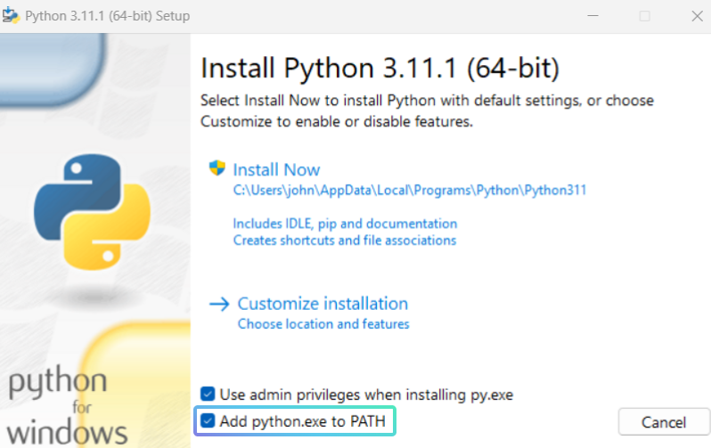
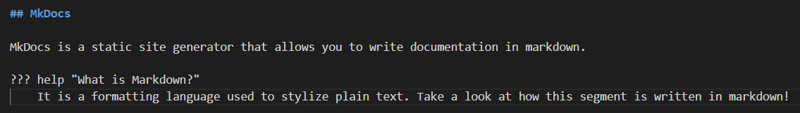

# Start Documenting

!!! note
    This guide is for new users unfamiliar with the installation process.

    Click [here](#overview) to skip the tutorial and jump to the overview.

Pre-requisites:

- [Readied the development environment](../getting-started.md)

Eager to help contribute to our ever-growing library of documentation? In this chapter, we will set up the documentation site generator so that you can start writing documentation.

## Python

Python needs to be installed for the site generator to work. Download Python [here](https://www.python.org/downloads/) and follow the instructions given by the installer. Remember to add Python to PATH during the installation!



By adding Python to PATH, it allows your terminals to be able to find and use Python. Try typing `Python` in any terminal to check if the installation process is successful.

=== "Command"

    ```
    Python
    ```

=== "Result"

    


## MkDocs

MkDocs is a static site generator that allows you to write documentation in markdown.

??? help "What is Markdown?"
    It is a formatting language used to stylize plain text. Take a look at how this segment is written in markdown!

    

Install MkDocs using the Package Installer for Python (pip). Run the following command in your terminal:

=== "Command"

    ```
    pip install mkdocs
    ```

Once done, you can check if your installation is successful with the command:

=== "Command"

    ```
    mkdocs
    ```

=== "Result"

    


Finally, install the following by running the given commands:

1. Material for MkDoc - A theme for MkDocs

    ```
    pip install mkdocs-material
    ```

2. Awesome Pages Plugin - Adds navigation customization

    ```
    pip install mkdocs-awesome-pages-plugin
    ```

3. mkdocs-macros - Allows for custom macros and variables

    ```
    pip install mkdocs-macros-plugin
    ```

You are now ready to start writing documentation! We will learn how Fragcolor's documentation is written in the next chapter.

## Overview ##

1. Download [Python](https://www.python.org/downloads/) and add it to PATH.

2. Install MkDocs.
```
pip install mkdocs
```

3. Install Material for MkDocs.
```
pip install mkdocs-material
```

4. Install the Awesome Pages Plugin.
```
pip install mkdocs-awesome-pages-plugin
```

3. Install mkdocs-macros.
```
pip install mkdocs-macros-plugin
```

--8<-- "includes/license.md"
