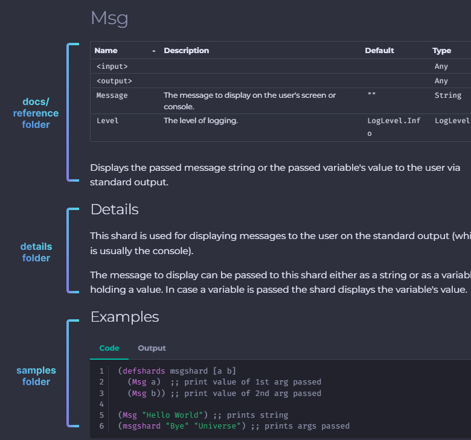

# Write Documentation

!!! note

    Our documentation follows the [Microsoft Style Guide](https://docs.microsoft.com/en-us/style-guide/welcome/). Do refer to it if you are unsure of the documentation style!

In this chapter, you will be learning how to write documentation for Fragcolor.

Pre-requisites:

- [Readied the Development Environment](../getting-started.md)

- [Built Shards](../../contribute/code/build-shards.md)

- [Installed MkDocs](./start-documenting.md)

## Navigating the Docs

Documentation exists under the `/docs` folder of the Shards repository. We will list down notable folders that you will want to take note of.

For Shards API Documentation:

- details: Holds the files containing the details of each shard

- samples: Contains the code and output of the examples for each shard

- docs/reference: Contains the pages for the "Reference" category of the site



For the other documentation pages:

- docs/contribute: Contains the pages for the "Contribute" category of the site

- docs/learn: Contains the pages for the "Learn" category of the site

## Generating Documentation for the Shards API

You might have noticed that the `docs/reference/shards` folder is conspicuously empty. This is to allow for faster previewing of your static site without having to load the pages for the Shards API.

In order to generate the documentation for the Shards API, you will have to run the `./docs/generate.edn` file. Launch your MinGW terminal and input the following command:

=== "Command"

    ```
    ./build/Debug/shards ./docs/generate.edn
    ```

--8<-- "includes/license.md"
