# Write Documentation

!!! note

    Our documentation follows the [Microsoft Style Guide](https://docs.microsoft.com/en-us/style-guide/welcome/). Do refer to it if you are unsure of the documentation style!

In this chapter, you will be learning how to write documentation for Fragcolor.

Pre-requisites:

- [Readied the Development Environment](../getting-started.md)

- [Built Shards](../../contribute/code/build-shards.md)

- [Installed MkDocs](./start-documenting.md)

## Navigating the Docs

Documentation exists under the `/docs` folder of the Shards repository. We will list down notable folders that you will want to take note of.

For Shards API Documentation:

- `/docs/docs/reference`: Contains the pages for the "Reference" category of the site

- `/docs/details`: Holds the files containing the details of each shard

- `/docs/samples`: Contains the code and output of the examples for each shard

For the other documentation pages:

- `docs/docs/contribute`: Contains the pages for the "Contribute" category of the site

- `docs/docs/learn`: Contains the pages for the "Learn" category of the site

## Previewing the Docs

1. Open your MinGW terminal.

2. Navigate to where your docs folder is located using the command `cd $(cygpath -u '(X)')`, where (X) is the directory of your folder.

        cd $(cygpath -u '(X)')

    If your docs folder is located at `C:\Fragcolor\Shards\docs`, the command used in the MinGW terminal would be `cd $(cygpath -u 'C:\Fragcolor\Shards\docs')`.

3. Run the following command to start the server:

        mkdocs serve

4. Enter the following in your browser to preview the site:

        http://127.0.0.1:8000/

## Pages and Levels

The root directory for our site is located at `/docs/docs`, with `docs/docs/index.md` being the file for our homepage. Subsequent directories are placed within folders.

Each level contains:

- An `index.md` file as the landing page

- A `.pages` file to organize the order of our pages

    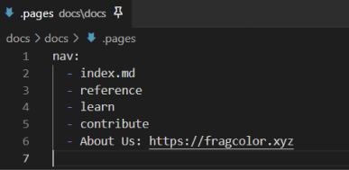

    !!! note
        If `...` is used within `.pages`, files in the same hierarchy that have not been mentioned in `.pages` will be arranged in alphabetical order.

        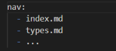

- An (optional) `asset` folder to hold media used in that level

## Generating Documentation for the Shards API

You might have noticed that the `/docs/docs/reference/shards` folder is conspicuously empty. This is to allow for the faster previewing of your static site without having to load all the pages for the Shards API.

To generate the documentation for the Shards API, run the `generate.edn` file by launching your MinGW terminal and inputting the following command:

    ./build/Debug/shards ./docs/generate.edn

!!! note
    The **Debug** version of Shards must be used for the generating of the Shards API pages.

Once done, you will notice that the directory is now filled with folders and Markdown files of various shards.

## Updating the Shards API Docs

As you have seen from the segment on [navigating the docs](#navigating-the-docs), a shard's API documentation is generated from three different locations:

1. `/docs/details` folder

2. `/docs/samples` folder

3. `/docs/docs/reference` folder

Each segment will require a different approach for editing. The following are the steps required to work with each segment:

### Details

1. Navigate to the `/docs/details` folder.

2. Search for the .md file with the shard's name.

    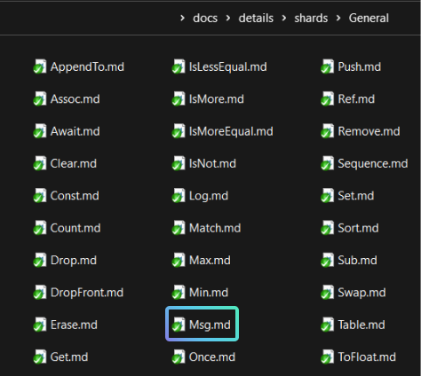

3. Amend the text within the .md file.

    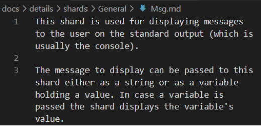

4. The changes will be reflected on the site.

    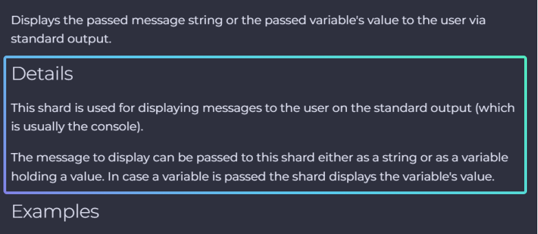

### Examples

1. Navigate to the `/docs/samples` folder and locate the folder with the shard's name.

2. The examples are `.edn` files named in numerical order, starting from 1.

    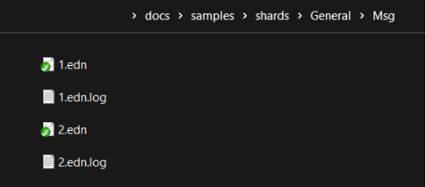

3. Amend the code within the `.edn` file, or add a new `.edn` file to create a new example.

    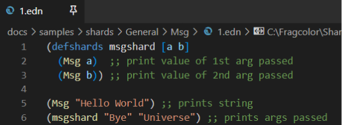

4. Amend the code within the `.edn.log` file of the same number to reflect the results of the example.

    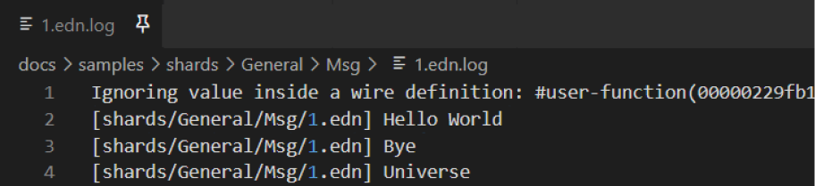

5. The changes to the `.edn` file will be reflected in the "Code" portion of the "Examples" segment on the site.

    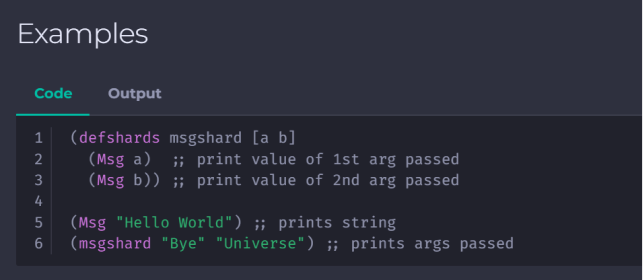

6. The changes to the `.edn.log` file will be reflected in the "Output" portion of the "Examples" segment on the site.

    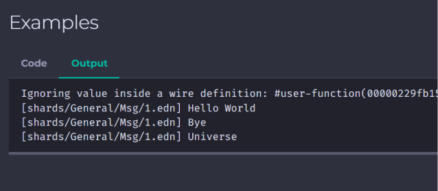

### Reference

Since the files within the `/docs/docs/reference` folder were generated by running a script, the editing of the description text in it will require additional steps.

In this segment, we will learn how to edit the following:

- The basic description of a shard

- The description text for the input and output

- The description text for the shard's parameters

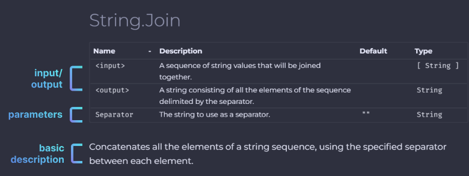

Editing these description text will require looking to the source .cpp and .hpp files.

#### Basic Description 

Firstly, locate the struct of the shard you wish to make amendments to. For this tutorial, we will be using the `String.Join` shard as an example.

1. Navigate to the `/src/core/shards` folder and select the file that most likely contains the target shard. For this example, we will select the `strings.cpp` file.

    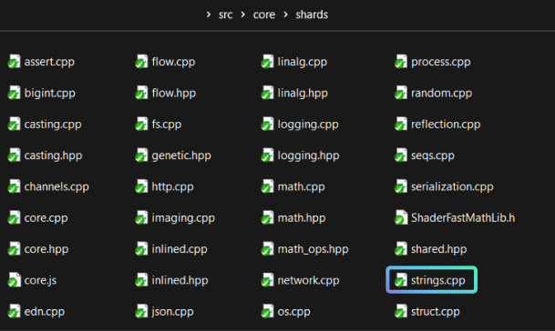

2. Search for where the shards are being registered and check the struct of the shard. In this example, the `String.Join` shard has a struct named `Join`.

    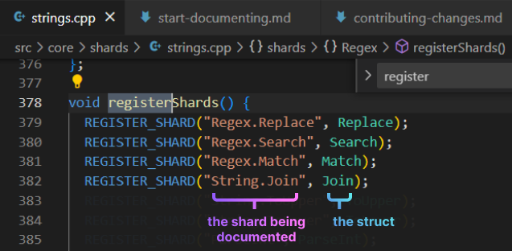

    !!! note
        There might be instances whereby the struct is named differently from the shard. It is therefore important to check the struct's name first before proceeding.

3. Navigate to the struct in the same file to access the `help()` function. The basic description of the shard is located in the return statement and can be edited from there.

     

#### Input and Output

Within the same struct, you can find the description text for the input and output within the `inputHelp()` and `outputHelp()` functions.

 

#### Parameters

For the description of the parameters, look for the `parameters()` function within the struct.

You will see either:
    
- The parameter description within the function,

- OR a variable being returned. 
    
In the case for `String.Join`, a variable `params` is returned. Search for the variable used to find the description text of the parameters.

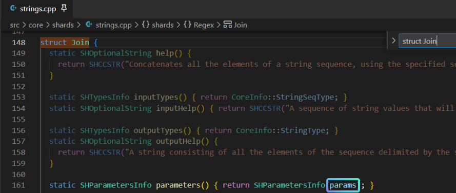 

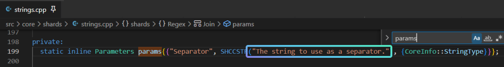 

## Formatting the Docs

Our documentation is formatted with Markdown. Do check out the [cheatsheet](https://www.markdownguide.org/cheat-sheet/) if you are new to Markdown or need a refresher.

Material for MkDocs allows you to add fancier stuff to your documentation, such as admonitions and annotated code blocks. For more information on what you can achieve, do check out the reference page [here](https://squidfunk.github.io/mkdocs-material/reference/).

!!! note

    This is an admonition created with Material for MkDocs!

--8<-- "includes/license.md"
