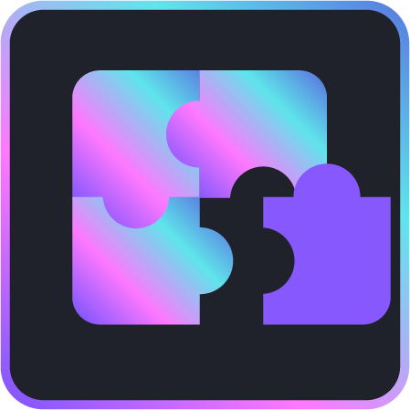

{ width=180 }

# Contribute

Fragnova is a community-driven organization that thrives on collaboration and innovation. We have a bunch of exciting [projects](https://github.com/fragcolor-xyz) that are open to community contributions, and we would love for you to get involved!

If you're interested in contributing to our projects, we've put together a guide that will help you get started. The guide will walk you through the process of setting up your development environment, which is the software and tools you'll need to work on our projects.

Once you're set up, the guide will take you through your first contribution. This could be code or documentation – whatever you're most comfortable with. We'll explain the process and show you how to make your contribution, so you can get a feel for how things work.

Contributing to open source projects like ours is a great way to learn new skills, build your portfolio, and connect with other developers. Plus, you'll be making a meaningful contribution to a project that could revolutionize the game development scene.

If you're ready to get started, [check out our guide](./getting-started/) and dive in!

--8<-- "includes/license.md"
