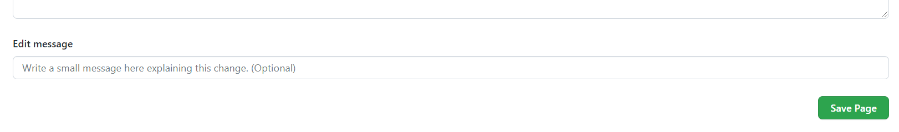

# Contributing to the wiki

The wiki for each repository is located at the respective repository's URL path + '/wiki'.

For example the wiki for Chainblocks is at :

https://github.com/fragcolor-xyz/chainblocks/wiki

You are encouraged to contribute code recipes, game performance/ optimization techniques, or anything else that might be useful to the Fragcolor Chainblocks community, to this wiki.

## Request collaborator access
To be able to edit the Wiki of a repository you need to have collaborator access to that repository.

*For now you can request collaborator access by opening an issue in the repository and tagging the maintainer.*

Once you have collaborator access, you'll be able to see the Edit and New Page buttons on the upper right-hand side of the Wiki page.

## Edit page

To edit an existing page select it from the right-hand TOC table.

Clicking on **Edit** will open the selected page in edit mode in Github's own built-in editor (you can select the Editor Format from the Edit Mode dropdown.)

An Edit Message can be optionally added (equivalent of a Commit Message) and the edit can be saved using the Save button at the bottom of the editor.

## New page

Clicking on **New Page** will open a page template.

Adding content/ editing message and saving this new page can be done in the same manner as [in the case of editing a page.](#edit-page)

--8<-- "includes/license.md"