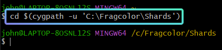
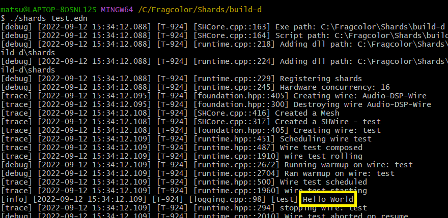
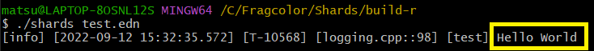
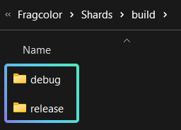
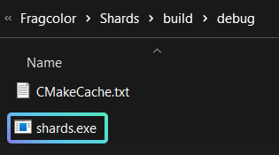
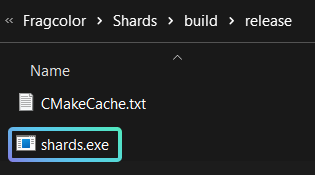

# Build Shards

!!! note
    This guide is for new users unfamiliar with the Shards building process. 
    
    Click [here](#overview) to skip the tutorial and jump to the overview.

How-to build Shards.

Curious about the inner workings of Shards? Build Shards to unlock its hidden magics, and gain access to infinite creative possibilities! ✨ 

Do ensure that you have your [development environment readied](../how-to/start-developing.md) before embarking on the quest to build Shards!


## Cloning the Shards Repository ##

Go to the [Shard’s repository on Github](https://github.com/fragcolor-xyz/shards). If you have GitHub for Desktop installed, select the “Code” button, and “Open with GitHub Desktop” to clone the repository. 


??? help ""Open with GitHub Desktop" Error"
    If “Open with GitHub Desktop” does not work, you can instead copy the HTTPS link. 

    

    In GitHub Desktop, select the option to “Clone a Repository” (Ctrl+Shift+O). 
    
    Click on the “URL” tab, paste the HTTPS link and select “Clone”. 

    

The repository is now cloned to your computer! Take note of where it has been cloned to, as we will be using it in the following step…


## Navigating to the Shards Repository ##

Launch the MinGW terminal (ming64.exe). The .exe file can be found in the msys64 folder, usually located in your C drive.


Navigate to where your Shards repository is located using the command `cd $(cygpath -u '(X)')`, where (X) is the directory of your folder.

```
cd $(cygpath -u '(X)')
```

??? "cd"
	The `cd` command is used for navigating to different directories within the MinGW terminal.

??? "cygpath"
    The MinGW terminal requires you to convert the backslashes(\\) in your directory address to forward slashes(/). You will also have to remove the colon(:) after the drive alphabet. 
    
    This is the Unix form of an address, and can be done automatically by using the cygpath program.

    e.g. `cygpath -u 'C:\Fragcolor\Shards'` will output `/c/Fragcolor/Shards`

If your Shards repository is located at `C:\Fragcolor\Shards`, the command used in the MinGW terminal would be `cd $(cygpath -u 'C:\Fragcolor\Shards')`.



!!! tip
    A simple way to obtain a folder’s directory is to copy the address as text. 

    Navigate into the folder, right-click the folder in the navigation bar, and select “Copy address as text”.

    

## Creating Build Folders ##

We will next create build folders in the Shards repository - one for the Debug version of Shards, and another for the Release version.

??? "Debug or Release?"
    Debug builds are used when your code is still being tested and you wish to see detailed logs of what happens when your code is run. Release builds are used when you simply want the finished product without excessive logs.

    Debug Build:
    
    

    Release Build:

    

First input `mkdir build` in the MinGW terminal to create a folder named “build”. 

```
mkdir build
```

??? "mkdir"
    The `mkdir` command is used to create new folders.


Next, input `cd build` to navigate into the newly created folder.

```
cd build
```

Input `mkdir debug` to create a folder named “debug”.

```
mkdir debug
```

Input `mkdir release` to create a folder named “release”.

```
mkdir release
```

??? "What happened?"
	Look into your Shards repository, you should see the new folders created with the command line!

    
    

## Building the Shards Executable ##

We will first build the Debug version of Shards. Navigate to the “debug” folder with the command `cd debug`.

```
cd debug
```

Input the command `cmake -G Ninja -DCMAKE_BUILD_TYPE=Debug ../..` to generate the build files.

=== "Command"

    ```
    cmake -G Ninja -DCMAKE_BUILD_TYPE=Debug ../..
    ```

=== "Output"

    ```
    -- SHARDS_DIR = C:/Fragcolor/Shards
    -- clang-format found: C:/msys64/mingw64/bin/clang-format.exe
    .
    .
    .
    -- Configuring done
    -- Generating done
    -- Build files have been written to: C:/Fragcolor/Shards/build/debug
    ```


??? help "cmake: command not found"
    This error occurs when WinGW is unable to find where cargo.exe is. We will have to manually add the path of the folder containing it to the MinGW environment. 

    The default location is at `C:\Users\username\.cargo\bin`.

    Use the command `export PATH=$PATH:$(cygpath -u '(X)')` whereby (X) is the folder directory for cargo.exe.

    ```
    export PATH=$PATH:$(cygpath -u '(X)')
    ```

    For the user ‘john’, the command used would be `export PATH=$PATH:$(cygpath -u 'C:\Users\john\.cargo\bin')`.

    You can check if the path has been set correctly by using the command `cargo` in the MinGW terminal. If done correctly, a wall of text starting with “Rust’s package manager” will appear. Otherwise, you will get the error “cargo: command not found”.


Next, input the command `ninja shards` to build the .exe file. This might take a few minutes, so feel free to take a coffee break while waiting!

=== "Command"

    ```
    ninja shards
    ```

=== "Output"

    ```
    [0/2] Re-checking globbed directories...
    [1/876] Creating directories for 'sdl_a'
    .
    .
    .
    [874/876] Linking CXX static library lib\libshards-extra.a
    [875/876] Linking CXX static library lib\libshards-core-static.a
    [876/876] Linking CXX executable shards.exe
    ```

The debug version of shards.exe has been built! 🥳




We will now repeat the process to create a Release version of Shards.

Navigate to the release build folder with the command `cd ../release`.

```
cd ../release
```

??? "cd .."
    `cd ..` lets you navigate out of your current folder.


Enter the command `cmake -G Ninja -DCMAKE_BUILD_TYPE=Release ../..`.

=== "Command"

    ```
    cmake -G Ninja -DCMAKE_BUILD_TYPE=Release ../..
    ```

=== "Output"

    ```
    -- The C compiler identification is GNU 12.2.0
    -- The CXX compiler identification is GNU 12.2.0
    .
    .
    .
    -- Configuring done
    -- Generating done
    -- Build files have been written to: C:/Fragcolor/Shards/build/release
    ```

Once again, build the .exe file with the command `ninja shards`. Why not watch a few cat videos while waiting this time?

=== "Command"

    ```
    ninja shards
    ```

=== "Output"

    ```
    [0/2] Re-checking globbed directories...
    [1/876] Creating directories for 'sdl_a'
    .
    .
    .
    [874/876] Linking CXX static library lib\libshards-extra.a
    [875/876] Linking CXX static library lib\libshards-core-static.a
    [876/876] Linking CXX executable shards.exe
    ```

The release version of shards.exe has been built! 😊




## Overview ##
1. Create a “build” folder with nested “debug” and “release” folders

2. Navigate to the debug/release folder with `cd $(cygpath -u 'directoryAddress')`

3. Use `cmake -G Ninja -DCMAKE_BUILD_TYPE=Debug ../..` in the debug folder
    
4. Use `cmake -G Ninja -DCMAKE_BUILD_TYPE=Release ../..` in the release folder
    
5. Use `ninja shards` in each folder


--8<-- "includes/license.md"
