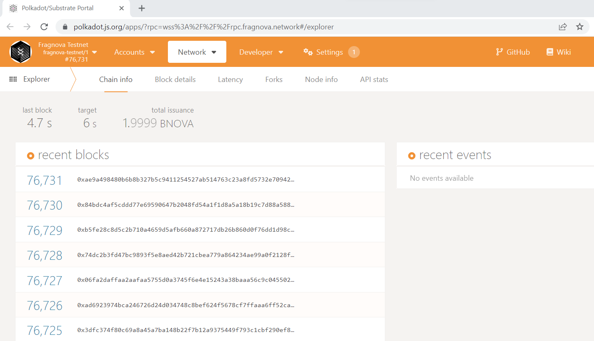
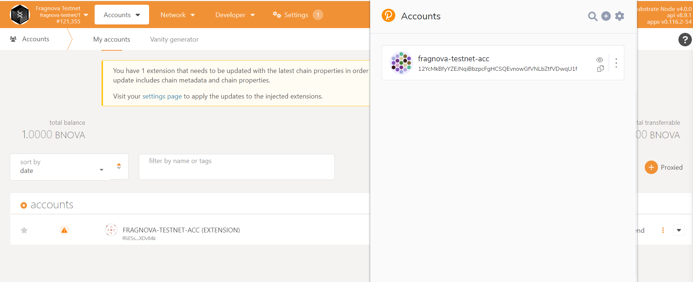
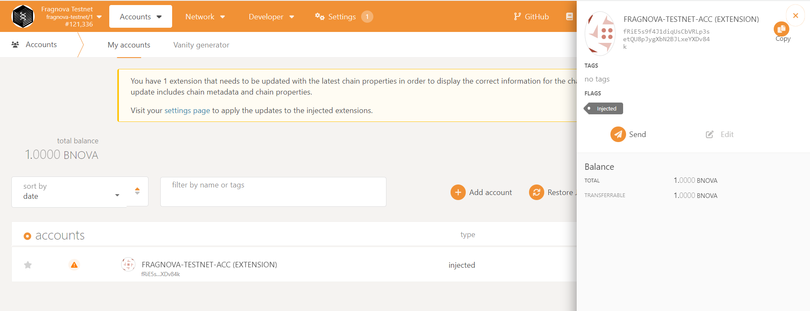
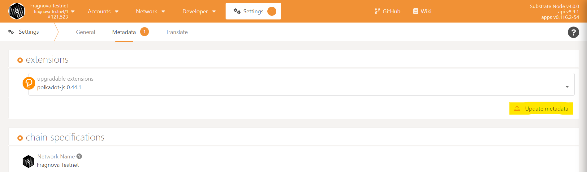
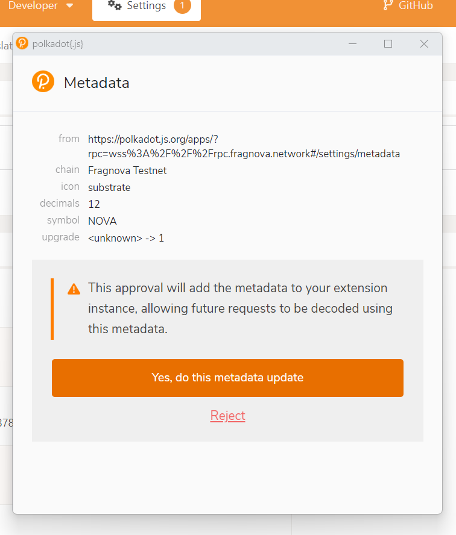
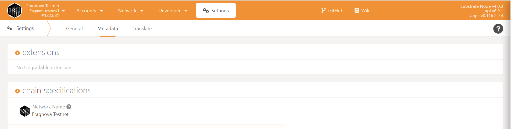

# Fragnova Testnet

This document will show you how to access and play around with Fragnova Testnet via Polkadot's App Explorer.

## Substrate, Polkadot, and Fragnova

[Substrate](https://substrate.io/) is the SDK with which you can build parachains and [Polkadot](https://polkadot.network/) is the means of securing the chains and allowing them to communicate with each other

[Fragnova](https://fragnova.com/) is our custom blockchain built on Substrate and our test network (testnet) is now deployed and connected to Polkadot.

## Accessing Fragnova testnet

Any custom blockchain network built on Substrate can be connected to Polkadot and accessed via Polkadot's web application, [App Explorer](https://polkadot.js.org/apps/).

Since Fragnova testnet is still being integrated with Polkadot's App Explorer menu use [this](https://polkadot.js.org/apps/?rpc=wss%3A%2F%2F%2Frpc.fragnova.network#/explorer) link to access our testnet.

## Get an account

You'll need a Substrate account to be use with the testnet.

### Create a Polkadot account

If you already have one then skip to the [next section](#account-address-transformations), else follow the instructions [here](https://wiki.polkadot.network/docs/learn-account-generation#polkadotjs-browser-extension) to create an account using Polkadot's secure browser extension.

### Account address transformations

Once your Polkadot account is created you can see it in the browser extension.

However, on the Polkadot App's Accounts page (`App Explorer` > `Header Menu` > `Accounts` > `Accounts`), you'll a difference account address, which is your Fragnova account.

Both these account addresses just different representations of your base account for different chains, based on the `ss58` prefix alloted to that chain. For example, all Polkadot accounts start with the `1` while all Fragnova accounts start with `fR`. 

You can read more about this account address transformation and `ss58` [here](https://wiki.polkadot.network/docs/learn-accounts#address-format) and [here](https://wiki.polkadot.network/docs/build-ss58-registry). 

So your Polkadot account and your Fragnova account addresses represent the same base account.

### Update chain metadata

You should also update your metadata to enable your Polkadot browser extension to parse and decode the raw call data instead of doing it manually via the Polkadot App > `Extrinsics` > `Decode` (more details [here](https://wiki.polkadot.network/docs/learn-accounts#decoding-call-data)).

To update your extension metdata for Fragnova go to `App Explorer` > `Header Menu` > `Settings` > `Metadata`.

On this page, click the `Update Metadata` button on the right side in the `extensions` pane.

A pop-up will open for confirmation.

After confirmation you'll see that the `Update metdata` button is no longer visible.

## Get some Nova

As this is a testnet you'll need some amount of test digital currency to be able to play around on the network.

Fragnova's digital currency is called Nova and you can get some test Nova on our Discord channel [X-Y-Z]() by sharing your Fragnova account address.

## Upload a proto

## Set proto metadata

## Fragnova marketplace

Marketplace landing page
https://staging-marketplace.fragnova.com/

Explore the creator store
https://staging-marketplace.fragnova.com/explore-creator-store

Paste the proto hash to access it directly
https://staging-marketplace.fragnova.com/proto-details/0c1eed25a385c08f22f789c7ac40502f50bb9eb0de924119acf33ce37eafaabc

--8<-- "includes/license.md"
