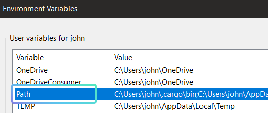
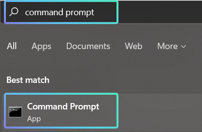

// TODO: Add guides for Mac and Linux.

# Start Developing

!!! note
    This guide is for new users unfamiliar with the installation process. 

    Click [here](#overview) to skip the tutorial and jump to the overview.


How-to start developing.

A guide for setting up the development environment to work with our projects.

## Code Editor ##

A code editor allows you to work with code more easily. We will be using Visual Studio Code (VS Code) for this tutorial. You can download it [here](https://code.visualstudio.com/download), and install it with the default settings.

!!! note
    You are free to use any code editor of your choice, although you will have to complete steps of this tutorial through alternate means.

## Setting up the GCC Compiler ##

A compiler translates human-readable code into machine code. We will be setting up the GCC compiler so that our code written in the human-readable C++ language can be understood by the computers!

First, [download MSYS2](https://www.msys2.org/) and install it with the default settings. MSYS2 helps to set up MinGW-w64, which uses the GCC compiler to create Windows programs.

When the MinGW terminal pops up, enter `pacman -Sy --needed --noconfirm base-devel mingw-w64-x86_64-toolchain mingw-w64-x86_64-cmake mingw-w64-x86_64-ninja mingw-w64-x86_64-clang mingw-w64-x86_64-lld wget`

This will install the Mingw-w64 toolset which includes GCC, and other build tools that will be employed later.

```
pacman -Sy --needed --noconfirm base-devel mingw-w64-x86_64-toolchain mingw-w64-x86_64-cmake mingw-w64-x86_64-ninja mingw-w64-x86_64-clang mingw-w64-x86_64-lld wget
```


Next, we will set the Mingw-w64 path to the environment variables. This will allow the terminal to search the Mingw-w64 directory for executables to run without requiring the user to specify the full address of the .exe each time.

Search for “Edit environment variables for your account.” in the Window’s search bar and select the option that appears.

!!! help
    You can also access the Environment Variables window from "Control Panel → User Accounts → User Accounts → Change my environment variables".

Double-click on “Path” under “User variables”.



In the “Edit environment variable” window, select “New” and add `C:\msys64\mingw64\bin` to the empty field that appears.
```
C:\msys64\mingw64\bin
```


## Rust ##

Rust is a programming language that we will be using. Install it [here](https://www.rust-lang.org/tools/install). 

Open up the Command Prompt. You can use the Windows Search Bar to find the Command Prompt application.



!!! tip
    You can check if Rust is properly installed by inputting `cargo –version` in the Command Prompt. 

    If a version number is printed, your installation was successful!
        ```
        cargo –version
        ```

Input `rustup default nightly` to use the nightly version of Rust. The nightly release is updated more frequently compared to the stable and beta versions.
	```
    rustup default nightly
	```

Input the command `rustup target add wasm32-unknown-unknown --toolchain nightly` to add support for building to web browsers.
	```
    rustup target add wasm32-unknown-unknown --toolchain nightly
	```

Use the `rustup update` command to update your installation. Since we are using the nightly release, you are encouraged to update often.
	```
    rustup update
	```
 

##  Git & GitHub ##

Git is a system used for managing and tracking changes in your code. It is also known as a Version Control System (VCS). It makes it easier for collaborators to work together, and allows you to access our projects too!

Install Git [here](https://git-scm.com/download). The installation settings can be left unchanged.

Although Git is powerful, it can be daunting to use on its own. Instead, we use GitHub, a service which employs Git’s version control with its own to make project collaboration much easier. 

Download GitHub for Desktop [here](https://desktop.github.com/). You can install it with the default settings, and create a GitHub account when prompted if you do not have one.


## VS Code Extensions ##

Launch Visual Studio Code and open the Extensions view (Ctrl+Shift+X). We will be installing a few extensions to facilitate our VS Code experience.


Search for and install the following extensions:

1. C/C++

2. rust-analyzer

3. CodeLLDB 

4. Better TOML

5. Calva

6. CMake

7. CMake Tools

8. YAML

## Overview ##

1. Install the [VS Code Editor](https://code.visualstudio.com/download)

2. Install [MSYS2](https://www.msys2.org/)

3. Install the Mingw-w64 toolset with the MinGW terminal
```
pacman -Sy --needed --noconfirm base-devel mingw-w64-x86_64-toolchain mingw-w64-x86_64-cmake mingw-w64-x86_64-ninja mingw-w64-x86_64-clang mingw-w64-x86_64-lld wget
```

4. Add the Mingw-w64 folder path to the user’s system path.
```
C:\msys64\mingw64\bin
```

5. Install [Rust](https://www.rust-lang.org/tools/install)

6. Set the Rust default build to nightly
```
rustup default nightly
```

7. Install the Rust Web Assembly toolchain
```
rustup target add wasm32-unknown-unknown --toolchain nightly
```

8. Update Rust
```
rustup update
```

9. Install [Git](https://git-scm.com/download)

10. Install [GitHub for Desktop](https://desktop.github.com/)

11. Install [Extensions for Visual Studio Code](#vs-code-extensions)


--8<-- "includes/license.md"
