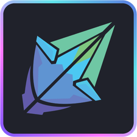

<!--  -->

{: style="height:240px;width:300px"}

# Welcome to Fragnova documentation!

Here at Fragnova, we're passionate about the potential of technology to change the way we interact with the world around us. 

We believe that we're on the brink of a major revolution, where traditional interfaces will be replaced by more flexible and intuitive virtual interfaces that can be seamlessly integrated into the user's environment.

To make this vision a reality, we're dedicated to creating programming tools that will empower developers to build the future.

## Ready to step into the world of Fragnova?

[Download](./download/){ .md-button .md-button--primary }

 

| | | |
| :----------: | :----------: |:----------: |
|[{: style="height:180px;width:180px"}](./learn/index.md)   [Getting Started](./learn/index.md) | [{: style="height:180px;width:180px"}](./learn/index.md)  [Shards](./learn/shards/index.md) | [{: style="height:180px;width:180px"}](./learn/rare-engine/index.md)  [Rare Engine](./learn/rare-engine/index.md)   Coming Soon! |
| | | |

*Use the search box above if you're looking for something specific.*

--8<-- "includes/license.md"

Built on {{ (git.date or now()).strftime("%b %d, %Y at %H:%M:%S") }} from commit [{{ git.short_commit }}](https://github.com/fragcolor-xyz/shards/commit/{{ git.commit }}).
