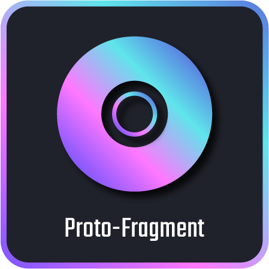
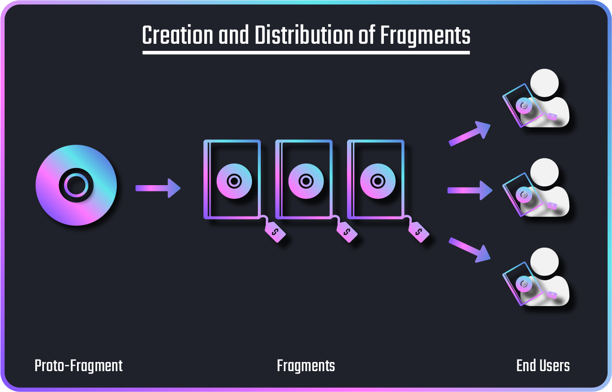

{ width=180 }

# The Fragnova Network

The Fragnova Network is a *fully decentralized blockchain* that allows game and application creators to *create and monetize their creations*.

Furthermore, the Fragnova Blockchain has been designed to allow creators to seamlessly integrate other user's creations in their own works - promoting collaboration amongst creators.

In Fragnova, a Creator can monetize his creations in any one of two ways:

1. Royalties

2. Direct Sales

Every Creation on the network is fully stored on-chain along with a record of its creator.

Before you can start exploring the interesting world of Fragnova, you must first acquaint yourself with two terms: *Proto-Fragments* and *Fragments*.

## What is a Proto-Fragment?

{ width=180 }

In Fragnova, any creation that is uploaded by its creator is known as a Proto-Fragment (also known as *Protos* for short). 

Each Proto uploaded must have its type specified by the creator.

The valid types are:

- Text

- Image

- Video

- Animation

- Full-Fledged Game

- Etc.

The creator has full ownership and control over any Proto uploaded and can decide on how exactly the Proto can be used by other creators.

For example he can determine his Proto's:

- Royalty Fee Structure

- License Type

## What are Fragments?

{ width=180 }

In the Fragnova Network, Fragments are the *end products* that are meant for the *end users*. They can be created from a Proto-Fragment.

If a creator wants to sell or distribute his Proto-Fragment to the end users, he must first create Fragments from his Proto-Fragment and then put the Fragments on sale. End users can then buy these Fragments.

??? Example 1
    If a creator of a game wants to sell his game to consumers, he will need to create Fragments from his Full-Fledged Game Proto-Fragment and put it on sale. If a consumer purchases one of the Fragments, they would effectively be the owner of one copy of the game.

??? Example 2
    If a creator of a painting wants to sell his painting to the end user, he will need to create Fragments from his Image Proto-Fragment and put it on sale. If a consumer purchases one of the Fragments, they would effectively be the owner of one copy of the painting.



## Interacting with the Fragnova Blockchain

To interact with the Fragnova Blockchain Network, you will need to send transactions to it. 

A *Pallet* consists of a group of related transactions.

In Fragnova, there are seven custom Pallets:

1. Protos Pallet
2. Fragments Pallet
3. Clusters Pallet
4. Aliases Pallet
5. Accounts Pallet
6. Detach Pallet
7. Oracle Pallet

### Protos Pallet

The [Protos Pallet](https://fragcolor-xyz.github.io/fragnova/doc/pallet_protos/index.html) contains transactions related to Proto-Fragments.

Some examples of the transactions include:

- [`protos.upload()`](https://fragcolor-xyz.github.io/fragnova/doc/pallet_protos/pallet/struct.Pallet.html#method.upload): Uploads a creation as a Proto-Fragment.

- [`protos.patch()`](https://fragcolor-xyz.github.io/fragnova/doc/pallet_protos/pallet/struct.Pallet.html#method.patch): Patch/updates an existing Proto-Fragment.

- [`protos.transfer()`](https://fragcolor-xyz.github.io/fragnova/doc/pallet_protos/pallet/struct.Pallet.html#method.transfer): Transfers the ownership of a Proto-Fragment.

- [`protos.set_metadata()`](https://fragcolor-xyz.github.io/fragnova/doc/pallet_protos/pallet/struct.Pallet.html#method.set_metadata): Sets the metadata of a Proto-Fragment.

### Fragments Pallet

The [Fragments Pallet](https://fragcolor-xyz.github.io/fragnova/doc/pallet_fragments/index.html) contains transactions related to Fragments.

Some examples of the transactions include:

- [`fragments.mint()`](https://fragcolor-xyz.github.io/fragnova/doc/pallet_fragments/pallet/struct.Pallet.html#method.mint): Creates Fragments from a Proto-Fragment.

- [`fragments.publish()`](https://fragcolor-xyz.github.io/fragnova/doc/pallet_fragments/pallet/struct.Pallet.html#method.publish): Puts Fragments on sale (primary sale).

- [`fragments.buy()`](https://fragcolor-xyz.github.io/fragnova/doc/pallet_fragments/pallet/struct.Pallet.html#method.buy): Buys a Fragment in a primary sale.

- [`fragments.give()`](https://fragcolor-xyz.github.io/fragnova/doc/pallet_fragments/pallet/struct.Pallet.html#method.give): Transfers the ownership of a Fragment .

- [`fragments.resell()`](https://fragcolor-xyz.github.io/fragnova/doc/pallet_fragments/pallet/struct.Pallet.html#method.resell): Puts a Fragment on sale (secondary sale).

- [`fragments.secondary_buy()`](https://fragcolor-xyz.github.io/fragnova/doc/pallet_fragments/pallet/struct.Pallet.html#method.secondary_buy): Buys a Fragment in a secondary sale.

### Clusters Pallet

The [Clusters Pallet](https://fragcolor-xyz.github.io/fragnova/doc/pallet_clusters/index.html) contains transactions related to *Clusters*.

A Cluster is a group of Fragnova Accounts. It can be associated with a Proto-Fragment when it is uploaded. This allows all Cluster Members to claim partial ownership of the Proto-Fragment.

An example of a Cluster transaction:

- [`clusters.createCluster()`](https://fragcolor-xyz.github.io/fragnova/doc/pallet_clusters/pallet/struct.Pallet.html#method.create_cluster): Creates a Cluster.

### Aliases Pallet 

The [Aliases Pallet](https://fragcolor-xyz.github.io/fragnova/doc/pallet_aliases/index.html) contains transactions related to human-readable aliases for Proto-Fragments or Fragments.

Examples of the transactions:

- [`aliases.createAlias()`](https://fragcolor-xyz.github.io/fragnova/doc/pallet_aliases/pallet/struct.Pallet.html#method.create_alias): Creates a human-readable alias for a Proto-Fragment or a Fragment.

- [`aliases.deleteAlias()`](https://fragcolor-xyz.github.io/fragnova/doc/pallet_aliases/pallet/struct.Pallet.html#method.delete_alias): Deletes an existing human-readable alias for a Proto-Fragment/Fragment.

### Accounts Pallet

The [Accounts Pallet](https://fragcolor-xyz.github.io/fragnova/doc/pallet_accounts/index.html) contains transactions related to Fragnova Accounts.

Transaction examples:

- [`accounts.link()`](https://fragcolor-xyz.github.io/fragnova/doc/pallet_accounts/pallet/struct.Pallet.html#method.link): Links your Fragnova Account with your Ethereum Account.

- [`accounts.unlink()`](https://fragcolor-xyz.github.io/fragnova/doc/pallet_accounts/pallet/struct.Pallet.html#method.unlink): Unlinks your Ethereum Account from your Fragnova Account.

### Detach Pallet

The [Detach Pallet](https://fragcolor-xyz.github.io/fragnova/doc/pallet_detach/index.html) contains transactions relating to the detaching of a Proto or Fragment from the Fragnova Blockchain to an External Blockchain.

### Oracle Pallet

The [Oracle Pallet](https://fragcolor-xyz.github.io/fragnova/doc/pallet_oracle/index.html) contains transactions related to oracles.

### Substrate Pallets

Apart from the seven custom Pallets, the Fragnova Network also contains the following Substrate Pallets:

1. [Balances Pallet](https://paritytech.github.io/substrate/master/pallet_balances/index.html) contains transactions related to NOVA. NOVA is the native currency of the Fragnova Blockchain.

2. [Contracts Pallet](https://paritytech.github.io/substrate/master/pallet_contracts/index.html) contains transactions related to the uploading and calling of smart contracts on the Fragnova Blockchain.

3. [Assets Pallet](https://paritytech.github.io/substrate/master/pallet_assets/index.html) contains transactions related to user-created fungible tokens.

!!! note
    The transactions listed above are only a subset of all available transactions on the Fragnova Network. They have been chosen for illustration purposes.
    
    To view all the available transactions and the exact parameters needed for each transaction, you can visit Fragnova's [Extrinsics Page](https://polkadot.js.org/apps/?rpc=wss%3A%2F%2Fws.fragnova.network#/extrinsics) or the [Rust Developer Documentation](https://fragcolor-xyz.github.io/fragnova/).

!!! note
    These pallets have been provided by the [Substrate Framework](https://docs.substrate.io/reference/frame-pallets/). Since the Fragnova Network was built using the Substrate Framework, it can use these pallets.

## JavaScript/TypeScript SDK

!!! warning
    Please read [Interacting with the Fragnova Blockchain](#interacting-with-the-fragnova-blockchain) before this section.

You can use the NPM package [@fragnova/api-augment](https://www.npmjs.com/package/@fragnova/api-augment) to interact with the Fragnova Blockchain using JavaScript/TypeScript.

### Installation

Install the following 2 NPM packages:

=== "Code"

    ```bash
    npm install @fragnova/api-augment && npm install @polkadot/api@9.14.2 
    ```

### Connecting to a Fragnova Node

To connect to the Fragnova Node with the websocket endpoint `"ws://ws.fragnova.network"`, you can do as follows:

=== "Code"

    ```typescript
    npm install @fragnova/api-augment && npm install @polkadot/api@9.14.2 
    import { options } from "@fragnova/api-augment";
    import { ApiPromise, WsProvider, Keyring } from '@polkadot/api';
    import { Vec, U8aFixed } from "@polkadot/types-codec";

    const api = await ApiPromise.create({
        provider: new WsProvider("ws://ws.fragnova.network"),
        ...options,
    });
    ```

### Interacting with the Fragnova Blockchain

Once your `api` variable is connected, you are ready to interact with the Fragnova Blockchain.

To call a transaction from a pallet, you must adhere to the following format:

=== "Code"

    ```typescript
    api.tx.<pallet>.<transaction>
    ```

For example, if you want to call the transaction `upload` from the pallet `protos` and upload the plain text data `"Hello World!"` as a Proto-Fragment using your Fragnova Account `alice` - you can do as follows:

=== "Code"

    ```typescript
    const keyring = new Keyring({type: 'sr25519'});
    keyring.setSS58Format(93);
    const alice = keyring.addFromUri('//Alice');

    const references: Uint8Array[] = [];
    await api.tx.protos.upload(
        references as Vec<U8aFixed>,
        {Text: 'Plain'},
        [],
        null,
        'Closed',
        null,
        {Local: "Hello World!"}
    ).signAndSend(alice)

    ```

Volia! You have successfully sent a transaction to the Fragnova Blockchain!

For more details on usage, please see the [Polkadot API library documentation](https://polkadot.js.org/docs/api).

--8<-- "includes/license.md"
