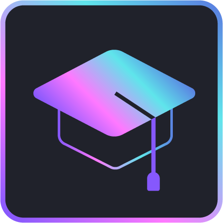

{ width=180 }

# Learn

Ready to learn more about our organization's various projects and initiatives? Check out our primers and tutorials! They're a valuable resource for anyone who wants to get involved and make a difference with our projects.

Our primers are comprehensive guides that provide a detailed introduction to our projects. They cover everything you need to know to get started and are a great way to get up to speed quickly.

Our tutorials, on the other hand, are more focused on practical application and techniques. If you're more interested in getting your hands dirty and learning practical skills, then our tutorials are what you need. They take you step-by-step through specific tasks or projects, with easy-to-follow instructions and examples.

Begin by navigating to the project you wish to learn more about:

- [Shards](./shards/)

- Rare Engine (Coming Soon!)
<!-- - [Rare Engine](./rare-engine/) -->

--8<-- "includes/license.md"
