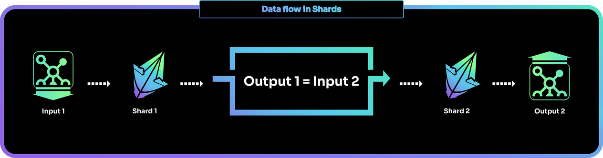
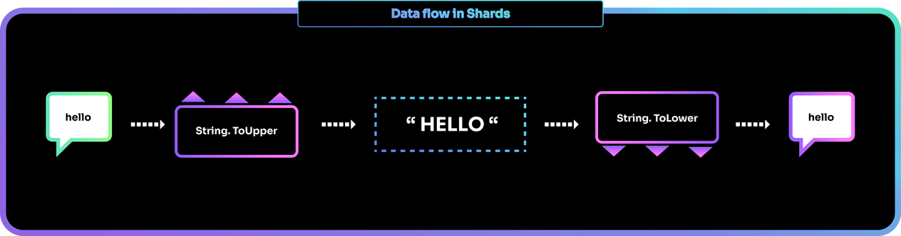
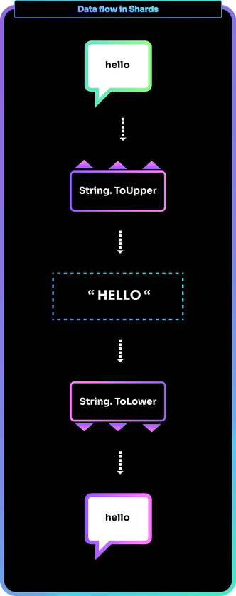

# Anatomy of a shard

Shards are the Shards language's built-in chunks of data transformation logic. It's these that give Shards its highly visual nature.

## Input and output

A shard is always written as enclosed within a set of curved brackets (parentheses).

For example, the shard [`(Math.Sqrt)`](https://docs.fragcolor.xyz/shards/Math/Sqrt/) computes the square root of a number.

```clj
(Math.Sqrt)
```

Shards expect their input to come from outside of their parentheses. Either from the left side:
```clj
9 (Math.Sqrt)
```

Or from the line above:
```clj
9
(Math.Sqrt)
```

Similarly, a shard can be visualised as placing its computed output either to it's right (outside its parentheses):
```clj
9 (Math.Sqrt)   ;; output => 3 ;;
```

Or in the line below it:
```clj
9
(Math.Sqrt)
;; output => 3 ;;
```

Since the output of a shard is available to its right (or below it), and a shard processes input from its left (or from above it) - if we were to place a shard after (or below) the first shard, the 2nd shard would process the output created by the first shard (more on this [later](#data-flow)).

Let's use this fact to run some actual code (*Code example 7* below) and print the output of the `(Math.Sqrt)` shard to the standard output (i.e., the terminal screen). We'll use the shard `(Log)` for this, as this shard takes its input and prints it to the terminal screen.

*Code example 7*

=== "EDN"

    ```{.clojure .annotate linenums="1"}
    ;; input coming in from left, output going out from the right
    9.0 (Math.Sqrt) (Log)     ;; `Log` processes output of `(Math.Sqrt)` => 3.0

    ;; input coming in from top, output being placed below
    9.0             ;; input
    (Math.Sqrt)     ;; shard
    (Log)           ;; `Log` processes output of `(Math.Sqrt)` => 3.0

    ;; mixed syntax
    9.0 (Math.Sqrt) ;; input and shard
    (Log)           ;; `Log` processes output of `(Math.Sqrt)` => 3.0
    ```
    
=== "Result"

    ```
    [info] [2022-07-25 22:51:00.768] [T-2664] [logging.cpp::55] [mywire] 3
    [info] [2022-07-25 22:51:00.773] [T-2664] [logging.cpp::55] [mywire] 3
    [info] [2022-07-25 22:51:00.774] [T-2664] [logging.cpp::55] [mywire] 3
    ```

## Parameters

Besides the main input coming in from the left side, a shard may also take additional inputs or controls via *parameters*. Parameters are additional data that is needed by the shard to process its input.

Parameters may be mandatory or optional. Mandatory parameters are needed for the shard to work and hence a value has to be passed to them. Optional parameters do not necessarily need a value and empty optional parameters are ignored by the shard.

Unlike input and output, a shard's parameters need to be defined/placed inside the shard's parentheses. For example, `(Log)` has an optional parameter (that's why `(Log)` worked without any parameter value in the last code example) - `:Prefix`: prefixes `(Log)`'s output.

The following code example illustrates this.

*Code example 8*

=== "EDN"

    ```{.clojure .annotate linenums="1"}
    9.0             ;; input
    (Math.Sqrt)     ;; shard
    ;; `Log` attaches prefix string to its output => My output is: 3.0
    (Log :Prefix "My output is" )

    ;; mixed syntax
    9.0 (Math.Sqrt) ;; input and shard
    ;; `Log` attaches prefix string to its output => My output is: 3.0
    (Log :Prefix "My output is" )  ;; `Log` prints => My output is: 3.0
    ```
    
=== "Result"

    ```
    [info] [2022-07-25 23:07:27.319] [T-2316] [logging.cpp::53] [mywire] My output is: 3
    [info] [2022-07-25 23:07:27.328] [T-2316] [logging.cpp::53] [mywire] My output is: 3
    ```

**Position and Keywords**

Parameters in Shards are positional if you're not using keywords, i.e., if you skip the keywords and directly put the value in the shard it will work as long as you maintain the position of the parameter w.r.t other parameters in the shard (though it's a good idea to keep keywords in for readability).

For example, the shard [`(Table)`](https://docs.fragcolor.xyz/shards/General/Table/), which creates a new/empty table with one key, has four parameters:
```{.clojure .annotate linenums="1"}
(Table
  :Name [(String) (ContextVar [(Any)])]
  :Key [(String) (ContextVar [(String)]) (None)]
  :Global [(Bool)]
  :Types [(Enum) (Seq [(Enum)]) (Seq [(Enum) (Seq [(Enum)]) (Self)])]
)
```

So, assuming we're using all the parameters and their keywords, you'd write it out like this:
```{.clojure .annotate linenums="1"}
(Table
    :Name "my-table"
    :Key "Key-1"
    :Global true 
    :Types Type.Float)

.my-table (Log) ;; => {Key-1: {}}
```

If you retain the keywords, the positions of the parameters don't matter. The following is valid too:
```{.clojure .annotate linenums="1"}
(Table
    :Global true
    :Name "my-table"
    :Types Type.Float
    :Key "Key-1")

.my-table (Log) ;; => {Key-1: {}}
```

If you drop the parameter keywords, then you have to maintain the original positions of the parameters (else how will Shards know which value is for which parameter?). The following two codes are valid:
```{.clojure .annotate linenums="1"}
(Table
    "my-table"
    "Key-1"
    true
    Type.Float)

.my-table (Log) ;; => {Key-1: {}}
```
OR

```{.clojure .annotate linenums="1"}
(Table "my-table" "Key-1" true Type.Float)

.my-table (Log) ;; => {Key-1: {}}
```

But this code isn't (this will give errors as there are no parameter keywords and the parameter positions are wrong):
```{.clojure .annotate linenums="1"}
(Table
    true
    "Key-1"
    Type.Float
    "my-table")

;; errors => 
;; [error] [2022-07-26 13:11:23.530] [T-12896] [SHCore.cpp::1113] Parameter validation failed: Parameter not accepting this kind of variable (Bool) shard: Table
;; [error] [2022-07-26 13:11:23.538] [T-12896] [SHCore.cpp::1156] Failed parameter index: 0 line: 32   
Error: Parameter validation failed
```

## Data flow

Shards are composed by default. When you place a shard next to another (to its right or just after it in the next line), this shard that you just placed takes the output of the existing shard (which is to its left or above it) as its input.

For example:
```
(sh1) (sh2) (sh3) (sh4)
```
or this:
```
(sh1)
(sh2)
(sh3)
(sh4)
```
is equivalent to the composition:
```
(sh4 (sh3 (sh2 (sh1))))
```

Typically, shards code is written in a mixed form of the first two syntax forms.

Here's an example snippet from our [Snake tutorial](https://learn.fragcolor.xyz/snake/).

```{.clojure .annotate linenums="1"}
(Count .snake) (Math.Subtract 1) >= .head-idx
                     .snake (Take .head-idx) >= .head
                     ; snake eats its own body?
                     (When (-> .snake (IndexOf .head) (IsNot .head-idx))
                           (-> true > .game-over))
                     ; snake hits a wall?
                     (When (-> .head (Take 0) (IsLess 0) (Or) (Take 0) (IsMoreEqual grid-cols)
                               (Or)
                               .head (Take 1) (IsLess 0) (Or) (Take 1) (IsMoreEqual grid-rows))
                           (-> true > .game-over))
```

As you can see, this syntax maps very nicely to the linear left-to-right data flow that we discussed in the [What is code?](../introduction/#what-is-code) section (Figure 3). 

To see this similarity better, let's convert the code above into a flow diagram.

Figure 11



To explore this concept further, let's consider an example using two transformations: 

* convert lower case characters to upper case (the shard `String.ToUpper`)
* and then, convert upper case characters back to lower case (the shard `String.ToLower`)

Laying out these transformations from left to right, we get a sense of how the data flows along the transformation blocks.

Figure 12



The equivalent Shards code fragment:
```{.clojure .annotate linenums="1"}
"hello" (String.ToUpper) (String.ToLower)
```

would produce the output:
```{.clojure .annotate linenums="1"}
"hello"
```

Now, if you stack the shards vertically instead of laying them down horizontally, the code would still work.

Figure 13



The flow of the data would become top-to-bottom but the transformations and the output would remain the same. 

So this code fragment:
```{.clojure .annotate linenums="1"}
"hello" 
(String.ToUpper)
(String.ToLower)
```
would still produce:
```{.clojure .annotate linenums="1"}
"hello"
```

As would this code fragment:
```{.clojure .annotate linenums="1"}
"hello" (String.ToUpper)
(String.ToLower)
```

or this one:
```{.clojure .annotate linenums="1"}
"hello" 
(String.ToUpper) (String.ToLower)
```

Hence, the flow of data in shards can be thought of as left-to-right, top-to-bottom, or a mix of the two.

## Null input and passthrough

Sometimes you may want a shard to *not* process the input coming to it from the previous shard. This can be done by inserting a `nil` constant (basically a nil/ null/ nothing value) in between the two shards, effectively overwriting the output coming in from the previous shard with a null value. You can declare a nil constant by using the keyword [`(Const)`](https://docs.fragcolor.xyz/shards/General/Const/).

In the following code example `(Const nil)` overwrites the output of `(Math.Sqrt)` (value 3.0) preventing it from reaching the next shard, `(Log)`. Since `(Log)` now receives a 'nothing' value (courtesy `nil`), it prints nothing to the screen.

*Code example 9*

=== "EDN"

    ```{.clojure .annotate linenums="1"}
    9.0 (Math.Sqrt)     ;; output of `Math.Sqrt` => 3.0  
    (Const nil) (Log)   ;; `nil` blocks value 3.0 and passes null to `Log`, which then prints => None
    ```
    
=== "Result"

    ```
    [info] [2022-07-25 23:37:49.720] [T-16580] [logging.cpp::55] [mywire] None
    ```

On the other hand, sometimes you may want a shard's input to be available to the shard after the next.

Suppose have three shards such that *shard1* takes 'a' as input and after passing through *shard2* and *shard3* this 'a' becomes 'd':
```
(a) -> shard1 -> (b) -> shard2 -> (c) -> shard3 (d)
```

Now assume you need *shard3* to receive output from *shard1* ('b') instead of output from *shard2* ('c').

This can be done with the `:Passthrough` parameter. If a shard has this parameter and you set it to `true`, that shard will pass as its output whatever it received as its input (its own output will be computed but will not be passed to the next shard). As a result, the data 'passes through' one full shard and becomes the input for the next shard.

Going back to our example above, let's also assume that *shard2* has a passthrough parameter and we have set it to `true`. Now, *shard2* will still take in input 'b' and compute 'c' internally, but because of passthrough being in effect, it will instead pass 'b' as its output to *shard3*.
```
(a) shard1 -> (b) -> shard2 -> (c) |:| (b) -> shard3 (e)
```

You'll notice that *shard3*'s output has changed since it's now processing 'b' as input instead of processing 'c'.

Let's illustrate this with a real Shards example.

[`(Assert.IsNot)`](https://docs.fragcolor.xyz/shards/Assert/IsNot/) has passthrough permanently enabled (it cannot be turned off). So in the following code, `(Assert.IsNot)` still does its job (compares its input value 8 with its parameter value 7 and concludes assertion is `true`), but letting its input (value 8) passthrough itself as its output and become the input for the next shard, `(Log)`.

*Code example 10*

=== "EDN"

    ```{.clojure .annotate linenums="1"}
    8                   ;; input for `Assert.IsNot`
    (Assert.IsNot 7)    ;; assertion `true` (8 is not equal to 7) so no error; input passed as own output
    (Log)               ;; passthrough true so `Log` receives value 8 as input form `Assert.IsNot`, so prints => 8
    ```
    
=== "Result"

    ```
    [info] [2022-07-25 23:53:43.609] [T-25300] [logging.cpp::55] [mywire] 8
    ```

For `(Asset.IsNot)` passthrough is default switched on and cannot be changed, but for [`(Match)`](https://docs.fragcolor.xyz/shards/General/Match/) it's a controllable parameter.

In the code example below, passthrough has been turned on for `(Match)` and is already enabled for `(Assert,IsNot)`. As a result, the input to `Match` (value 1) passes through both these shards and ends up as input for `(Log)`, which prints it to the terminal screen.

*Code example 11*

=== "EDN"

    ```{.clojure .annotate linenums="1"}
    1
    (Match [
            nil (-> (Msg "Matched nil"))     ;; case processed, match found
            1 (-> (Msg "Matched 1"))         ;; case ignored
            (+ 0 1) (-> (Msg "Matched 1a"))  ;; case ignored
            2 (-> (Msg "Matched 2"))]        ;; case ignored
        :Passthrough true)                   ;; passthrough turned on --
    (Assert.IsNot 10 true)                   ;; -- so input to `Match` is also input to `Assert.IsNot`
    (Log)                                    ;; passthrough for `Assert.IsNot` too, so `Log` receives value 1 as input, prints it => 1
    ```
    
=== "Result"

    ```
    [info] [2022-07-25 23:59:01.693] [T-9688] [logging.cpp::98] [mywire] Matched nil
    [info] [2022-07-25 23:59:01.701] [T-9688] [logging.cpp::55] [mywire] 1
    ```

!!! note
    1. The shard [`(Sub)`](https://docs.fragcolor.xyz/shards/General/Sub/) can simulate passthrough for other shards. See the section [KISS and `(Sub)`](../control-flow/#kiss-and-sub) for more.
    2. The mathematics expression shown in this example, `(+ 0 1)`, uses the prefix notation (AKA [Polish notation](https://en.wikipedia.org/wiki/Polish_notation)). More on this in the section [Do your sums](../manipulate-data/#do-your-sums).


--8<-- "includes/license.md"
