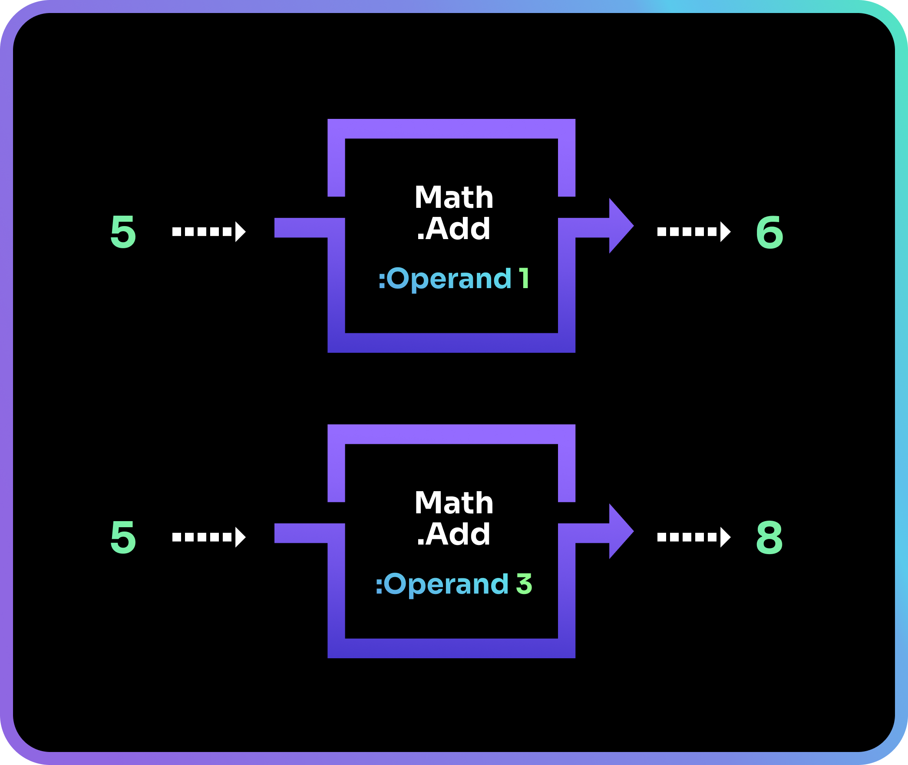
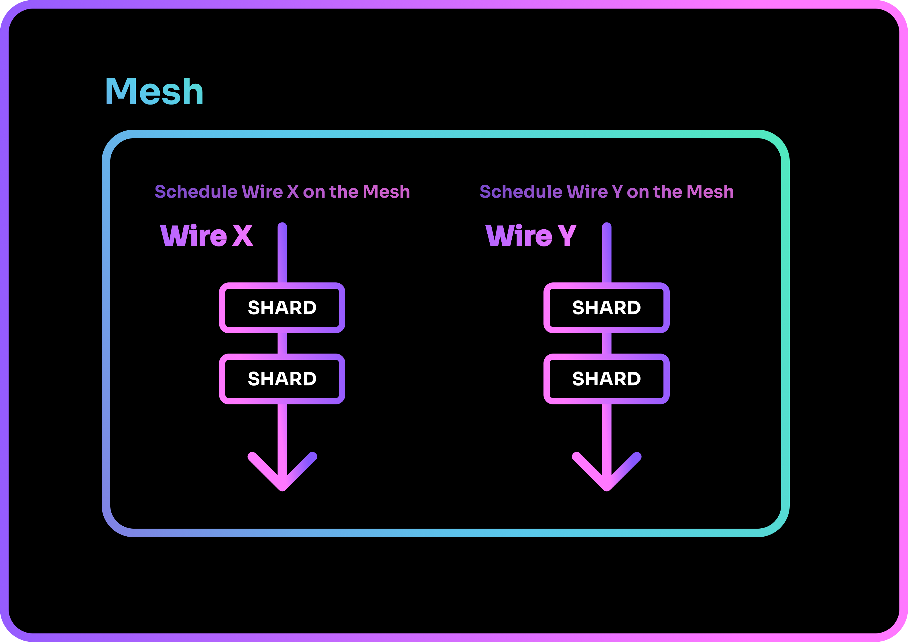

# Coding with Shards

In this chapter, we will be learning how to code with Shards so that you can write your very own program!

## The shard

A shard in its most basic code form consists of its name and parameters(when applicable).

```shards
Math.Add(Operand: 1)

Msg("Hello")

Wait(Wire: main-gfx Timeout: 2.0)
```

The above example consists of 3 different predefined shards.

Shards are named to make their purpose rather intuitive. [`Msg`](../../../../reference/shards/shards/General/Msg) is the Message shard that prints a message to the console, while [`Math.Add`](../../../../reference/shards/shards/Math/Add/) is a Mathematics shard that adds numbers together.

A shard can take in an input, process that input, and produce an output. Shards also have *parameters* that behave as user-defined settings.

For example, `Math.Add` has the parameter `Operand` which is defined by the user. It determines the value that will be added to the input. The final result is then produced as the output.



In code form, parameters are defined by the user within the parentheses after the shard's name. The above examples will appear as `5 Math.Add(Operand: 1)` and `5 Math.Add(3)` in code. 
 
Some shards have multiple parameters. When specifying values for multiple parameters, you will have to prepend your values with the parameter they are for if some parameters are skipped.

Let us take a look at the [`Repeat`](../../../../reference/shards/shards/General/Repeat/) shard which has four parameters: `Action`, `Times`, `Forever`, `Until`.

We can utilize the `Repeat` shard with its different parameters as shown:

=== "1 Parameter (Implicit)"

    ```shards
    Repeat({
        Msg("Hello World")
    }) // (1)(2)
    ```

    1. When no parameters are specified, parameters are treated as *implicit* and are resolved in order. In this case, `Action` is the implicit parameter for `Repeat` and we set `Msg("Hello World")` to it.
    2. Since the other parameters are not defined, they will assume their default values. In this case, the `Repeat` shard will not run at all as `Times` has a default value of 0.

=== "2 Parameters (Explicit)"

    ```shards
    Repeat(
        Action: {Msg("Hello World!")} // (1)
        Times: 2
    ) // (2)
    ```

    1. The parameters are explicitly declared for clarity.
    2. Repeats the `Action` twice.

=== "2 Parameters (Implicit)"

    ```shards
    Repeat( // (1)
        {Msg("Hello World!")}
        2
    )
    ```

    1. Both parameters can be implicit since they are resolved in order. In this case, `Action` is the first implicit parameter, and `Times` is the second implicit parameter.

=== "2 Parameters (Implicit 1st)"

    ```shards
    Repeat(
        {Msg("Hello World!")} // (1)
        Times: 2
    )
    ```

    1. You can still implicitly declare the first parameter, while fully declaring the other parameters. Note that it does not work vice versa. You cannot implicitly declare parameters if a parameter before it has been explicitly declared.

=== "(INCORRECT) 2 Parameters (Implicit 2nd)"

    ```shards
    Repeat(
        Action: {Msg("Hello World!")} 
        2
    ) // (1)
    ```

    1. This will not work as you cannot implicitly declare the second parameter if the first has been fully declared.

=== "3 Parameters (Explicit)"

    ```shards
    Repeat(
       Action: Msg("Hello World!")
       Forever: true // (1)
       Until: { // some condition }
       ) // (2)
    ```

    1. The `Times` parameter is skipped and `Forever` is declared instead. Since we are skipping a parameter, we must fully declare the parameters that come after it.
    2. `Until` takes a shard that returns `true` or `false`. `Repeat` will loop forever until the shard specified in `Until` evaluates to `true`.

!!! note "`{}`"
    When using groups of shards for a parameters (e.g., `Action`), you must place those shards in a `{}` container or an error will be thrown.

To find out more about the input/output/parameter of a shard, you can search for the shard in the search bar above and check out its documentation page.

!!! note "Give it a try!"
    Type "Msg" in the search bar above and select the first result that appears. It should lead you to the page for `Msg` [here](../../../../reference/shards/shards/General/Msg/).

    From there, you can learn more about:

    * The purpose of the shard

    * Its parameters

    * The input type it can receive

    * The output it will produce

    * How to utilize the shard by looking at the examples given

## Data Types

A shard can take in data, process it, and output the results.


There are many different types of data in the Shards language, and each shard will have specific data types that it can work with. 

For example, the [`Math.Add`](../../../../reference/shards/shards/Math/Add/) shard can only work with numeric data types, while the [`Log`](../../../../reference/shards/shards/General/Log/) shard that prints information to the console can work with `Any` data type.

Here are some of the data types found in Shards:

| Data Type   | Description                                            | Example           |
| :---------- | :----------------------------------------------------- | :---------------- |
| `Any`       | Any data type.                                         |                   |
| `None`      | No data type.                                          |                   |
| `Bool`      | Evaluates to either `true` or `false`.                 | `true`, `false`   |
| `Float`     | A numerical value with a decimal point.                | `2.53`, `-9.124`  |
| `Int`       | A numerical value with no decimals. Read as "integer". | `2`, `-9`         |
| `Sequence`  | A collection of values.                                | `[2.5, -9.1, 9.7]`|
| `String`    | Characters enclosed by double quotes.                  | "A string!"       |
| `Wire`      | A sequence of shards.                                  |                   |

!!! note
    A shard can have multiple data types as its input and output. For example, the shard `Math.Add` can have its input and output as an `Int`, or it can have its input and output as a `Float`.

For the full list of data types and more in-depth reading, check out the `Types` documentation page [here](../../../../reference/shards/shards/types/).

## Variables

To better work with data across your code, we can assign them to data containers known as *variables*.

Imagine a scenario where you have a float `3.141592653589793` that you need to reuse in code multiple times. Instead of typing out the entire float each time, you could assign it to a variable called `pi-value` and simply use that variable whenever it is needed.

=== "Without Variables"

    ```shards
    3.141592653589793 | Math.Add(3.141592653589793) | Math.Multiply(3.141592653589793) | Math.Subtract(3.141592653589793)
    ```

=== "With Variables"

    ```shards
    3.141592653589793 = pi-value // (1)
    pi-value | Math.Add(pi-value) | Math.Multiply(pi-value) | Math.Subtract(pi-value)
    ```

    1. 3.141592653589793 is assigned to the variable `pi-value`. We'll learn more about assigning variables in a bit!

Some example of variable names:

- `x`

- `number-of-apples`

- `is-verified` 

How you assign data to variables depends on the variable type. The main differences between variables are as follows:

- Constant vs Mutable

    - Constant: The variable's value cannot be changed once defined.

    - Mutable: The variable's value can be changed.

- Local vs Global

    - Local: The variable is only known within the Wire it originated from.

    - Global: The variable is known throughout the entire Mesh.

!!! note "Local vs Global"
    We will learn more about this later in the section about [Scope](../working-with-data/#scope) in Shards.

Here are the variable types and the symbols used to create and assign to them:

| Variable Type   | Shard       | Alias  | Description                          |
| :-------------- | :---------- | :----- | :----------------------------------- |
| Local, Constant | `Ref`       | `=`    | Creates a local constant variable.   | 
| Local, Mutable  | `Set(Global: false)`       | `>=`   | Creates a local mutable variable.    |
| Global, Mutable | `Set(Global: true)`       | none | Creates a global mutable variable.   |
| Mutable         | `Update`    | `>`    | Updates a mutable variable.          |

In summary:

- Use `=` to create **constant** variables.

- Otherwise, use `>=` to create **local** variables.

- Use `>` to update variable values.

When defining variables in your program, you can use `Once` to ensure that variables defined within it will only ever be defined once within a program.

=== "Defining Variables in Once"

    ```shards
    Once({
     10 >= timer
     100 >= max-points
    }) // (1)
    ```

    1. Code within a `Once` will only be run once. As such, you can prevent variables defined in a loop from being reset each time.

## Grouping shards

[`@define`](../../../reference/shards/built-ins/macros-templating.md) Creates a named definition in the current environment. These definitions can then be used inline in your script for substitution. By creating a named definition using a group of shards, you can reduce repeating huge chunks of code and improve readability.

<!-- `@define` has a syntax as such:

=== "Creating @define"

    ```shards

    @define( message-groups {
        Msg("Hello World 1")
        Msg("Hello World 2")
     }
    )
    ```

When used in code:

=== "Using @define"

    ```shards
    @send-message("Hello World!")
    ``` -->

[`@template`](../../../reference/shards/built-ins/macros-templating.md) similarly allows you to group shards together to create a definition in the current environment. `@template` however allows you pass parameters into the new shard.

<!-- === "Creating @template"

    ```shards

    @template(send-message [message] {
        Msg ("Message Incoming...")
        Msg(message)
    })
    ```

When used in code:

=== "Using @template"

    ```shards

    @send-message("Hello World!")
    ```

=== "Result"

    ```shards

    Message Incoming...
    Hello World!
    ``` -->

Let us now take a look at how we can utilize `@define`. Let's say we have a player that can be damaged by different sources.

=== "Code"
    
```shards

@wire(main-game {
	Once({
		40 >= current-player-health // initializing our player health variable
	})

	Msg("Player gets damaged by monster!")
	current-player-health | Math.Subtract(10) > current-player-health
	current-player-health | Log("Player's Current Health")

	Msg("Player gets damaged by trap!")
	current-player-health | Math.Subtract(10) > current-player-health
	current-player-health | Log("Player's Current Health")

	Msg("Player gets damaged by harsh environment!")
	current-player-health | Math.Subtract(10) > current-player-health
	current-player-health | Log("Player's Current Health")
} Looped: false)
```

We can replace code that is repeated in the `Action` parameter above with a `@define` to make it less verbose and more readable.

=== "Using @define"
    
```shards

@define(damage-player {
	current-player-health | Math.Subtract(10) > current-player-health
	current-player-health | Log("Player's Current Health")
})

@wire(main-game {
	Once({
		40 >= current-player-health // initializing our player health variable
	})

	Msg("Player gets damaged by monster!")
	@damage-player

	Msg("Player gets damaged by trap!")
	@damage-player

	Msg("Player gets damaged by harsh environment!")
	@damage-player
} Looped: false)
```

Currently the `@damage-player`definition we created can only do 10 damage to the player. If we want to vary the amount of damage that can be done, we can instead use `@template`

=== "Using @template"
```shards
@template(damage-player [damage-amount] {
	current-player-health | Math.Subtract(damage-amount) > current-player-health
	current-player-health | Log("Player's Current Health")
})

@wire(main-game {
	Once({
		40 >= current-player-health // initializing our player health variable
	})

	Msg("Player gets damaged by monster!")
	@damage-player(10)

	Msg("Player gets damaged by trap!")
	@damage-player(5)

	Msg("Player gets damaged by harsh environment!")
	@damage-player(2)
} Looped: false)
```


## Manipulating Evaluation Order

In shards there are a few clever tools you can employ to manipulate the evaluation order should you need to.

### Parentheses
By default, Shards evaluates pipelines from left to right. Parentheses let you group expressions so a section is evaluated first, and its result is then passed to the surrounding pipeline.

=== "Parenthesis equivalent"

```shards
1 | Math.Add((3 | Math.Subtract(1))) // Is the same as ...

3 | Math.Subtract(1) = x
1 | Math.Add(x)
```

### \#

When you prefix a parenthesized expression with `#`, eg. `#(3 | Math.Add(2))`, it evaluates at [construct time](shards-lifecycle.md) and embeds the resulting value.

=== "Const Evaluation"

```shards
#(3 | Math.Add(2)) // this will be evaluated at construct time.
```

!!! note "Pipeline `|`"
		Shards evaluates pipelines left → right. The `|` is optional sugar that visually separates steps; it does not change semantics.

		=== " `|` sugar"
		```shards
		3 Math.Add(1) // is the same as
		3 | Math.Add(1)
		```

## The Wire

A Wire is made up of a sequence of shards, queued for execution from left to right, top to bottom.


To create a Wire, we use [`@wire`](../../../../reference/shards/lisp/macros/#defwire).

=== "Creating a Wire"
    
```shards
@wire( wire-name 
	// shards here
)
```

!!! note
    `@wire` inherits variables from the parent wire unless the variables are pure.

!!! note
    Unlike `@define` which group shards up for organization, `@wire` groups shards up to fulfill a purpose. As Wires are created with a purpose in mind, they should be appropriately named to reflect it.

A Wire's lifetime ends once the final shard within it has been executed. To keep a Wire alive after it has reached its end, we can set it to be loopable. This is called a Looped Wire.


A Looped Wire will continue running until its exit conditions have been met.

!!! note
    You will learn more about the entering and exiting of Looped Wires in the next chapter!

To create a Looped Wire, we use @wire with its `Looped` parameter set to true.

=== "Creating a Looped Wire"
    
```shards
@wire(loop-name {
 // shards here
}Looped: true)
```

## The Mesh

Wires are queued for execution within a Mesh, from left to right, top to bottom.


To queue a Wire on a Mesh, we use [`@schedule`](../../../../reference/shards/lisp/misc/#schedule).

=== "Scheduling a Wire"
    
```shards
@schedule(mesh-name wire-name)
```

!!! note
    We will learn more about controlling the flow of Shards with Wires and Meshes in the following chapter.


## Running Shards

To get Shards running, a specific hierarchy and sequence must be followed. Your shards are first queued into Wires, which are then queued onto a Mesh.



When the Mesh is run, the Wires are executed in sequence and your program is started. This is done using the aptly named command [`@run`](../../../../reference/shards/lisp/misc/#run).

=== "Running a Mesh"
    
```shards
@run(mesh-name)
```

`@run` can take in two optional values:

- The interval between each iteration of the Mesh.

- The maximum number of iterations, which is typically used for debugging purposes.

!!! note
    If your program has animations, we recommend that you set the first value to `(1.0 | Math.Divide(60.0))` which emulates 60 frames per second (60 FPS).

	=== "Running a Mesh at 60 FPS"
	
	```shards
	@run(mesh-name (1.0 | Math.Divide(60.0)))
	```

Let us now take a look at what a basic Shards program will look like!

## Writing a sample program

Do you remember the example where our player gets damaged when learning about `@define` and `@template`? Let's build on that example using the concepts we have learnt in this chapter.

### @template and @wire

=== "Code So Far"
```shards
@template(damage-player [damage-amount] {
	current-player-health | Math.Subtract(damage-amount) > current-player-health
	current-player-health | Log("Player's Current Health")
})

@wire(main-game {
	Once({
		40 >= current-player-health // initializing our player health variable
	})

	Msg("Player gets damaged by monster!")
	@damage-player(10)

	Msg("Player gets damaged by trap!")
	@damage-player(5)

	Msg("Player gets damaged by harsh environment!")
	@damage-player(2)
} Looped: true)
```

For this example, we have made our `main-game` `Looped: true`. Now, let's make our player try to heal their health after it falls below a certain value. First, let's create a new definition called `@heal-player`.

=== "Code So Far"
```shards
@define(heal-player {
	current-player-health | Math.Add(5) > current-player-health
})

@template(damage-player [damage-amount] {
	current-player-health | Math.Subtract(damage-amount) > current-player-health
	current-player-health | Log("Player's Current Health")
})

@wire(main-game {
	Once({
		40 >= current-player-health // initializing our player health variable
	})

	Msg("Player gets damaged by monster!")
	@damage-player(10)

	Msg("Player gets damaged by trap!")
	@damage-player(5)

	Msg("Player gets damaged by harsh environment!")
	@damage-player(2)
} Looped: true)
```

### Conditionals

A conditional can be used to check if the player's health has fallen below a specific value. There are two different conditionals that can be used:

- [`When`](../../../../reference/shards/shards/General/When/)
- [`If`](../../../../reference/shards/shards/General/If/)

`When` allows you to specify what happens if a condition is met. The syntax reads as such: `When` a condition is met, a specified action happens.

`If` is similar to `When`, but it has an additional parameter `Else` that allows it to have a syntax that reads as such: `If` a condition is met, `Then` a specified action occurs, `Else` another action is executed instead.

For this example, using `When` would suffice as we only need `@heal-player` to run when `current-player-health` falls below 20.

=== "Adding Conditional"
```shards
@define(heal-player {
	current-player-health | Math.Add(5) > current-player-health
	Log("Player healed!")
})

@template(damage-player [damage-amount] {
	current-player-health | Math.Subtract(damage-amount) > current-player-health
	current-player-health | Log("Player's Current Health")
})

@wire(main-game {
	Once({
		40 >= current-player-health // initializing our player health variable
	})

	Msg("Player gets damaged by monster!")
	@damage-player(10)

	Msg("Player gets damaged by trap!")
	@damage-player(5)

	Msg("Player gets damaged by harsh environment!")
	@damage-player(2)

	current-player-health
	When(Predicate: IsLess(20) Action: {
		@heal-player
	})
} Looped: true)
```

    1. [`IsLess`](../../../../reference/shards/shards/General/IsLess/) compares the input to its parameter and outputs `true` if the input has a lower value. In this case, it is comparing the value of `current-player-health` to 0.

### Debugging

If you look closely, you will notice that we used the [`Log`](../../../../reference/shards/shards/Math/Log/) shard, which is useful for debugging code .

!!! note "Debugging"
    Debugging is the process of attempting to find the cause of an error or undesirable behavior in your program. When attempting to debug your code, functions or tools that allow you to check the value of variables at various points in your code can be useful in helping you narrow down where the errors could be originating from.

`Log` is useful as it can be placed at any point of your code to check the value passing through it. In this example, we use `Log` to verify the value of `current-player-health` at each point health change.

### Readying the Mesh

Before our program can run, do not forget to:

- Define the Mesh.

- `schedule` the Wire on the Mesh.

- `run` the Mesh.

=== "Adding Conditional"
```shards
@mesh(main)
@define(heal-player {
	current-player-health | Math.Add(5) > current-player-health
	Log("Player healed!")
})

@template(damage-player [damage-amount] {
	current-player-health | Math.Subtract(damage-amount) > current-player-health
	current-player-health | Log("Player's Current Health")
})

@wire(main-game {
	Once({
		40 >= current-player-health // initializing our player health variable
	})

	Msg("Player gets damaged by monster!")
	@damage-player(10)

	Msg("Player gets damaged by trap!")
	@damage-player(5)

	Msg("Player gets damaged by harsh environment!")
	@damage-player(2)

	current-player-health
	When(Predicate: IsLess(20) Action: {
		@heal-player
	})
} Looped: true)

@schedule(
	Mesh: main 
	Wire: main-game
)
@run(
	Mesh: main 
	TickTimer: 1.0 
	Runs: 4
)
```

    1. We set the Mesh to only run 4 iterations. This means that the `main-game` loop will only occur 3 times.
    
=== "Results"
    
```
[main-game] Player gets damaged by monster!
[main-game] Player's Current Health: 30
[main-game] Player gets damaged by trap!
[main-game] Player's Current Health: 25
[main-game] Player gets damaged by harsh environment!
[main-game] Player's Current Health: 23
[main-game] Player gets damaged by monster!
[main-game] Player's Current Health: 13
[main-game] Player gets damaged by trap!
[main-game] Player's Current Health: 8
[main-game] Player gets damaged by harsh environment!
[main-game] Player's Current Health: 6
[main-game] Player healed!: 11
[main-game] Player gets damaged by monster!
[main-game] Player's Current Health: 1
[main-game] Player gets damaged by trap!
[main-game] Player's Current Health: -4
[main-game] Player gets damaged by harsh environment!
[main-game] Player's Current Health: -6
[main-game] Player healed!: -1
[main-game] Player gets damaged by monster!
[main-game] Player's Current Health: -11
[main-game] Player gets damaged by trap!
[main-game] Player's Current Health: -16
[main-game] Player gets damaged by harsh environment!
[main-game] Player's Current Health: -18
[main-game] Player healed!: -13
```

Notice that our player's health falls below 0. Let's have player death occur by using another wire.

=== "Player Death wire"
```shards
@wire(player-death {
	Msg("Player has died!")
} Looped: true)
```

Now let's create another conditional to check when player's health is 0 or less. Then let's switch our wire's flow to the `player-death` wire when this happen. 

!!! note "Wire Flow"
    We are being a bit cheeky and using the shard [`SwitchTo`](../../../../reference/shards/shards/General/SwitchTo/) here to tease you on what is to come! Wire flow will be taught in the next chapter. For now, just know that we are using `SwitchTo` to execute the `player-death` wire instead of the `main-game` wire once player health is 0 or less.

=== "Final Code"
```shards
@mesh(main)

@wire(player-death {
	Msg("Player has died!")
} Looped: true)

@define(heal-player {
	current-player-health | Math.Add(5) > current-player-health
	Log("Player healed!")
})

@template(damage-player [damage-amount] {
	current-player-health | Math.Subtract(damage-amount) > current-player-health
	current-player-health | Log("Player's Current Health")
})

@wire(main-game {
	Once({
		40 >= current-player-health // initializing our player health variable
	})

	Msg("Player gets damaged by monster!")
	@damage-player(10)

	Msg("Player gets damaged by trap!")
	@damage-player(5)

	Msg("Player gets damaged by harsh environment!")
	@damage-player(2)

	current-player-health
	When(Predicate: IsLess(20) Action: {
		@heal-player
	})

	current-player-health
	When(Predicate: IsLessEqual(0) Action: {
		SwitchTo(player-death) // Switching execution to player-death wire
	})
} Looped: true)

@schedule(
	Mesh: main 
	Wire: main-game
)
@run(
	Mesh: main 
	TickTimer: 1.0 
	Runs: 4
)
```

=== "Result"
```shards
[main-game] Player gets damaged by monster!
[main-game] Player's Current Health: 30
[main-game] Player gets damaged by trap!
[main-game] Player's Current Health: 25
[main-game] Player gets damaged by harsh environment!
[main-game] Player's Current Health: 23
[main-game] Player gets damaged by monster!
[main-game] Player's Current Health: 13
[main-game] Player gets damaged by trap!
[main-game] Player's Current Health: 8
[main-game] Player gets damaged by harsh environment!
[main-game] Player's Current Health: 6
[main-game] Player healed!: 11
[main-game] Player gets damaged by monster!
[main-game] Player's Current Health: 1
[main-game] Player gets damaged by trap!
[main-game] Player's Current Health: -4
[main-game] Player gets damaged by harsh environment!
[main-game] Player's Current Health: -6
[main-game] Player healed!: -1
[player-death] Player has died!
```

Congratulations! You have now learned the fundamentals of writing a Shards program.

We will next look at how you can manipulate the flow of Shards to give you better control of how your program utilizes different Wires.

--8<-- "includes/license.md"
