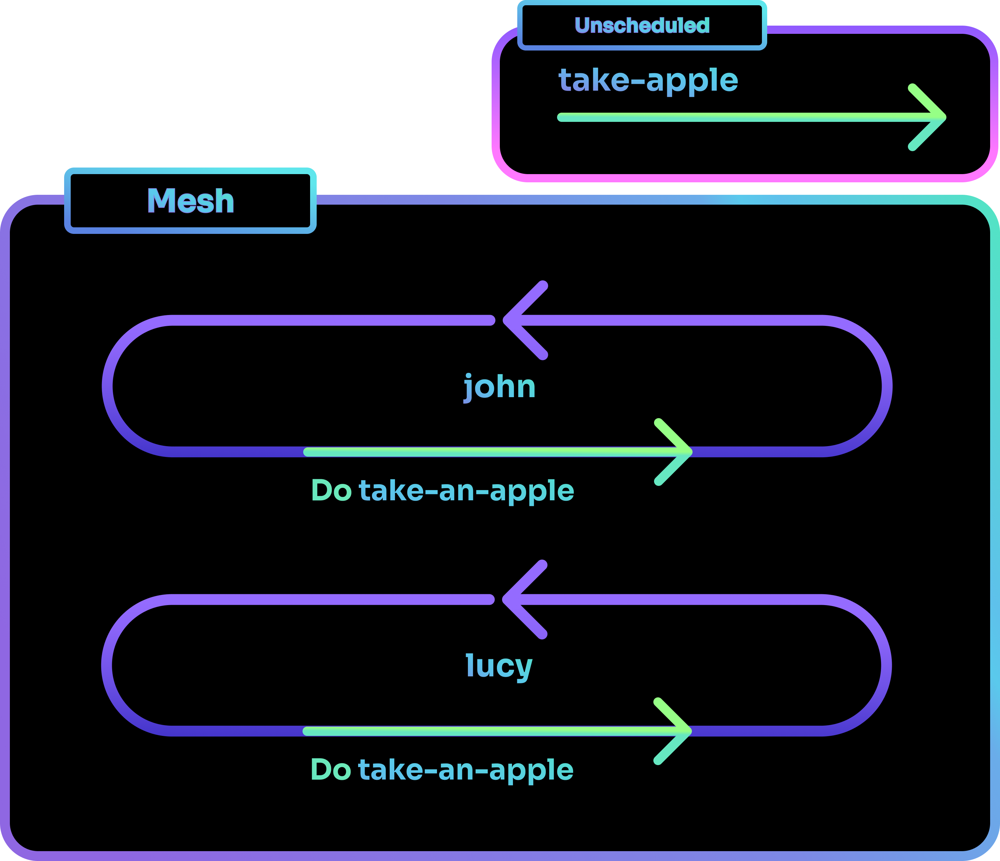

# Shards Flow
A Shards program flows from left to right, top to bottom.
Wires are scheduled on the Mesh, and they are run in the order they are scheduled in.

To gain better control of the flow in your Shards program, you can employ some of the methods described here.

## Do

[`Do`](../../../../reference/shards/shards/General/Do) allows you to run a Wire without having to schedule it on a Mesh. This is useful when you wish to reuse a Wire multiple times, similar to a function. `Do` takes an input, passes it into the Wire being called, and returns the output from it.

In the example below, John and Lucy are taking apples in turn. The Looped Wires are scheduled on the Mesh. When they are run, they each call the unscheduled Wire `take-an-apple`.

!!! note
    Wires scheduled on the Mesh are automatically run in order when the program starts. Unscheduled Wires however will only run when called by methods such as `Do`.

=== "Command"
    ```{.clojure .annotate linenums="1"}
    (defmesh main)

    (defwire take-an-apple
      = .name (Log "Actor") ;; (1)
      (Setup 10 >= .apples) ;; (2)
      (Math.Dec .apples)
      .apples (Log "Apples Remaining"))

    (defloop john
      (Msg "Taking an apple!")
      "John" (Do take-an-apple))

    (defloop lucy
      (Msg "Taking an apple!")
      "Lucy" (Do take-an-apple))

    (schedule main john)
    (schedule main lucy)
    (run main 1 3)
    ```

    1. The value passed into the Wire is saved into a variable. In this case, the string "John" or "Lucy" is passed into the Wire and saved into the variable `.name`.

    2. The program starts with 10 apples. This value decreases each time the Wire `take-an-apple` is called.

=== "Output"
    ```
    [john] Taking an apple!
    [take-an-apple] Actor: John
    [take-an-apple] Apples Remaining: 9
    [lucy] Taking an apple!
    [take-an-apple] Actor: Lucy
    [take-an-apple] Apples Remaining: 8
    [john] Taking an apple!
    [take-an-apple] Actor: John
    [take-an-apple] Apples Remaining: 7
    [lucy] Taking an apple!
    [take-an-apple] Actor: Lucy
    [take-an-apple] Apples Remaining: 6
    [john] Taking an apple!
    [take-an-apple] Actor: John
    [take-an-apple] Apples Remaining: 5
    [lucy] Taking an apple!
    [take-an-apple] Actor: Lucy
    [take-an-apple] Apples Remaining: 4
    ```



## Detach / Spawn

[`Detach`](../../../../reference/shards/shards/General/Detach) and [`Spawn`](../../../../reference/shards/shards/General/Spawn) schedules a Wire to run on the same Mesh.

The difference between `Detach` and `Spawn` is that:

- `Detach` schedules the original Wire itself.

- `Spawn` schedules a clone of the Wire.

This means that there can only be one instance of the detached Wire running, while you can have many instances of the spawned Wire.


### Wait

`Detach` allows you to pause the original Wire to run the detached Wire by calling the [`Wait`](../../../../reference/shards/shards/General/Wait/) shard. It is useful when you have to pause a Wire's execution to wait for something. Use cases would include pausing a program to wait for a file to upload, or waiting for an online transaction to go through.


Back to our previous example with apples, if John now requires some time to juice each apple before taking another, we could use `Detach` and `Wait` to implement this. Note how Lucy continues to take apples while John is still making apple juice.

=== "Command"
    ```{.clojure .annotate linenums="1"}
    (defmesh main)

    (defwire take-an-apple
      = .name (Log "Actor")
      (Setup 10 >= .apples (Log "Setup"))
      (Math.Dec .apples)
      .apples (Log "Apples Remaining"))

    (defwire juice-apple
      = .name (Log "Actor")
      (Msg "Juicing Apple...") (Pause 1) ;; (1)
      (Msg "Made some Apple Juice!"))

    (defloop john
      (Msg "Taking an apple!")
      "John" (Do take-an-apple)
      "John" (Detach juice-apple)
      (Wait "juice-apple"))

    (defloop lucy
      (Msg "Taking an apple!")
      "Lucy" (Do take-an-apple))

    (schedule main john)
    (schedule main lucy)
    (run main 1 4)
    ```

    1. [`Pause`](../../../../reference/shards/shards/General/Pause/) pauses the Wire by the specified amount of seconds.

=== "Output"
    ```
    [john] Taking an apple!
    [take-an-apple] Actor: John
    [take-an-apple] Setup: 10
    [take-an-apple] Apples Remaining: 9
    [lucy] Taking an apple!
    [take-an-apple] Actor: Lucy
    [take-an-apple] Apples Remaining: 8
    [juice-apple] Actor: John
    [juice-apple] Juicing Apple...
    [lucy] Taking an apple!
    [take-an-apple] Actor: Lucy
    [take-an-apple] Apples Remaining: 7
    [juice-apple] Made some Apple Juice!
    [lucy] Taking an apple!
    [take-an-apple] Actor: Lucy
    [take-an-apple] Apples Remaining: 6
    [john] Taking an apple!
    [take-an-apple] Actor: John
    [take-an-apple] Apples Remaining: 5
    [lucy] Taking an apple!
    [take-an-apple] Actor: Lucy
    [take-an-apple] Apples Remaining: 4
    [juice-apple] Actor: John
    [juice-apple] Juicing Apple...

    ```

If you tried `(Detach juice-apple)` for Lucy too, you would notice that the juicing does not happen on Lucy's end. This is due to how `Detach` is scheduling the original Wire, and only one instance of it can be scheduled at any time. When John is using the juicer to make apple juice, Lucy cannot use it.

Now say we have a large oven that bakes multiple apples concurrently. We can use `Spawn` to make clones of a `bake-apple` Wire that can be scheduled to run together.

=== "Command"
    ```{.clojure .annotate linenums="1"}
    (defmesh main)

    (defwire take-an-apple
      = .name (Log "Actor")
      (Setup 10 >= .apples)
      (Math.Dec .apples)
      .apples (Log "Apples Remaining"))

    (defwire bake-apple
      = .name (Log "Actor")
      (Msg "Baking Apple...") (Pause 1)
      (Msg "Made a Baked Apple!"))

    (defloop john
      (Msg "Taking an apple!")
      "John" (Do take-an-apple)
      "John" (Spawn bake-apple))

    (defloop lucy
      (Msg "Taking an apple!")
      "Lucy" (Do take-an-apple))

    (schedule main john)
    (schedule main lucy)
    (run main 1 4)
    ```

=== "Output"
    ```
    [john] Taking an apple!
    [take-an-apple] Actor: John
    [take-an-apple] Apples Remaining: 9
    [lucy] Taking an apple!
    [take-an-apple] Apples Remaining: 8
    [bake-apple-1] Actor: John
    [bake-apple-1] Baking Apple...
    [john] Taking an apple!
    [take-an-apple] Actor: John
    [take-an-apple] Apples Remaining: 7
    [lucy] Taking an apple!
    [take-an-apple] Actor: Lucy
    [take-an-apple] Apples Remaining: 6
    [bake-apple-2] Actor: John
    [bake-apple-2] Baking Apple...
    [john] Taking an apple!
    [take-an-apple] Actor: John
    [take-an-apple] Apples Remaining: 5
    [lucy] Taking an apple!
    [take-an-apple] Actor: Lucy
    [take-an-apple] Apples Remaining: 4
    [bake-apple-1] Made a Baked Apple!
    [bake-apple-2] Made a Baked Apple!
    [bake-apple-3] Actor: John
    [bake-apple-3] Baking Apple...
    [john] Taking an apple!
    [take-an-apple] Actor: John
    [take-an-apple] Apples Remaining: 3
    [lucy] Taking an apple!
    [take-an-apple] Actor: Lucy
    [take-an-apple] Apples Remaining: 2
    [bake-apple-2] Actor: John
    [bake-apple-2] Baking Apple...
    ```

If you added `(Spawn bake-apple)` for Lucy, you will notice that Lucy starts to bake apples along with John! Unlike `Detach`, you can have multiple instances of a spawned Wire running.

Use cases for `Spawn` would include spawning the same projectile (such as bullets fired from a gun) or spawning monster mobs with many instances of one monster type.

## Start / Resume

### Start

[`Start`](../../../../reference/shards/shards/General/Start) scheduling a Wire to run on the same Mesh, in place of the current Wire.

!!! note "Start vs Detach"
    Even though they both schedule a Wire onto the Mesh, `Start` will stop the current Wire to run the scheduled Wire. With `Detach`, the scheduled Wire will only run when its turn on the Mesh is up.


### Resume

[`Resume`](../../../../reference/shards/shards/General/Resume) will resume a suspended Wire from where it was last paused at.

!!! note
    If `Resume` is used on a Wire that has not been scheduled yet, it will behave as `Start` would and schedule the Wire on the Mesh before starting it.


`Start` and `Resume` are useful when managing different states.

For example:

- Your game `Start`s the player in Zone 1.

- When the player moves to Zone 2, you `Start` Zone 2's Wire.

- When the player returns to Zone 1, you `Resume` Zone 1's Wire.

- Any previous changes made by the player in Zone 1 would still persist.

In the example below, we use `Start` and `Resume` to toggle between John's and Lucy's turns. Note how `Resume` redirects the flow back to exactly where `john` was paused at.

=== "Command"
    ```{.clojure .annotate linenums="1"}
    (defmesh main)

    (defwire take-an-apple
      (Setup 10 >= .apples)
      (Math.Dec .apples)
      .apples (Log "Apples Remaining"))

    (defloop lucy
      (Setup 0 >= .apple-count)
      (Msg "Taking an apple!")
      (Do take-an-apple)
      (Math.Inc .apple-count)

      (When
       :Predicate (-> .apple-count (IsMore 2))
       :Action
       (-> (Msg "I have enough, you can have the rest.")
           (Resume)))) ;; (1)

    (defloop john
      (Setup
       (-> (Msg "Lucy, you can take as much as you want first.")
           (Start lucy) ;; (2)
           (Msg "It's my turn now!")))
      (Msg "Taking an apple!")
      (Do take-an-apple))

    (schedule main john)
    (run main (/ 1 60) 6) ;; (3)

    ```

    1. Returns the flow to the Wire that started it, which is `john` in this case.
    2. Starts the `lucy` Wire and redirects the program's flow to it.
    3. `(/ 1 60)` is read as "1 divided by 60". It is used to get the program to run at 60 FPS (Frames Per Second).

=== "Output"
    ```
    [john] Lucy, you can take as much as you want first.
    [lucy] Taking an apple!
    [take-an-apple] Apples Remaining: 9
    [lucy] Taking an apple!
    [take-an-apple] Apples Remaining: 8
    [lucy] Taking an apple!
    [take-an-apple] Apples Remaining: 7
    [lucy] I have enough, you can have the rest.
    [john] It's my turn now!
    [john] Taking an apple!
    [take-an-apple] Apples Remaining: 6
    [john] Taking an apple!
    [take-an-apple] Apples Remaining: 5
    ```

## Stop

[`Stop`](../../../../reference/shards/shards/General/Stop) is used to end Wires. It is very useful for managing Wires created with `Detach` or `Spawn`.
For example, if you have spawned multiple monsters, you could set them to `Stop` running once their health reaches 0.

!!! note
    If `Stop` is used on a Wire that is running from `Start` or `Resume`, the Wire itself is stopped and the entire program will end.


For our example, we use `Stop` to end `bake-apple` looped Wires after they iterate twice.

=== "Command"
    ```{.clojure .annotate linenums="1"}
    (defmesh main)

    (defloop bake-apple
      (Setup
       (-> (Msg "Started Baking")
           0 >= .timer))
      (Math.Inc .timer)
      .timer (Log "Time Baked")

      (When
       :Predicate (-> .timer (Is 2))
       :Action (->
                (Msg "Apple is Baked!")
                (Stop))))

    (defloop john
      (Msg "Baking Apple...")
      (Spawn bake-apple))

    (schedule main john)
    (run main 1 3)
    ```

=== "Output"
    ```
    [john] Baking Apple...
    [bake-apple-1] Started Baking
    [bake-apple-1] Time Baked: 1
    [john] Baking Apple...
    [bake-apple-1] Time Baked: 2
    [bake-apple-1] Apple is Baked!
    [bake-apple-2] Started Baking
    [bake-apple-2] Time Baked: 1
    [john] Baking Apple...
    [bake-apple-2] Time Baked: 2
    [bake-apple-2] Apple is Baked!
    [bake-apple-1] Started Baking
    [bake-apple-1] Time Baked: 1
    ```
## Step

[`Step`](../../../../reference/shards/shards/General/Step) schedules and runs another Wire on the Wire calling `Step` itself. That is, if `X Step Y`, Y  is scheduled to run on X itself.

Being scheduled on a Wire (instead of the Mesh) has a few implications:

1. The flow is different.

2. It shares the same environment and scope as the Wire which stepped it.

3. It can affect variables on the Wire which stepped it.

### Flow Difference

The stepped Wire runs similarly to how `Do` does as the flow shifts into the stepped Wire immediately. It may seem like it is running inline too, but the difference is obvious when calling `Pause` on the stepped Wire.

For `Do`, the flow is paused and resumed only after the pause is resolved. For `Step`, even though the stepped Wire is paused, the original Wire continues to run.


### Shared Environment

Being scheduled on a Wire allows the stepped Wire to share the same scope and environment as the Wire which stepped it. This is especially useful when working with `UI` shards that can only exist within a single `GFX` window. The topic of `UI` and `GFX` is beyond the scope of this tutorial, but the general idea is that when implementing `UI` elements, they can only be stepped from the Wire that holds the `GFX.MainWindow` shard in your program.

### Shared Variables

Most of the methods described in this chapter will "snapshot" the variables of the Wire that called it. That is:

- Variables existing in the caller Wire will be copied and made available to the callee Wire.

- **Changes made to variable copies will not be reflected on the original variables.**

`Step` is unique in the sense that it has access to the original variables. Changes made to variables from the Wire that called it will persist.

### Example

In the example below, we demonstrate how the main Looped Wired `john` continues to run even when the Wire `bake-apple` is paused after stepping into it. `bake-apple` cannot be stepped into again when it is paused due to how it is still running.

The example also showcases how variables defined in `john` are affected by changes made to it by the stepped Wires.

=== "Command"
    ```{.clojure .annotate linenums="1"}
    (defmesh main)

    (defwire take-an-apple ;; (1)
      (Math.Inc .fresh-apples)
      (Msg "Taking an apple...")
      .fresh-apples (Log "Fresh Apple (+1)"))

    (defwire bake-apple ;; (2)
      (Math.Dec .fresh-apples)
      (Msg "Baking apple...")
      .fresh-apples (Log "Fresh Apple (-1)")
      (Pause 1)
      (Math.Inc .baked-apples)
      (Msg "Baking complete!")
      .baked-apples (Log "Baked Apple (+1)"))

    (defloop john
      (Setup
       5 >= .fresh-apples
       0 >= .baked-apples)

      (Step take-an-apple)
      (Step bake-apple))

    (schedule main john)
    (run main 1 5)
    ```

    1. This Wire increases the value of `.fresh-apples` every time it is stepped into.
    2. This Wire decreases the value of `.fresh-apples`, pauses the Wire for 1 second, and increases the value of `.baked-apples` every time it is stepped into.

=== "Output"
    ```
    [take-an-apple] Taking an apple...
    [take-an-apple] Fresh Apple (+1): 6
    [bake-apple] Baking apple...
    [bake-apple] Fresh Apple (-1): 5
    [take-an-apple] Taking an apple...
    [take-an-apple] Fresh Apple (+1): 6
    [bake-apple] Baking complete!
    [bake-apple] Baked Apple (+1): 1
    [take-an-apple] Taking an apple...
    [take-an-apple] Fresh Apple (+1): 7
    [bake-apple] Baking apple...
    [bake-apple] Fresh Apple (-1): 6
    [take-an-apple] Taking an apple...
    [take-an-apple] Fresh Apple (+1): 7
    [take-an-apple] Taking an apple...
    [take-an-apple] Fresh Apple (+1): 8
    [bake-apple] Baking complete!
    [bake-apple] Baked Apple (+1): 2
    ```

## Branch

[`Branch`](../../../../reference/shards/shards/General/Branch) is used when you wish to create a Submesh on the current Mesh. You can schedule Wires on the Submesh by placing Wires in its `Wires` parameter. These Wires will behave as if they were run with `Step`.

=== "Syntax"
    ```{.clojure .annotate linenums="1"}
    (Branch [wire-x wire-y wire-z]) ;; (1)
    ```

    1. You can schedule as many Wires as you wish within the square brackets here. In this example, three Wires are scheduled on the Submesh.

## Expand

- Creates and schedules copies of a Wire.

- Returns an array of the output from all the copies.

[`Expand`](../../../../reference/shards/shards/General/Expand) is useful when you need to run code in bulk. The results produced can then be evaluated, which is useful in Machine Learning for example.

??? "Multithreading with `Expand`"
    Simple programs are usually run on a single thread. You can think of a thread as a thought process. For a Computer to be able to "multitask", they require multiple threads.

    `Expand` has the parameter `Threads` which allows you to specify the number of threads to use. Multithreading can improve performance when attempting to `Expand` a Wire to a large size.

In our example below, we will be using `Expand` to teach John about multiplication with zeros.

=== "Command"
    ```{.clojure .annotate linenums="1"}
    (defmesh main)

    (defwire learn-zero-multiplication
      (Expand
       :Size 100 ;; (1)
       :Wire (defwire zero-multiplication
               (RandomInt :Max 100)(Math.Multiply 0))) ;; (2)
      (ForEach (-> (Is 0)(Log)))) ;; (3)

    (defwire john
      (Do learn-zero-multiplication))

    (schedule main john)
    (run main)

    ```

    1. Creates and runs 100 copies of the Wire `zero-multiplication`.
    2. Generates a random number from 0 to 99 and multiplies it with 0.
    3. `Expand` outputs an array of the results. We use [`ForEach`](../../../../reference/shards/shards/General/ForEach/) to check if each result [`Is`](../../../../reference/shards/shards/General/Is/) 0.

=== "Output"
    ```
    [learn-zero-multiplication] true
    [learn-zero-multiplication] true
    [learn-zero-multiplication] true
    [learn-zero-multiplication] true
    ...

    ```

## TryMany ##

- Takes a sequence as input.

- Creates a clone of a Wire for each entry in the sequence.

 [`TryMany`](../../../../reference/shards/shards/General/TryMany) can be used to check for values that would achieve the result desired. This is useful in Machine Learning for example, as it teaches your program how it can achieve a result by using specific values.

`TryMany` has a `Policy` parameter that takes a value of [`WaitUntil`](../../../../reference/shards/enums/WaitUntil/). The value used determines the output `TryMany` produces.

There are three variations of `WaitUntil`:

1. `WaitUntil.FirstSuccess` - Will output the result of the first successful Wire copy and ignores the rest.

2. `WaitUntil.AllSuccess` - Will only output all the results if all Wire copies are successful. If one Wire fails, no output is produced.

3. `WaitUntil.SomeSuccess` - Will wait for all Wire copies to run, but will only output the successful results.

In the following examples, John attempts to hit a moving target by firing arrows at it. He can only land a hit if the `.distance-shot` is an odd number. Note how the results vary based on the `Policy` used.

=== "FirstSuccess"
    ```{.clojure .annotate linenums="1"}
    (defmesh main)

    (defwire fire-arrow
      [1, 2, 3]
      (TryMany
       :Wire (defwire check-for-hit
               >= .distance-shot
               (Math.Mod 2) ;; (2)
               (Assert.Is 1 false)
               .distance-shot)
       :Policy WaitUntil.FirstSuccess) ;; (1)
      (Log "Hits the mark"))

    (defwire john
      (Do fire-arrow))

    (schedule main john)
    (run main)

    ```

    1. Only the first successful result will be used as output. Once a Wire is successful, the rest are ignored.
    2. Odd numbers will have a remainder of 1 when divided by 2. We use [`Math.Mod`](../../../../reference/shards/shards/Math/Mod/) to get the remainder from the division.

=== "Output"
    ```
    [fire-arrow] Hits the mark: 1
    ```

=== "AllSuccess"
    ```{.clojure .annotate linenums="1"}
    (defmesh main)

    (defwire fire-arrow
      [1, 2, 3]
      (TryMany
       :Wire (defwire check-for-hit
               >= .distance-shot
               (Math.Mod 2)
               (Assert.Is 1 false)
               .distance-shot)
       :Policy WaitUntil.AllSuccess) ;; (1)
      (Log "Hits the mark"))

    (defwire john
      (Do fire-arrow))

    (schedule main john)
    (run main)

    ```

    1. All results will be produced in the output, but only if all Wires are successful.

=== "Output"
    ```
    ;; No result is obtained as the condition for WaitUntil.AllSuccess was not achieved.
    ;; The Wire with a .distance-shot of 2 would fail the Assert checks.
    ```

=== "SomeSuccess"
    ```{.clojure .annotate linenums="1"}
    (defmesh main)

    (defwire fire-arrow
      [1, 2, 3]
      (TryMany
       :Wire (defwire check-for-hit
               >= .distance-shot
               (Math.Mod 2) ;; (2)
               (Assert.Is 1 false)
               .distance-shot)
       :Policy WaitUntil.SomeSuccess) ;; (1)
      (Log "Hits the mark"))

    (defwire john
      (Do fire-arrow))

    (schedule main john)
    (run main)

    ```

    1. Only the successful results will be produced as output after all Wires have been executed.

=== "Output"
    ```
    [fire-arrow] Hits the mark: [1, 3]
    ```

??? "Multithreading with `TryMany`"
    `TryMany` has the additional parameters of `Threads` and `Coroutines` which allow it to work better with a very large input. A large input means that it has a large number of Wire copies to run.

    `Threads` will determine the number of Wires that `TryMany` can run at the same time, while `Coroutines` determines the maximum number of Wires running together on each thread at any point in time.

    Using `Threads` and `Coroutines` helps to split the work and makes your program runs more efficiently.


Congratulations! You have now learned new methods of executing and scheduling Wires, which gives you better control of the Flow of Shards. The possibilities of what you can create with Shards just got much wider with this newfound knowledge!

In the next chapter, we will take a look at what working with data in Shards is like.

## Summary

| Shard    | Uses Original Variables? | Restarts Wire? | Continues Loop?  | 1 Instance per run? |
| :------- | :----------------------- | :------------- | :--------------- | :------------------ |
| Do       | Yes                      | No             | Yes              | Yes                 |
| Detach   | No                       | Yes            | Yes              | Yes                 |
| Spawn    | No                       | Yes            | Yes              | No                  |
| Start    | No                       | Yes            | No               | No                  |
| Resume   | No                       | Yes            | Yes              | Yes                 |
| Step     | Yes                      | Yes            | Yes              | Yes                 |
| StepMany | Yes                      | Yes            | Yes              | No                  |
| Branch   | Yes                      | No             | Yes              | Yes                 |
| Expand   | Yes                      | Yes            | Yes              | No                  |
| TryMany  | Yes                      | Yes            | Yes              | No                  |

--8<-- "includes/license.md"
