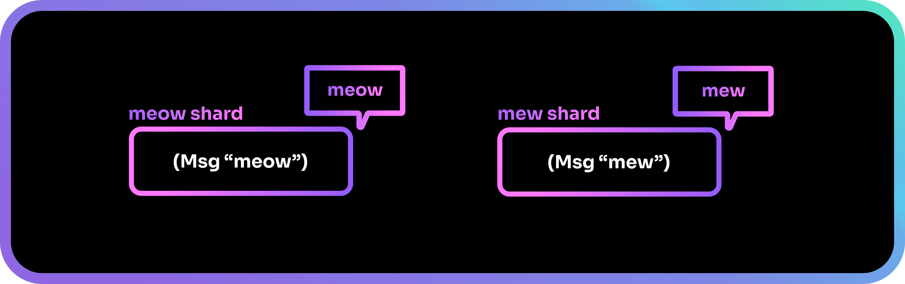
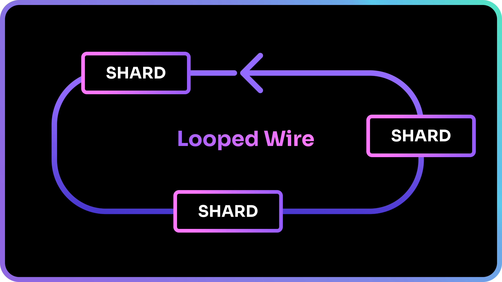
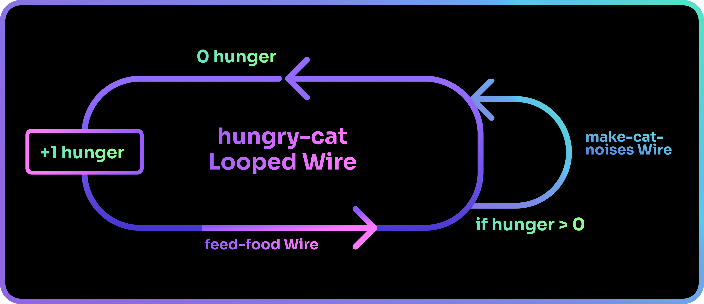
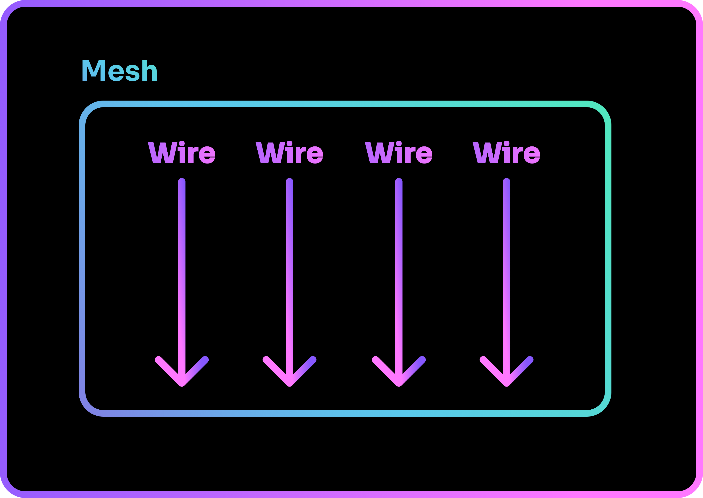

# What is Shards

Let us first learn about what makes up the language of Shards.

## The shard

The basic building block of the Shards programming language is called a shard (with a lowercase ‘s’).

A shard can receive an input, do work on that input, and produce an output.

Every shard has a role and is usually named after it. For example, the shard `Math.Add` takes a number as an input, adds a specified value to it and outputs the result.

Shards can be grouped up to form another shard. 

For example, you might have a `meow` shard that prints a "meow" to the user's screen, and a `mew` shard that prints a "mew" instead. 

If you wanted your program to be able to make cat noises, you might have a bunch of `meow` and `mew` shards... which could end up being rather cluttered:

To keep our work organized, we can group shards up to form a new shard. In our example, we can create a new `meows` shard that is made up of a few `meow` shards, and create a `mews` shard for our `mew` shards.

When our shards are grouped up into logical segments, our program becomes more readable and orderly.

## The Wire
In the flow of a Shards program, each shard is queued for execution and will be run in the order they are presented in. The order goes from left to right, top to bottom.

When shards are queued, they form a sequence know as a **Wire**.

Wires can be set to be loopable. This is called a **Looped Wire**.

You may look at this and wonder - is this the same as grouping shards together? When shards are grouped up to form a new shard, they are still executed from left to right, top to bottom after all.

The answer is... no! A Wire is not the same as a shard containing shards. 

A Wire queues shards for a **purpose**, while grouping shards up are for **organization**. In the earlier example, we were trying to create a program that makes cat noises. We can achieve that by queueing our shards in a Wire named `make-cat-noises`.

Whenever we want our program to produce cat noises, we would call the `make-cat-noises` Wire. A Wire is similar to what we call a *function* in traditional programming languages.

??? "What is a function?"
    It is a block of code that can be reused over and over again.
    
    It allows you to reuse code without writing out the same block of code each time by calling the function's name instead.

Think of shards as the different components of your program, while Wires are the lifeblood connecting the many different shards in your program, creating a Flow.

By mastering the usage of Wires, the possibilities of what you can achieve are endless!

## The Mesh

In order to actually run shards, we have to schedule Wires on a Mesh. Multiple Wires can be scheduled, and they will be run in the order that they are scheduled in.

After scheduling our Wires, we can finally run the Mesh... and that is when Shards comes to life!

!!! note
    If the scheduling of Wires seems rigid to you, fret not! We will be learning more about manipulating [the flow of Shards](the-flow.md) later.

Now that you have a basic understanding of what Shards are, let us take a look at how coding with Shards work.

--8<-- "includes/license.md"
