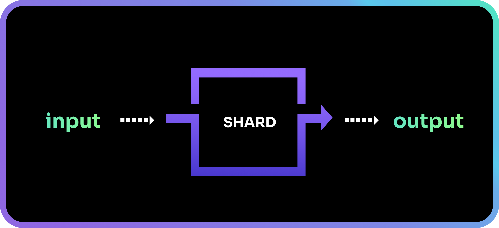
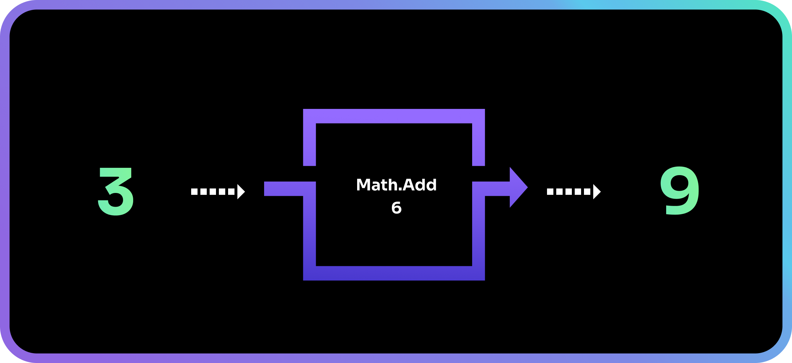
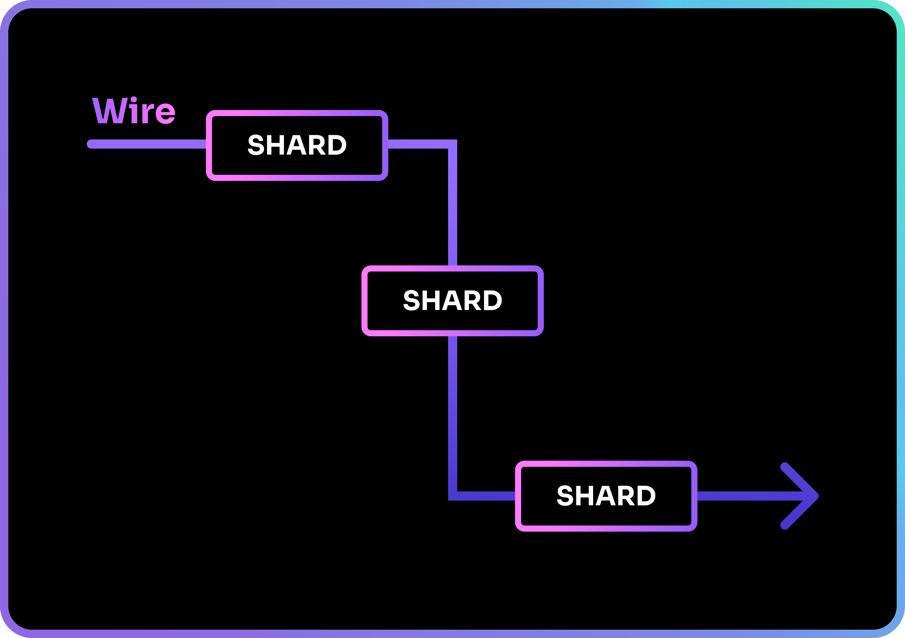
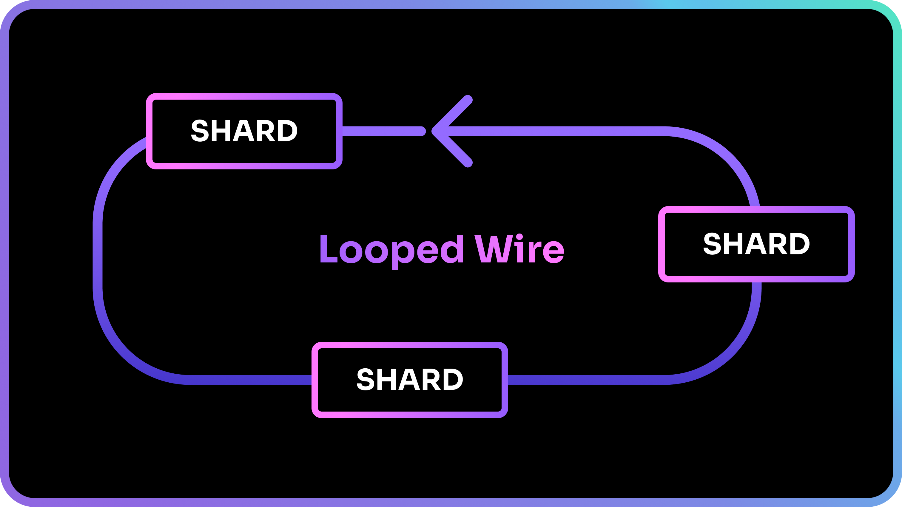
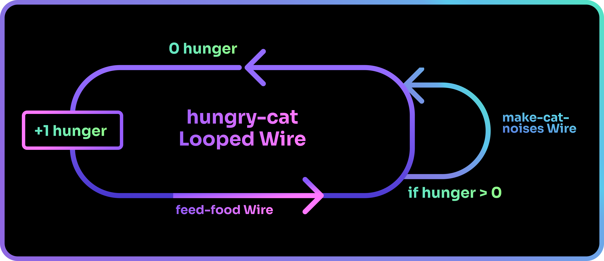
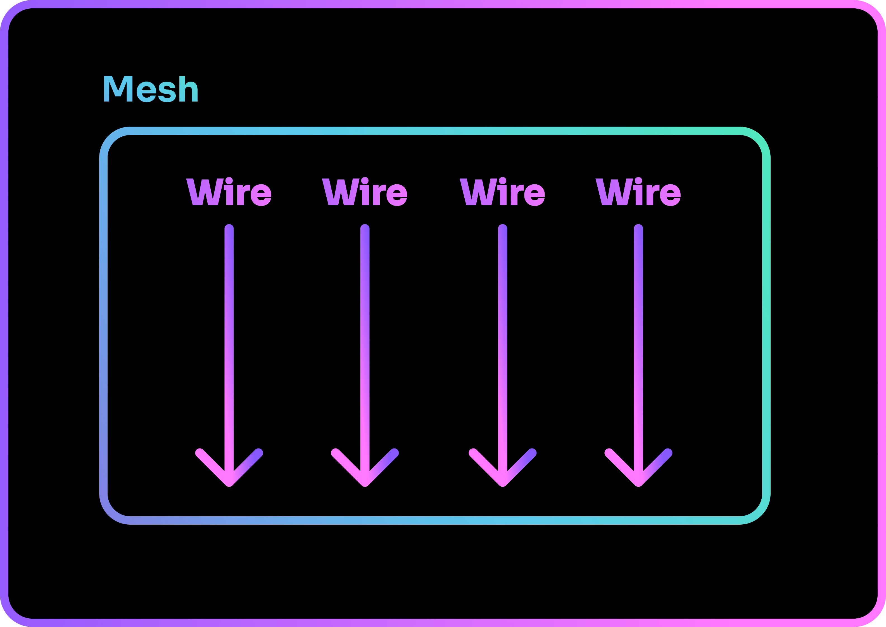

# What is Shards

Before we delve into the intricacies of Shards, let's familiarize ourselves with its fundamental concepts.

## The shard

The basic building block of the Shards programming language is called a shard (with a lowercase ‘s’).

A shard can receive an input, do work on that input, and produce an output.

Every shard has a role and is usually named after it. For example, the shard `Math.Add` takes a number as an input, adds a specified value to it and outputs the result.

## The Wire
In the flow of a Shards program, each shard is queued for execution and will be run in the order they are presented in. The order goes from left to right, top to bottom.

When shards are queued, they form a sequence know as a **Wire**.

Wires can be set to be loopable. This is called a **Looped Wire**.

??? "What is a function?"
    It is a block of code that can be reused over and over again.
    
    It allows you to reuse code without writing out the same block of code each time by calling the function's name instead.

Think of shards as the different components of your program, while Wires are the lifeblood connecting the many different shards in your program, creating a Flow.

By mastering the usage of Wires, the possibilities of what you can achieve are endless!

## The Mesh

In order to actually run shards, we have to schedule Wires on a Mesh. Multiple Wires can be scheduled, and they will be run in the order that they are scheduled in.

After scheduling our Wires, we can finally run the Mesh... and that is when Shards comes to life!

!!! note
    If the scheduling of Wires seems rigid to you, fret not! We will be learning more about manipulating [the flow of Shards](the-flow.md) later.

Now that you have a basic understanding of what Shards is, let us take a look at how coding with Shards work.

--8<-- "includes/license.md"
