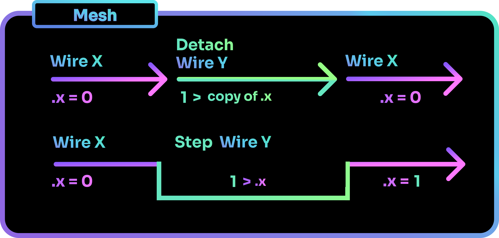
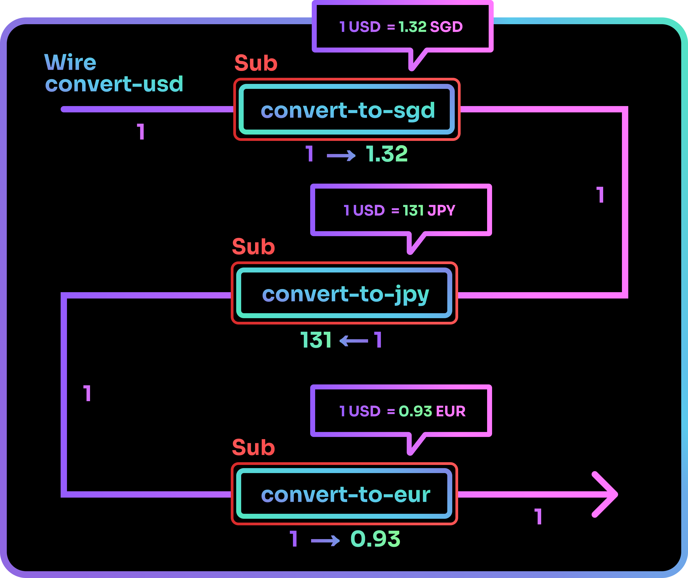
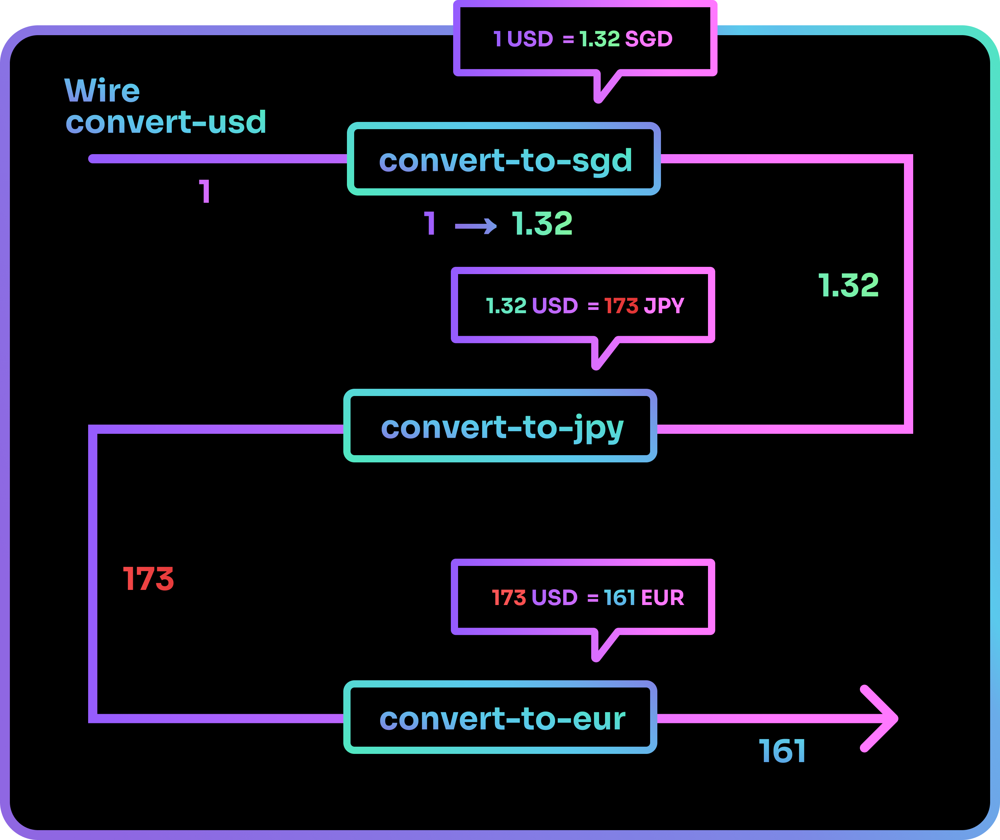

# Working with Data

Now that you have learned to code with Shards and mastered the program flow, let us round off this series of primers by taking a look at how data works in Shards.

## Scope

### Local and Global

Scope determines the visibility of data at different points in your program. When data is assigned to variables, these variables will either have a **local** or **global** scope.

- Local: The variable is only known within the Wire it originated from.

- Global: The variable is known throughout the entire Mesh.

In the example below, the Wire `get-x` attempts to retrieve the value of `x` defined in the Wire `define-x`. Note how it can retrieve the value of 1 even though it was defined in a separate Wire. This is due to how `x` has been defined as a global variable, making its value available to all Wires on the Mesh.

=== "Command"
    ```shards
    @mesh(main)

    @wire( get-x {
      Get( Name:x Default: 0) | Log("x")
    } Looped: false)

    @wire(define-x {
      1 | Set(Name: x Global: true)
    } Looped: false)

    @schedule(main define-x)
    @schedule(main get-x)
    @run(main)
    ```

=== "Output"
    ```shards
    [get-x] x: 1
    ```

For the following example, `get-x` fails to retrieve the value of `x` defined in `define-x` and returns the default value of 0. This is due to how `x` was locally defined within the Wire `define-x` and cannot be accessed by other Wires separate from it.

=== "Command"
    ```shards
    @mesh(main)

    @wire( get-x {
      Get(Name:x Default: 0) | Log("x")
    } Looped: false)

    @wire( define-x {
      1 >= x //// (1)
    } Looped: false) 

    @schedule(main define-x)
    @schedule(main get-x)
    @run(main)
    ```

    1. `>=` is the alias for the [`Set`](../../../reference/shards/General/Set/) shard, with the parameter `Global` set to **false**. This makes `x` a local variable.

=== "Output"
    ```shards
    [get-x] x: 0
    ```

### Flow Methods

If Wire Y is run from a separate Wire X using methods such as [`Detach`](../../../../reference/shards/shards/General/Detach/), the variables on Wire X will be copied such that Y has access to its value at the moment it was called.

However, this does not mean that Wire Y is in the same scope as X. Wire Y holds only a copy of the value - it does not have access to the actual variable.

If a method such as [`Step`](../../../../reference/shards/shards/General/Step) is used instead, Wire Y would be scheduled on Wire X itself, giving it the same scope and access to X's actual variables.

=== "Detach"
    ```shards
    @mesh(main)

    @wire( wire-y {
      12 > x | Log //// (1)
    } Looped: false)

    @wire( wire-x {
      Once({
        0 >= x
      })
      x | Log
      Detach(wire-y)
    } Looped: false)

    @schedule(main wire-x)
    @run(main 1 2)
    ```

    1. `x` here is a copy of the original variable in `wire-x`. It was snapshotted when `Detach wire-y` was called.

=== "Output"
    ```
    [wire-x] 0
    [wire-y] 12
    [wire-x] 0
    [wire-y] 12
    ```

=== "Step"
    ```shards
    @mesh(main)

    @wire( wire-y {
      12 > x | Log
    } Looped: false) //// (1)

    @wire(wire-x {
      Once({0 >= x})
      x | Log
      Step(wire-y)
    } Looped: false)

    @schedule(main wire-x)
    @run(main 1 2)
    ```

    1. `x` here is the original variable from `wire-x`. This is due to how `Step` results in `wire-y` existing in the same scope as `wire-x`.

=== "Output"
    ```
    [wire-x] 0
    [wire-y] 12
    [wire-x] 12
    [wire-y] 12
    ```



### Pure Wires

Pure Wires are Wires that exist in their scope. When run from another Wire, they do not copy that Wire's variables.

To create a Pure Wire, we use `@wire` with the `Pure` parameter set to true.

=== "Syntax"
    ```shards
    @wire( wire-name {
      //// your shards here
    })
    ```

In the example below, you can see how using `Step` on a Pure Wire still does not give it access to the parent Wire's variables.

=== "Command"
    ```shards
    @mesh(main)

    @wire( unpure-wire {
      Get( Name: x Default: 0) | Log
    } Looped: false)

    @wire(pure-wire {
      Get( Name: x Default: 0) | Log
    } Looped: false Pure: true)

    @wire( main-wire {
      5 >= x
      Sep(unpure-wire)
      Sep(pure-wire)
    } Looped: false)

    @schedule(main main-wire)
    @run(main)
    ```

=== "Output"
    ```
    [unpure-wire] 5
    [pure-wire] 0
    ```

### Defined Constants

If you define a constant in your program using `@define`, it will have a global scope and can be accessed by any Wire in your program.

=== "Command"
    ```shards
    @mesh(main)

    @define(named-constant {1})

    @wire(get-named-constant {
      @named-constant | Log("named-constant")
    } Looped: false)

    @schedule(main get-named-constant)
    @run(main)
    ```

=== "Output"
    ```shards
    [get-named-constant] x: 1
    ```

## Passthrough

Passthrough determines if data can pass through shards unaltered. It allows you to better control the state of the data moving through your program.

Most shards take in data, process the data, and output the results. To allow data to emerge from these shards unaltered, we can wrap the segment of code that we want the input value to Passthrough with `{}`. `{}` creates a sub block and saves the initial value passed in, and outputs the saved value at the end. Any shards passed into the within the `{}` will run as per usual, except that the final output will be replaced with the initial input passed into `{}`, thereby creating a passthrough effect.

Shards that have a `Passthrough` parameter and has that parameter set to true will also output its input unchanged.

=== "Passthrough Example"
    ```shards
    @mesh(main)

    @wire(sub-test {
      1 >= x | Log("Before Passthrough")
      {Math.Add(2) | Log("In Passthrough")}
      > x | Log("After Passthrough")
    } Looped: false)

    @schedule(main sub-test)
    @run(main)
    ```

=== "Output"
    ```
    [sub-test] Before Passthrough: 1
    [sub-test] In Passthrough: 3
    [sub-test] After Passthrough: 1
    ```

=== "Shard with Passthrough parameter"
    ```shards
    @mesh(main)

    @wire(sub-test {
      1
      Match([
        1 {"One"}
        2 {"Two"}
        3 {"Three"}
      ] Passthrough: false)
      Log("No Passthrough")

      1
      Match([
        1 {"One"}
        2 {"Two"}
        3 {"Three"}
      ] Passthrough: true)
      Log("Yes Passthrough")
    } Looped: false)

    @schedule(main sub-test)
    @run(main)
    ```

=== "Output"
    ```
    [sub-test] No Passthrough: One
    [sub-test] Yes Passthrough: 1
    ```

In the example below, John wishes to check the price of an apple in different currencies. The base price of 1 USD is passed into a Wire and goes through a series of shards that each performs mathematical operations on it to obtain its foreign value.

To keep the initial value unchanged as it passes through the different shards, a passthrough is required.



Without passthrough, the data passed in at the start of the Wire gets altered each time it passes through a shard that transforms its value.



## Specific Data Types

Some shards can only accept specific data types and will require you to either:

- Explicitly declare the types of dynamic output types,

- Or convert data to the required data type.

### Dynamic Output Types

You do not have to declare the data types of most data in Shards. Shards can smartly infer and determine the data types when it is run, thereby removing the hassle of having to explicitly specify data types.

However, when data is output dynamically, you are still required to declare its data type as it cannot be determined easily. Examples would include data output from the shards [`FromBytes`](../../../../reference/shards/shards/General/FromBytes/) and [`FromJson`](../../../../reference/shards/shards/General/FromJson/).

You will also have to declare data types when trying to [`Take`](../../../../reference/shards/shards/General/Take/) from a mixed type [Sequence](../../../../reference/shards/shards/types/#sequence).

To declare a data type, you can use "Expect" shards to indicate the type of incoming data. Examples of "Expect" shards are [ExpectInt](../../../../reference/shards/shards/General/ExpectInt/) and [ExpectString](../../../../reference/shards/shards/General/ExpectString/).

### Converting Types

When you have to convert data's type to allow for it to be used by shards, you can employ type conversion shards such as [`ToString`](../../../../reference/shards/shards/General/ToString/) and [`ToInt`](../../../../reference/shards/shards/General/ToInt/).

In the example below, [`String.Join`](../../../../reference/shards/shards/String/Join/) retrieves elements in a sequence and combines them. It only accepts strings and will throw an error if the sequence passed into it contains non-strings. To get `String.Join` to use integer values to form a sentence, the integer will have to be converted to a string first.

=== "ToString"
    ```shards
    @mesh(main)

    @wire(wire {
      2 | ToString >= num-of-apples
      ["John has " num-of-apples " apples"] | String.Join | Log
    } Looped: false)

    @schedule(main wire)
    @run(main)
    ```

=== "Output"
    ```
    [wire] John has 2 apples.
    ```

Congratulations on making it to the end of the primer series! You are now equipped with the fundamentals that will allow you to start creating amazing things with Shards.

If you are still lost and unsure of where to go from here, why not take a look at our [tutorials](../tutorials/index.md) to have a taste of what you could potentially create with Shards?
