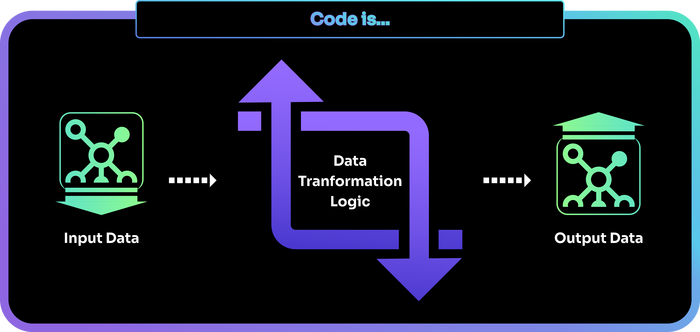

# What is code?

Computer code is a set of instructions to a computer on how to transform data.

In other words, code is the transformation logic that the computer uses to transform its input into output.

Figure 1

For example, an instruction telling the computer to calculate the square of a number is code.

Figure 2

Also, these data transformation logic blocks can be applied one after the other in a sequence. A sequence like this is also code.

Figure 3

A programming language is a human-readable syntax for writing out such instructions. A set of such instructions (or sequence of instructions) is considered a program or a source code.

??? note "Tech Tip"
    This source code is further parsed (processed and coverted) into a form that the computer understands (i.e. steps in building the source code like compiling, linking, etc.) but a discussion about that is beyond the scope of this text.

--8<-- "includes/license.md"
