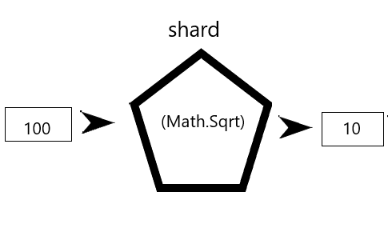
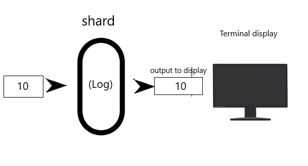
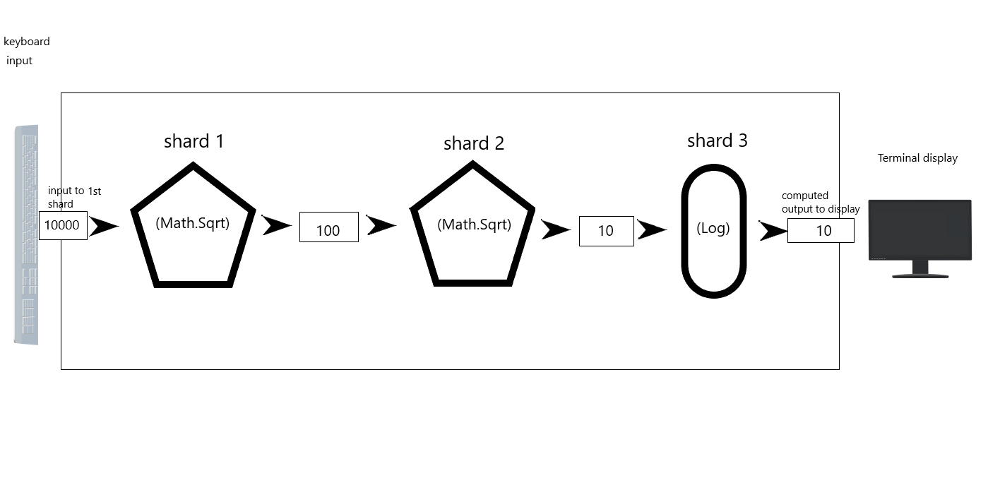
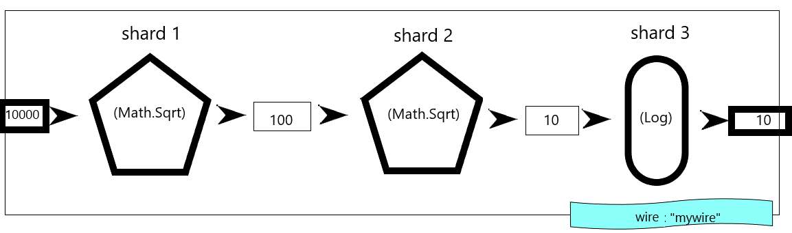
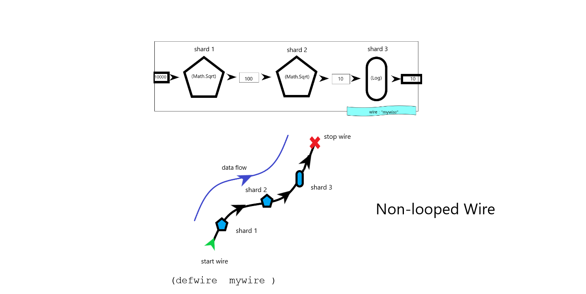
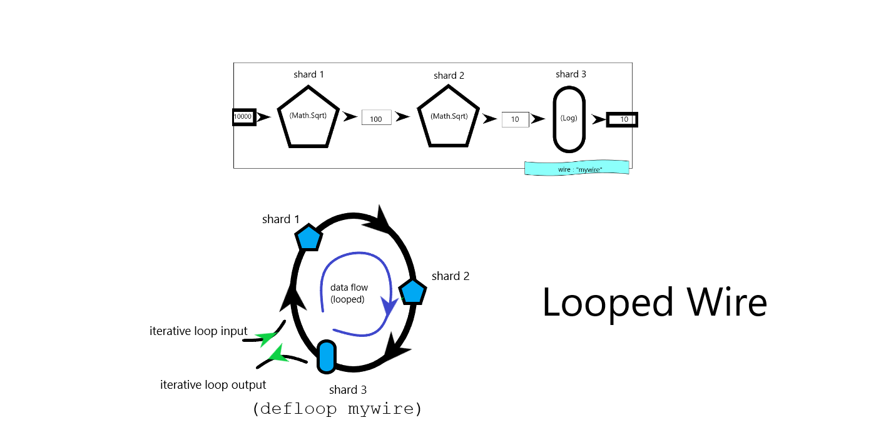
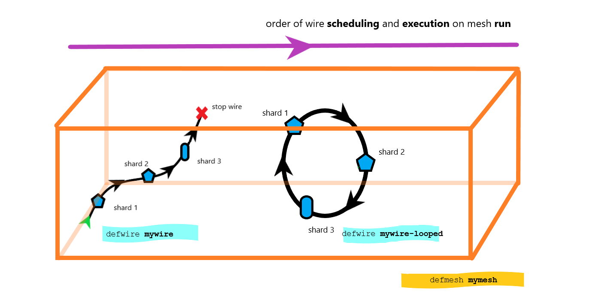
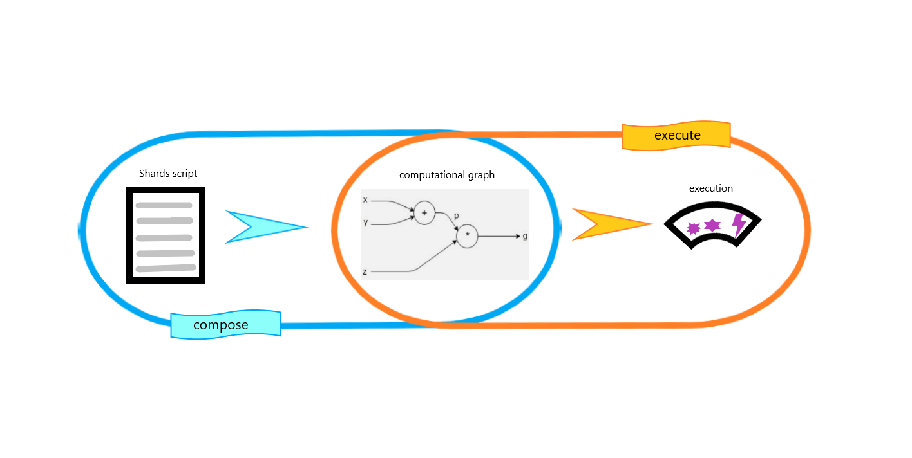

# What is Shards?

Shards is a highly flexible and powerful scripting language designed from the ground-up for developing games and for exploring creative ideas.

It's visual syntax is easy to read and reason in, and makes programming in Shards feel like working with a [visual programming language](https://en.wikipedia.org/wiki/Visual_programming_language).

## Elements

Let's look at the core elements of a Shards program and how they fit together.

### Shard

In Shards, the data transformation logic blocks are called [shards](https://docs.fragcolor.xyz/shards/) (with a lowercase *'s'*).

!!! note
    There are currently 600+ shards available that allow you to manipulate data in all kinds of ways.

For example, the shard [`(Math.Sqrt)`](https://docs.fragcolor.xyz/shards/Math/Sqrt/) can compute the square root of a number.

Figure 4



And the shard [`(Log)`](https://docs.fragcolor.xyz/shards/General/Log/) can print given data to the terminal screen.

Figure 5



Multiple shards maybe combined together to achieve a particular objective.

For example, suppose we want to print the square root of the square root of a given number to the terminal screen.

We could do this with a combination of `(Math.Sqrt)` and `(Log)` shards like this:

Figure 6



### Wire

A sequence of shards that work together (like in Figure 6 above), along with its related data (input, intermediate results, output, etc.) is called a *wire* in Shards.

These wire constructs need to be identified by a unique name as you may have more than one wire in a Shards script.

The figure below depicts a wire made up of the shard sequence from Figure 6 and is called *"mywire"*.

Figure 7



#### Non-looped wire

A wire that's supposed to execute only once is called a non-looped wire and is created by using the macro `(defwire)`.
```clj
(defwire <wire-name>)
```

Such a wire is useful for writing out logic that you want to execute only once everytime you run the Shards script.

??? note
    A macro is a part of the Shards composer language Mal/EDN, as explained in [macros](#macros) below.

You can visualize a non-looped wire as a broken necklace (but with its beads in place), laid out end to end. The beads here represent shards and the thread itself represents the wire (i.e., the flow of the data through the shards).

The execution starts at first shard and continues till the last shard is executed. The output of the wire maybe stored and/or transferred to other constructs in your Shards script.

In the figure below we visualize the wire *"mywire"* as a non-looped wire.

Figure 8



#### Looped wire

A wire that executes continuously in a loop is called a looped wire and is created by using the macro `(defloop)`.
```clj
(defloop <looped-wire-name>)
```

Such a wire may execute a finite or infinite number of loops depending on its parameters (like maximum loop iterations, time interval between two consecutive loop iterations, etc.).

Such a wire is useful when you want to execute some logic continously once you trigger your Shards script. This is a frequent use-case in game development.

You can visualize a looped wire as a necklace with beads. The beads here represent shards and the thread itself represents the wire (i.e., the flow of the data through the shards).

Once the last shard in the sequence is executed the control transfers again to the first shard in the sequence (hence the looped execution). The output of one iteration may be consumed again by the wire itself in the next iteration or transferred to other constructs in your Shards script.

In the figure below we visualize the wire *"mywire"* as a looped wire.

Figure 8



### Mesh

Just like a wire is a construct for holding and executing shards, a *mesh* is a construct for holding and executing wires.

You can bring a mesh into existence (and give it a name) using the macro `(defmesh)`.
```clj
(defmesh <mesh-name>)
```

Think of a mesh as a box in which wires (both looped and non-looped) can be queued for execution. This step is called *scheduling* and is achieved by using the keyword `(schedule)`.
```clj
(schedule <mesh-name> <wire-name>)
```

To execute the queued wires on a mesh, you need to *run* the mesh. You can do this using keyword `(run)`).
```clj
(run <mesh-name>)
```

Once a mesh is run, the scheduled wires are executed in the order they were scheduled.

The figure below depicts a mesh *"mymesh"* with two scheduled wires: non-looped wire *"mywire"* and a looped wire *"mywire-looped*.

Figure 9



## Code

Ok, time to write some Shards code!

??? note "How to run Shards sample code from this primer"
    1. If you're new to programming you should [install VS Code and set it up](#-code-editor). 
    2. The Shards [web sandbox](https://learn.fragcolor.xyz/sandbox) is coming soon but for now please [build Shards](https://docs.fragcolor.xyz/contribute/code/building-shards/) on your machine to work through the examples in this guide.
    3. Once the `shards.exe` is built, copy paste the code sample you want to run from this guide into a new file with an extension `edn` (that's the Shards script file extension for now). This is your Shards script file. 
    4. Place your Shards script (say`abc.edn`) into the`/build` folder and from there run the script `./shards <abc.edn>` to execute your Shards script.
    5. You just need to build the `shards.exe` once. After that you can change the code in your Shards script (or create a new Shards script) and run that script with the `./shards...` command
    6. If you're using [VS Code](https://code.visualstudio.com/) as your editor you can install the [code-runner plugin](https://marketplace.visualstudio.com/items?itemName=formulahendry.code-runner) and set up your VS Code to execute your Shards script on the click of the `Run` button (see [this](https://docs.fragcolor.xyz/contribute/code/building-shards/#verify-build-and-run) for details).


Let's write a fully functioning Shards script for on of our previous examples: compute the square root of the square root of an input number and print it to the terminal screen.

We will start with code-fragments (that cannot run on their own) and build that into a self-sufficient example that you can run from your editor.

!!! note
    In the code fragments and code examples below you will see some text starting with semicolons (`;` or `;;`) alongside the actual code statements. These text strings are called comments and are used to give more context about your code, to any other programmer reading your script (they're ignored by the computer). Comments in Shards must start with a semicolon (`;`) and continue till that line ends.

### Shard code fragment

Let's start with a shard that can compute the square root of a given number.

In the code fragment below the input data appears to come in from the line above the shard, and the output data can be visualized to be made available in the line below the shard.

!!! note
    In the code fragments below you'll notice that we've used data `10000.0` instead of a plain integer `100000` which we used in the figures. This is because the shard `(Math.Sqrt)` requires a float (decimal) format input, it won't accept an integer format.

*Code fragment 1*

```{.clojure .annotate linenums="1"}
10000.0         ;; input data to the first shard
(Math.Sqrt)     ;; shard that computes square root of given input
                ;; output (100) of first shard, made available to the next shard in sequence
```

However, the input data may also be placed in the same line as the shard (coming in from the shard's left side) and the output can also be visualized to be available on the same line (coming out from the shard's right side).

*Code fragment 2*

```{.clojure .annotate linenums="1"}
10000 (Math.Sqrt)          ;; input data (10000.0) => shard => output data (100)
```

Or, you could take a hybrid approach.

*Code fragment 3*

```{.clojure .annotate linenums="1"}
10000 (Math.Sqrt)           ;; input data (10000.0) => shard
                            ;; output data on next line => (100.0)
```

Let's throw in our second shard.

*Code fragment 4*

```{.clojure .annotate linenums="1"}
10000 (Math.Sqrt)           ;; input data (10000.0) => shard 1
(Math.Sqrt)                 ;; input data (100.0) => shard 2
                            ;; output data on next line => 10.0
```

And now the third shard to print the final output to our terminal.

*Code fragment 5*

```{.clojure .annotate linenums="1"}
10000 (Math.Sqrt)           ;; input data (10000.0) => shard 1
(Math.Sqrt)                 ;; input data (100.0) => shard 2
(Log)                       ;; input data (10.0) => shard 3 => will print 10 to the screen
```

### Wire code fragment

Our sequence of three shards is ready. But this won't do anything unless we put it into a wire, schedule the wire on a mesh, and run the mesh to execute this wire.

So, lets turn our shard sequence into a non-looped wire, *"mywire"*

*Code fragment 6*

```{.clojure .annotate linenums="1"}
(defwire mywire                 ;; macro `defwire` defines a non-looped wire named "mywire"
    10000.0 (Math.Sqrt)         ;; 10000.0 => shard 1 => 100.0
    (Math.Sqrt)                 ;; 100.0 => shard 2 => 10.0
    (Log)                       ;; 10.0 => shard 3 => 10 (print to terminal screen)
    )
```

Here's the version that turns the shard sequence into a looped-wire, *"mywire-looped"*

*Code fragment 7*

```{.clojure .annotate linenums="1"}
(defloop mywire-looped          ;; macro `defloop` defines a looped wire named "mywire-looped"
    10000.0 (Math.Sqrt)         ;; 10000.0 => shard 1 => 100.0
    (Math.Sqrt)                 ;; 100.0 => shard 2 => 10.0
    (Log)                       ;; 10.0 => shard 3 => 10 (print to terminal screen)
    )
```

### Mesh code fragment

Let's create a mesh, *"mymesh"*, and schedule our non-looped wire on it.

*Code fragment 8*

```{.clojure .annotate linenums="1"}
(defmesh mymesh)                    ;; macro `defmesh` creates a mesh named "mymesh"
(schedule mymesh mywire)            ;; schedule wire "mywire" on mesh "mymesh"
```

If we wanted to set up both our wires for execution, we could schedule both. The order of the scheduling will define the order of execution.

*Code fragment 9*

```{.clojure .annotate linenums="1"}
(defmesh mymesh)
(schedule mymesh mywire)            ;; "mywire" will execute first when "mymesh" runs
(schedule mymesh mywire-looped)     ;; "mywire-looped" will execute after "mywire" finishes execution
```

*Code fragment 10*

```{.clojure .annotate linenums="1"}
(defmesh mymesh)
(schedule mymesh mywire-looped)     ;; "mywire-looped" will execute first when "mymesh" runs
(schedule mymesh mywire)            ;; "mywire" will execute after "mywire-looped" finishes execution (which may be never if "mywire-looped" is set to loop inifinitely)
```

### Full working example

Now that we've created our wire and scheduled it on a mesh, lets run the mesh to execute our wires (the following example can be run in your code editor).

*Code example 1*

=== "EDN"

    ```{.clojure .annotate linenums="1"}
    (defwire mywire                 ;; create non-looped wire
        10000.0 (Math.Sqrt)         ;; compute square root => 100.0
        (Math.Sqrt)                 ;; compute square root => 10.0
        (Log)                       ;; print to terminal => 10
        )
    (defmesh mymesh)                ;; create a mesh
    (schedule mymesh mywire)        ;; schedule the non-looped wire on the mesh
    (run mymesh)                    ;; execute all wires sccheduled on the mesh
    ```
    
=== "Result"

    ```
    [info] [2022-08-17 17:53:32.691] [T-27876] [logging.cpp::55] [mywire] 10
    ```

You can see the value printed to the terminal in the "Result" tab of the above example. Its the output of the "mywire" execution.

What if this was the looped wire version? Well, in that case we would need to pass additional parameters to the `(run)` command else the wire output would print to the terminal in an infinite loop.

!!! note
    Use `ctrl+C` (Windows) or `command + .` (Mac) to stop an infinitely running or unresponsieve Shards script (actually any executable). Just in case.

The `(run)` command takes two more parameters (in addition to the name of the mesh it has to run):

- time interval between looped wire executions (in seconds)
- maximum number of iterations allowed for looped wire (integer)

These iteration control parameters for `(run)` have no effect on the execution of non-looped wirs.

*Code example 2*

=== "EDN"

    ```{.clojure .annotate linenums="1"}
    (defloop mywire-looped          ;; create looped wire
        10000.0 (Math.Sqrt)         ;; compute square root => 100.0
        (Math.Sqrt)                 ;; compute square root => 10.0
        (Log)                       ;; print to terminal => 10
        )
    (defmesh mymesh)                ;; create a mesh
    (schedule mymesh mywire-looped) ;; schedule the looped wire on the mesh
    (run mymesh 1 3)                ;; run any looped wires with 1-sec interval between loops and upto a maximum of 3 loops
    ```
    
=== "Result"

    ```
    [info] [2022-08-17 18:04:59.672] [T-25396] [logging.cpp::55] [mywire-looped] 10
    [info] [2022-08-17 18:05:00.685] [T-25396] [logging.cpp::55] [mywire-looped] 10
    [info] [2022-08-17 18:05:01.683] [T-25396] [logging.cpp::55] [mywire-looped] 10
    ```

How about if you had multiple wires to run, a mix of looped and non-looped? How would that look? 

To make it easier to illustrate lets use simpler wires, each using just the `(Log)` shard.

*Code example 3*

=== "EDN"

    ```{.clojure .annotate linenums="1"}
    (defwire mywire1
        "mywire1" (Log)
        )
    (defloop mywire-looped
        "mywire-looped" (Log)
        )
    (defwire mywire2
        "mywire2" (Log)
        )
    (defmesh mymesh)
    (schedule mymesh mywire2)
    (schedule mymesh mywire-looped)
    (schedule mymesh mywire1)
    (run mymesh 1 3)
    ```
    
=== "Result"

    ```
    [info] [2022-08-17 18:14:38.454] [T-17572] [logging.cpp::55] [mywire2] mywire2
    ...
    [info] [2022-08-17 18:14:38.460] [T-17572] [logging.cpp::55] [mywire-looped] mywire-looped
    ...
    [info] [2022-08-17 18:14:38.464] [T-17572] [logging.cpp::55] [mywire1] mywire1
    ...
    [info] [2022-08-17 18:14:39.461] [T-17572] [logging.cpp::55] [mywire-looped] mywire-looped
    [info] [2022-08-17 18:14:40.464] [T-17572] [logging.cpp::55] [mywire-looped] mywire-looped
    ```

As you can see, the wires, looped or not, execute in the order of their scheduling and complete their maximum iterations (if applicable).

## Parsing

Shards code is neither compiled nor interpreted.

Instead, it undergoes a two step process during which a computational graph is created and then executed.

As a result of this unique approach, Shards also supports the ability to integrate with an external templating/preprocessing language. 

Such a language can be used to influence the creation of the computational graph with extra directives (at compose time), while still being kept completely detached from graph's actual execution (at runtime).

### Two phases

The two phases in the parsing of a Shards program are - the composition phase, and the execution phase.

#### Composition phase

In the *composition* phase the whole Shards code (logic) is inspected and coverted into a computational graph (a type of mathematical entity, a graph that can be used to represent mathematical expressions).

In order to create a valid computational graph (that can later be executed) a number of things are verified at this stage (similar to compile-time check but this is not compilation):

- Entities being accessed should exist at access time (variables, shards, wires, meshes, etc.)
- Data being passed to shards must match their accepted input or parameter data types
- Keywords used must be valid and reserved keywords should not be used in an invalid manner
- No namespace conflicts must exist, etc.

If any of these validations, the process is aborted and the user (Shards programmer) is shown the relevant error messages that prevented their program from being parsed (and executed).

This phase is about *describing what to do* (building a computational graph) rather than *actually doing it* (executing the logic).

#### Execution phase

Once the computational graph is built, its time for the next phase - execution.

During this phase the already built computational graph is taken and executed. This where the Shards code/logic (that had been captured as a mathematical graph) is actually executed.

Since the graph was already created separately, this phase is completely independent of the composition phase. 

Also, this is the phase where you'd expect to see any runtime errors being thrown on the screen (*beep! bop! Index out of range for the referenced sequence. Brrzz ttt!*).

Figure 10



### Templating/preprocessing

Since the composition phase is basically just parsing of valid Shards code and coverting it into a computational graph, you could plug in any external programming language or system to do this processing on Shards.

In such a context this external language could be be viewed as a a templating, or preprocessing, or a composer language for Shards.

And since this is not part of the core Shards API, you could swap out this language with any other without impacting the output, as long as the new candidate is capable of parsing and converting Shards code into a computational graph.

In it's current avatar Shards uses a combination of the [Mal language](https://github.com/kanaka/mal) and [EDN format](https://github.com/edn-format/edn) as its composer language.

There more than 100 custom Mal [functions](https://docs.fragcolor.xyz/functions/) to allow extensive control of the Shards composition phase.

!!! note
    Mal code executes only during the compose phase as its goal is to build the computational graph out of the Shards code. This code is discarded during the execution phase.

??? note "Mal/EDN functions"
    Custom Mal/EDN functions created for Shards are discussed in more detail in [appendix D - Mal/EDN](#appendix-d-maledn).

Given below are the few important ones.

#### During composition phase

As we have seen a shard is the fundamental unit of a Shards program and hence a wire is the most basic self-contained logic construct (or a computable entity) that can exist in the Shards universe.

As a result of this, it's only the act of preparing/queuing such a construct for execution onto a mesh that triggers the composition phase validations and the actual building of the computational graph of a Shards program.

In other words [`(schedule)`](https://docs.fragcolor.xyz/functions/misc/#schedule), which is a Mal function custom built for Shards, is what initiates the composition phase. 

If your shards script does not invoke `(schedule)` for a wire on any mesh, then that means you do not intend to actually execute any logic and hence there's no point in building a computation graph.

Or to put simply, you need to schedule the wires that you want to generate the computational graph for. If there are no wires scheduled, no computational graph will be generated.

#### During execution phase

Similar to `(schedule)`, [`(run)`](https://docs.fragcolor.xyz/functions/misc/#run) is another Mal function custom built for Shards.

`(run)` processes a given mesh, effectively executing all the wires scheduled on that mesh.

If your script does not invoke `(run)` on any mesh then that means that the generated computational graph will not be loaded for execution at all.

In other words, you need a `(run)` to start the execution phase for your Shards script.

#### More code

Let's test our assertions about `(schedule)` and `(run)` with some real Shards code!

!!! note
    `>=` is an alias for [`(Set)`](https://docs.fragcolor.xyz/shards/General/Set/). This shard creates a new variable and assigns it a value. Attempt to use `>=` on an existing variable results in an update to the target variable but produces a warning. This warning is being used, in the examples below, as a proof of the completion of the compose phase.

**Assertion 1**

Shards code with both `(schedule)` and `(run)` invocations will complete both the compose phase (do validations, do type checks, create computational graph) the execution phase (valid output produced).

*Code example 4*

=== "EDN"

    ```{.clojure .annotate linenums="1"}
    (defmesh mesh)
    (defwire mywire
    ;; create a new variable .myvar with initial value 10
        10 >= .myvar                    
        .myvar (Log ".myvar created")   ;; wire run, so will output => .myvar created: 10
    ;; use `>=` on existing variable to generate `Set` warning
        20 >= .myvar                    ;; wire composed, so will display `Set` warning
        .myvar (Log ".myvar updated")   ;; wire run, so will output => .myvar updated: 20
        )
    (schedule mesh mywire)              
    (run mesh)                          
    ```
    
=== "Result"

    ```
    ;; PARSING STARTS
        [debug] [2022-08-17 22:29:24.095] [T-9588] [runtime.cpp::280] Registering shards
        [debug] [2022-08-17 22:29:24.096] [T-9588] [runtime.cpp::296] Hardware concurrency: 12
        [trace] [2022-08-17 22:29:24.131] [T-9588] [foundation.hpp::406] Creating wire: Audio-DSP-Wire
        [trace] [2022-08-17 22:29:24.132] [T-9588] [foundation.hpp::301] Destroying wire Audio-DSP-Wire
        [trace] [2022-08-17 22:29:24.207] [T-9588] [SHCore.cpp::350] Created a Mesh
        [trace] [2022-08-17 22:29:24.208] [T-9588] [SHCore.cpp::251] Created a SHWire - mywire
        [trace] [2022-08-17 22:29:24.209] [T-9588] [foundation.hpp::406] Creating wire: mywire
    ;; COMPOSE STARTS    
        [trace] [2022-08-17 22:29:24.210] [T-9588] [runtime.hpp::451] Scheduling wire mywire
    ;; compose - display warning for `Set`
        [info] [2022-08-17 22:29:24.211] [T-9588] [core.hpp::683] Set - Warning: setting an already exposed variable, use Update to avoid this warning, variable: myvar
        [trace] [2022-08-17 22:29:24.212] [T-9588] [runtime.hpp::487] Wire mywire composed
        [trace] [2022-08-17 22:29:24.213] [T-9588] [runtime.cpp::1960] wire mywire rolling
        [debug] [2022-08-17 22:29:24.214] [T-9588] [runtime.cpp::2722] Running warmup on wire: mywire
        [trace] [2022-08-17 22:29:24.215] [T-9588] [runtime.cpp::652] Creating a variable, wire: mywire name: myvar
        [debug] [2022-08-17 22:29:24.216] [T-9588] [runtime.cpp::2754] Ran warmup on wire: mywire
        [trace] [2022-08-17 22:29:24.217] [T-9588] [runtime.hpp::500] Wire mywire scheduled
    ;; COMPOSE ENDS
    ;; PARSING ENDS
    ;; EXECUTE STARTS
        [trace] [2022-08-17 22:29:24.218] [T-9588] [runtime.cpp::2010] wire mywire starting
    ;; execute - display outputs
        [info] [2022-08-17 22:29:24.219] [T-9588] [logging.cpp::53] [mywire] .myvar created: 10
        [info] [2022-08-17 22:29:24.220] [T-9588] [logging.cpp::53] [mywire] .myvar updated: 20
        [debug] [2022-08-17 22:29:24.225] [T-9588] [runtime.cpp::2762] Running cleanup on wire: mywire users count: 0
        [trace] [2022-08-17 22:29:24.226] [T-9588] [runtime.cpp::672] Destroying a variable (0 ref count), type: Int
        [debug] [2022-08-17 22:29:24.227] [T-9588] [runtime.cpp::2802] Ran cleanup on wire: mywire
        [trace] [2022-08-17 22:29:24.228] [T-9588] [runtime.cpp::2081] wire mywire ended
        [trace] [2022-08-17 22:29:24.228] [T-9588] [runtime.hpp::294] stopping wire: mywire
    ;; EXECUTE ENDS
    ```

*Assertion 1: Validated*

**Assertion 2**

Shards code invoking `(schedule)` but not `(run)` will only complete the compose phase (do validations, do type checks, create computational graph) but will not be executed (no output produced).

*Code example 5*

=== "EDN"

    ```{.clojure .annotate linenums="1"}
    (defmesh mesh)
    (defwire mywire
    ;; create a new variable .myvar with initial value 10
        10 >= .myvar
        .myvar (Log ".myvar created")   ;; wire not run, so => no output
    ;; use `>=` on existing variable to generate `Set` warning
        20 >= .myvar                    ;; wire composed, so will display `Set` warning
        .myvar (Log ".myvar updated")   ;; wire not run, so => no output
        )
    (schedule mesh mywire)
    ;; (run mesh)
    ```
    
=== "Result"

    ```
    ;; PARSING STARTS
        [debug] [2022-08-17 22:32:51.265] [T-16140] [runtime.cpp::280] Registering shards
        [debug] [2022-08-17 22:32:51.266] [T-16140] [runtime.cpp::296] Hardware concurrency: 12
        [trace] [2022-08-17 22:32:51.300] [T-16140] [foundation.hpp::406] Creating wire: Audio-DSP-Wire
        [trace] [2022-08-17 22:32:51.301] [T-16140] [foundation.hpp::301] Destroying wire Audio-DSP-Wire
        [trace] [2022-08-17 22:32:51.371] [T-16140] [SHCore.cpp::350] Created a Mesh
        [trace] [2022-08-17 22:32:51.377] [T-16140] [SHCore.cpp::251] Created a SHWire - mywire
        [trace] [2022-08-17 22:32:51.377] [T-16140] [foundation.hpp::406] Creating wire: mywire
    ;; COMPOSE STARTS 
        [trace] [2022-08-17 22:32:51.378] [T-16140] [runtime.hpp::451] Scheduling wire mywire
    ;; compose - display warning for `Set`
        [info] [2022-08-17 22:32:51.380] [T-16140] [core.hpp::683] Set - Warning: setting an already exposed variable, use Update to avoid this warning, variable: myvar
        [trace] [2022-08-17 22:32:51.381] [T-16140] [runtime.hpp::487] Wire mywire composed
        [trace] [2022-08-17 22:32:51.382] [T-16140] [runtime.cpp::1960] wire mywire rolling
        [debug] [2022-08-17 22:32:51.383] [T-16140] [runtime.cpp::2722] Running warmup on wire: mywire
        [trace] [2022-08-17 22:32:51.384] [T-16140] [runtime.cpp::652] Creating a variable, wire: mywire name: myvar
        [debug] [2022-08-17 22:32:51.385] [T-16140] [runtime.cpp::2754] Ran warmup on wire: mywire
        [trace] [2022-08-17 22:32:51.386] [T-16140] [runtime.hpp::500] Wire mywire scheduled
    ;; COMPOSE ENDS
    ;; PARSING ENDS 
    ```

*Assertion 2: Validated*

**Assertion 3**

Shards code invoking `(run)` but not `(schedule)` will not even complete the compose phase ( no validations, no type checks, no computational graph created) and hence will neither invoke the execution phase (no output produced).

*Code example 6*

=== "EDN"

    ```{.clojure .annotate linenums="1"}
    (defmesh mesh)
    (defwire mywire
    ;; create a new variable .myvar with initial value 10
        10 >= .myvar
        .myvar (Log ".myvar created")   ;; wire not run, so => no output
    ;; use `>=` on existing variable to generate `Set` warning
        20 >= .myvar                    ;; wire not composed, so no `Set` warning displayed
        .myvar (Log ".myvar updated")   ;; wire not run, so => no output
        )
    ;; (schedule mesh mywire)
    (run mesh)
    ```
    
=== "Result"

    ```
    ;; PARSING STARTS
        [debug] [2022-08-17 22:34:01.231] [T-14232] [runtime.cpp::280] Registering shards
        [debug] [2022-08-17 22:34:01.232] [T-14232] [runtime.cpp::296] Hardware concurrency: 12
        [trace] [2022-08-17 22:34:01.256] [T-14232] [foundation.hpp::406] Creating wire: Audio-DSP-Wire
        [trace] [2022-08-17 22:34:01.259] [T-14232] [foundation.hpp::301] Destroying wire Audio-DSP-Wire
        [trace] [2022-08-17 22:34:01.341] [T-14232] [SHCore.cpp::350] Created a Mesh
        [trace] [2022-08-17 22:34:01.348] [T-14232] [SHCore.cpp::251] Created a SHWire - mywire
        [trace] [2022-08-17 22:34:01.349] [T-14232] [foundation.hpp::406] Creating wire: mywire
    ;; PARSING ENDS
    ```

*Assertion 3: Validated*

#### Macros

After `(schedule)` and `(run)` the next most important category of custom Mal functions are the [macros](https://docs.fragcolor.xyz/functions/macros/).

We've already discussed many of these in the previous section so here's a quick recap to the most commonly used macros:

- [`(def)`](https://docs.fragcolor.xyz/functions/macros/#def) - defines an alias name for a value
- [`(defshards)`](https://docs.fragcolor.xyz/functions/macros/#defshards) - defines an alias name for a group of shards that may then be used wherever needed
- [`(defwire)`](https://docs.fragcolor.xyz/functions/macros/#defwire) - defines a non-looped wire
- [`(defloop)`](https://docs.fragcolor.xyz/functions/macros/#defloop) - defines a looped wire
- [`(defmesh)`](https://docs.fragcolor.xyz/functions/macros/#defmesh) - defines a mesh


--8<-- "includes/license.md"
